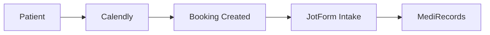
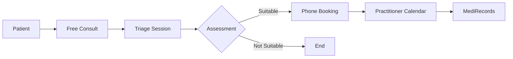

# Flow Comparison: Current vs New System

## Visual Flow Differences

### Patient Booking Journey

#### Current Flow
```
[Website] → [Book with Dr. Dia] → [Calendly] → [Pay] → [Confirmation] → [JotForm Intake] → [Appointment]
    ↓                                                          ↓
1 click                                                   After initial booking
```

#### New Flow
```
[Website] → [Free Consultation] → [Triage Call] → [Phone Booking] → [Pay over Phone] → [Appointment]
    ↓              ↓                    ↓                 ↓                ↓
1 click         No pay            Assessment      Right practitioner   Immediate
```

## Component-by-Component Changes

### 1. Entry Point Changes

| Component | Current | New | Implementation |
|-----------|---------|-----|----------------|
| **CTA Button** | "Book Appointment" | "Book Free Consultation" | Update button text and link |
| **Booking Page** | Direct to Calendly | Explain free consultation first | New landing page needed |
| **Service Selection** | Not available | Choose: Alt Med, GAPS, etc. | Add service selector UI |
| **Practitioner Choice** | No choice (Dr Dia only) | After triage assessment | New practitioner cards |

### 2. Booking Process Changes

| Stage | Current | New | What Changes |
|-------|---------|-----|--------------|
| **Initial Contact** | Paid booking | Free 20-min consultation | New Calendly event type |
| **Assessment** | After booking via form | During free consultation | Triage script/questions |
| **Practitioner Assignment** | Always Dr Dia | Based on needs/availability | Assignment logic |
| **Payment** | Online via Calendly | Over phone with consultant | Phone payment process |
| **Confirmation** | Immediate | After phone booking | New confirmation flow |

### 3. Technical Integration Changes

#### Calendly Setup

**Current:**
```yaml
Single Calendar:
  Events: 
    - "Initial Consultation"
      Payment: Required ($89 AUD)
      Duration: 15 minutes
    - "Follow-up Consultation"
      Payment: Required ($69 AUD)  
      Duration: 10 minutes
```

**New:**
```yaml
Triage Calendar:
  Event: "Free Consultation"
  Payment: None
  Duration: 20 minutes
  Purpose: Assessment only

Practitioner Calendars (×6):
  Events: Service-specific
  Payment: Via phone only
  Duration: Varies by service
  Availability: Synced with MediRecords
```

#### Webhook Flow

**Current Webhook:**
```javascript
Calendly → Webhook → Create Booking → Send Intake Form
```

**New Webhook Flow:**
```javascript
// Path 1: Free Consultation
Triage Calendly → Webhook → Create Triage Session → Prep Email

// Path 2: Practitioner Booking (Phone)
Phone Booking → Create Booking → Sync to Calendly → Sync to MediRecords
```

### 4. Data Flow Changes

#### Current Data Flow


#### New Data Flow


## Specific UI/UX Changes

### Homepage Changes

```diff
<!-- Current -->
<section class="hero">
-  <h1>Book Your Alternative Medicine Consultation</h1>
-  <p>Consult with Dr Dia - $89 AUD initial (15 min), $69 AUD follow-up (10 min)</p>
-  <button>Book Now</button>
</section>

<!-- New -->
<section class="hero">
+  <h1>Start with a Free 20-Minute Consultation</h1>
+  <p>Our triage consultant will match you with the right practitioner</p>
+  <button>Book Free Consultation</button>
+  <div class="services">
+    <div>✓ Alternative Medicine (Telehealth & In-Person)</div>
+    <div>✓ GAPS Diet Coaching</div>
+    <div>✓ More services coming soon</div>
+  </div>
</section>
```

### Booking Interface Changes

```diff
<!-- Current: Direct Calendly Embed -->
<div class="booking">
-  <CalendlyEmbed url="calendly.com/dr-dia" />
</div>

<!-- New: Step-by-step Process -->
<div class="booking-steps">
+  <Step1_FreeConsultation>
+    <CalendlyEmbed url="calendly.com/botaniqal-triage" />
+  </Step1_FreeConsultation>
+  
+  <Step2_TriageComplete>
+    <p>Great! Your consultant will call you at {time}</p>
+    <p>They'll assess your needs and help you book with the right practitioner</p>
+  </Step2_TriageComplete>
+  
+  <Step3_AfterTriage>
+    <p>Based on your consultation, we recommend:</p>
+    <PractitionerRecommendations />
+  </Step3_AfterTriage>
</div>
```

## Backend API Changes

### Booking Endpoints

| Endpoint | Current | New | Purpose Change |
|----------|---------|-----|----------------|
| `POST /bookings` | Creates paid booking | Requires triage session | Must have completed triage |
| `GET /availability` | Returns Dr. Dia slots | Returns all practitioner slots | Multi-practitioner support |
| `POST /consultations` | Doesn't exist | Creates free consultation | New triage flow |
| `POST /bookings/phone` | Doesn't exist | Creates phone booking | Consultant booking ability |

### Database Changes

```sql
-- Current: Simple booking
CREATE TABLE bookings (
    patient_id UUID,
    appointment_time TIMESTAMP,
    doctor_id UUID DEFAULT 'dr-dia-uuid'
);

-- New: Complex relationships
CREATE TABLE bookings (
    patient_id UUID,
    practitioner_id UUID, -- NEW: Multiple practitioners
    triage_session_id UUID, -- NEW: Link to triage
    service_type VARCHAR, -- NEW: Service selection
    booking_method VARCHAR, -- NEW: online/phone
    appointment_time TIMESTAMP
);

-- NEW: Triage tracking
CREATE TABLE triage_sessions (
    id UUID PRIMARY KEY,
    patient_id UUID,
    consultant_id UUID,
    outcome VARCHAR,
    recommended_practitioners UUID[]
);
```

## Key Behavioral Changes

### For Patients

| Aspect | Current Behavior | New Behavior | Benefit |
|--------|-----------------|--------------|---------|
| **First Step** | Pay $89 AUD upfront | Free consultation | Lower barrier to entry |
| **Practitioner Choice** | No choice | Matched to needs | Better fit |
| **Payment** | Online only | Phone option | Flexibility |
| **Assessment** | Fill form after booking | During consultation | More personal |

### For Staff

| Role | Current Tasks | New Tasks | Training Needed |
|------|---------------|-----------|-----------------|
| **Consultants** | N/A | Conduct triage, book appointments | Triage protocol, phone booking |
| **Admin** | Monitor one calendar | Monitor 6+ calendars | Multi-calendar management |
| **Practitioners** | See pre-booked patients | Receive triaged patients | Understanding triage notes |

## Migration Checklist

### Phase 1: Backend Prep
- [ ] Create practitioner records in database
- [ ] Set up triage session tracking
- [ ] Implement phone booking API
- [ ] Update webhook handlers

### Phase 2: Calendly Setup
- [ ] Create triage calendar (no payment)
- [ ] Create 6 practitioner calendars
- [ ] Configure webhook URLs
- [ ] Test calendar sync

### Phase 3: Frontend Updates
- [ ] Update homepage messaging
- [ ] Build free consultation flow
- [ ] Create phone booking interface
- [ ] Implement practitioner cards

### Phase 4: Testing
- [ ] End-to-end booking tests
- [ ] Phone booking training
- [ ] Load test multiple calendars
- [ ] Staff training sessions

### Phase 5: Launch
- [ ] Soft launch with 2 practitioners
- [ ] Monitor and adjust
- [ ] Full launch all practitioners
- [ ] Marketing update

---

*This comparison focuses on actual implementation differences, not conceptual improvements.*