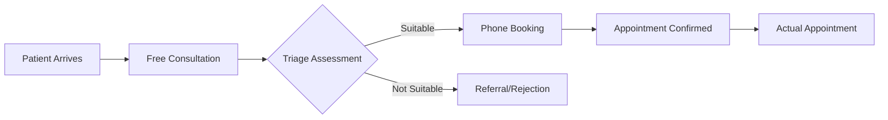

# Implementation Changes Guide

## Overview

This document outlines the specific changes required to upgrade from the current Botaniqal booking system to the new multi-practitioner system with free consultations and triage.

## Key System Changes

### 1. Booking Flow Transformation

#### Current System
- **Single practitioner**: Dr. Dia only
- **Direct booking**: Patients book directly via Calendly
- **Two-step process**: Book first, then fill intake form
- **Fixed pricing**: $89 initial, $69 follow-up

#### New System Changes Required
- **Multi-practitioner support**: 6+ practitioners
- **Triage-first approach**: Free consultation before booking
- **Unified process**: Assessment integrated with booking
- **Dynamic pricing**: Based on service and practitioner

### 2. New User Journey



## Specific Implementation Requirements

### Frontend Changes

#### 1. Landing Page Updates
```diff
- "Book with Dr. Dia" button
+ "Book Free Consultation" button

- Single service description
+ Service selector:
  + Alternative Medicine (Telehealth)
  + Alternative Medicine (In-Person Melbourne)
  + GAPS Diet Coaching
```

#### 2. New Booking Interface
```javascript
// NEW: Consultation booking component
const ConsultationBooking = () => {
  return (
    <div>
      <h2>Book Your Free 20-Minute Consultation</h2>
      <p>Speak with our triage consultant to find the right practitioner</p>
      <CalendlyEmbed 
        url="https://calendly.com/botaniqal-triage/consultation"
        prefill={{
          name: userName,
          email: userEmail,
          customQuestions: {
            primaryConcern: "What brings you here today?"
          }
        }}
      />
    </div>
  );
};

// CHANGE: Practitioner selection after triage
const PractitionerSelection = ({ triageResults }) => {
  const recommendedPractitioners = triageResults.practitioners;
  
  return (
    <div>
      <h3>Recommended Practitioners</h3>
      {recommendedPractitioners.map(practitioner => (
        <PractitionerCard 
          key={practitioner.id}
          practitioner={practitioner}
          availability={practitioner.nextAvailable}
          pricing={practitioner.pricing}
        />
      ))}
    </div>
  );
};
```

### Backend Changes

#### 1. Database Schema Additions
```sql
-- NEW: Add practitioners table
CREATE TABLE practitioners (
    id UUID PRIMARY KEY,
    name VARCHAR(255),
    type VARCHAR(50), -- 'doctor', 'nurse', 'consultant', 'coach'
    calendly_url VARCHAR(255),
    specializations TEXT[],
    location VARCHAR(50) -- 'telehealth', 'melbourne'
);

-- NEW: Add triage_sessions table
CREATE TABLE triage_sessions (
    id UUID PRIMARY KEY,
    patient_id UUID,
    consultant_id UUID,
    scheduled_time TIMESTAMP,
    triage_notes TEXT,
    recommended_practitioners UUID[],
    outcome VARCHAR(50), -- 'booked', 'referred', 'rejected'
    booking_id UUID REFERENCES bookings(id)
);

-- CHANGE: Modify bookings table
ALTER TABLE bookings 
ADD COLUMN practitioner_id UUID REFERENCES practitioners(id),
ADD COLUMN triage_session_id UUID REFERENCES triage_sessions(id),
ADD COLUMN service_type VARCHAR(50),
ADD COLUMN booking_method VARCHAR(50); -- 'online', 'phone'
```

#### 2. API Endpoints Changes

##### NEW Endpoints Required
```javascript
// Free consultation booking
POST /api/consultations/book
{
  "patientName": "string",
  "email": "string", 
  "phone": "string",
  "preferredTime": "datetime",
  "primaryConcern": "string"
}

// Get available practitioners based on triage
GET /api/practitioners/available?service={service}&date={date}

// Phone booking by consultant
POST /api/bookings/phone
{
  "triageSessionId": "uuid",
  "practitionerId": "uuid",
  "scheduledTime": "datetime",
  "paymentCollected": true,
  "paymentMethod": "phone"
}
```

##### MODIFIED Endpoints
```javascript
// CHANGE: Booking creation now requires triage
POST /api/bookings
{
  "patientId": "uuid",
  "practitionerId": "uuid", // NEW: specific practitioner
  "triageSessionId": "uuid", // NEW: link to triage
  "serviceType": "string", // NEW: service selection
  "appointmentType": "initial|followup",
  "scheduledTime": "datetime"
}
```

### Integration Changes

#### 1. Calendly Configuration

##### Current Setup
```yaml
Single Calendar:
  - URL: calendly.com/dr-dia
  - Event Types:
    - Initial Consultation ($89)
    - Follow-up ($69)
```

##### New Setup Required
```yaml
Multiple Calendars:
  
Triage Calendar:
  - URL: calendly.com/botaniqal-triage
  - Event Type: Free Consultation (20 min)
  - No payment collection
  
Dr. Dia Calendar:
  - URL: calendly.com/dr-dia-botaniqal
  - Location: Telehealth
  - Event Types: Alt Medicine Initial/Follow-up
  
Dr. Shivani Calendar:
  - URL: calendly.com/dr-shivani-botaniqal
  - Location: Melbourne In-Person
  - Event Types: Alt Medicine Initial/Follow-up
  
Nurse Practitioner Calendar:
  - URL: calendly.com/nurse-botaniqal
  - Location: Telehealth
  - Event Types: Alt Medicine Initial/Follow-up
  
GAPS Coach Calendar:
  - URL: calendly.com/gaps-botaniqal
  - Event Types: GAPS Initial/Follow-up
```

#### 2. Webhook Processing Changes

```javascript
// CURRENT: Single webhook handler
const handleCalendlyWebhook = async (event) => {
  if (event.event === 'invitee.created') {
    await createBooking({
      patientEmail: event.payload.email,
      appointmentTime: event.payload.event.start_time,
      doctorId: 'dr-dia' // hardcoded
    });
  }
};

// NEW: Multiple webhook handlers with routing
const handleCalendlyWebhook = async (event) => {
  const calendarId = event.payload.event.calendar_id;
  
  // Route to appropriate handler
  if (calendarId === TRIAGE_CALENDAR_ID) {
    await handleTriageBooking(event);
  } else {
    await handlePractitionerBooking(event);
  }
};

const handleTriageBooking = async (event) => {
  // Create triage session
  const session = await createTriageSession({
    patientEmail: event.payload.email,
    consultantId: getConsultantFromCalendar(event),
    scheduledTime: event.payload.event.start_time
  });
  
  // Send prep email
  await sendTriagePreparationEmail(session);
};

const handlePractitionerBooking = async (event) => {
  // Identify practitioner from calendar
  const practitioner = await getPractitionerByCalendarId(calendarId);
  
  // Create booking with practitioner
  await createBooking({
    practitionerId: practitioner.id,
    patientEmail: event.payload.email,
    serviceType: determineServiceType(event),
    appointmentTime: event.payload.event.start_time
  });
};
```

### Admin Interface Changes

#### 1. Multi-Practitioner Management

```javascript
// NEW: Practitioner management interface
const PractitionerManagement = () => {
  return (
    <div>
      <h2>Practitioner Management</h2>
      
      {/* NEW: Add practitioner form */}
      <AddPractitionerForm 
        onSubmit={async (data) => {
          await api.post('/admin/practitioners', {
            ...data,
            calendlyUrl: data.calendlyUrl,
            medirecordsId: data.medirecordsId
          });
        }}
      />
      
      {/* NEW: Practitioner list with calendar sync status */}
      <PractitionerList 
        columns={[
          'Name',
          'Type',
          'Location',
          'Calendar Sync Status',
          'Active Bookings',
          'Next Available'
        ]}
      />
    </div>
  );
};
```

#### 2. Phone Booking Interface

```javascript
// NEW: Phone booking component for consultants
const PhoneBookingInterface = ({ triageSession }) => {
  const [selectedPractitioner, setSelectedPractitioner] = useState(null);
  const [selectedTime, setSelectedTime] = useState(null);
  const [paymentCollected, setPaymentCollected] = useState(false);
  
  return (
    <div>
      <h3>Complete Phone Booking for {triageSession.patientName}</h3>
      
      {/* Show triage notes */}
      <TriageNotes notes={triageSession.notes} />
      
      {/* Practitioner selection */}
      <PractitionerSelector 
        recommended={triageSession.recommendedPractitioners}
        onSelect={setSelectedPractitioner}
      />
      
      {/* Available times */}
      <TimeSlotSelector 
        practitioner={selectedPractitioner}
        onSelect={setSelectedTime}
      />
      
      {/* Payment confirmation */}
      <PaymentConfirmation 
        amount={calculatePrice(selectedPractitioner, 'initial')}
        onConfirm={() => setPaymentCollected(true)}
      />
      
      <button 
        onClick={() => completePhoneBooking({
          triageSessionId: triageSession.id,
          practitionerId: selectedPractitioner.id,
          time: selectedTime,
          paymentCollected
        })}
        disabled={!paymentCollected}
      >
        Complete Booking
      </button>
    </div>
  );
};
```

### Service Expansion Preparation

#### Pricing Structure Implementation
```javascript
const SERVICES = {
  ALTERNATIVE_MEDICINE: {
    name: 'Alternative Medicine',
    initial: { price: 119, duration: 15 }, // NEW pricing (was $89)
    followup: { price: 79, duration: 10 }  // NEW pricing (was $69)
  },
  ALTERNATIVE_MEDICINE_INPERSON: {
    name: 'Alternative Medicine (In-Person)',
    initial: { price: 119, duration: 20 }, // NEW pricing
    followup: { price: 79, duration: 15 }  // NEW pricing
  },
  GAPS_COACHING: {
    name: 'GAPS Diet Coaching',
    initial: { price: 195, duration: 60 },
    followup: { price: 79, duration: 15 }
  },
  // Ready for future services
  WEIGHT_LOSS: {
    name: 'Medical Weight Loss Program',
    initial: { price: 150, duration: 30 },
    followup: { price: 95, duration: 20 },
    status: 'coming_soon'
  }
};
```

## Migration Steps

### Phase 1: Database and Backend (Week 1-2)
1. Create new database tables
2. Migrate existing patient data
3. Set up practitioner records
4. Implement new API endpoints
5. Update webhook handlers

### Phase 2: Calendly Integration (Week 2-3)
1. Create triage calendar
2. Set up practitioner calendars
3. Configure webhook endpoints
4. Test booking flows

### Phase 3: Frontend Updates (Week 3-4)
1. Update landing page
2. Implement consultation booking
3. Create practitioner selection UI
4. Add phone booking interface

### Phase 4: Testing and Launch (Week 4-5)
1. End-to-end testing
2. Load testing with multiple calendars
3. Staff training
4. Soft launch with limited practitioners
5. Full launch

## Critical Success Factors

### Must Have Before Launch
- [ ] All 6 practitioner calendars configured
- [ ] Triage booking flow working
- [ ] Phone booking interface for consultants
- [ ] Payment collection over phone
- [ ] Multi-calendar sync working
- [ ] Updated patient communications

### Performance Requirements
- Booking API response time < 500ms
- Calendar sync every 5 minutes
- Support 100 concurrent bookings
- 99.9% uptime for booking system

## Rollback Plan

If issues arise, system can revert to current state:
1. Disable triage calendar
2. Route all bookings to Dr. Dia
3. Disable practitioner selection
4. Revert to simple booking flow

---

*This document focuses on actual implementation changes needed, not theoretical improvements.*