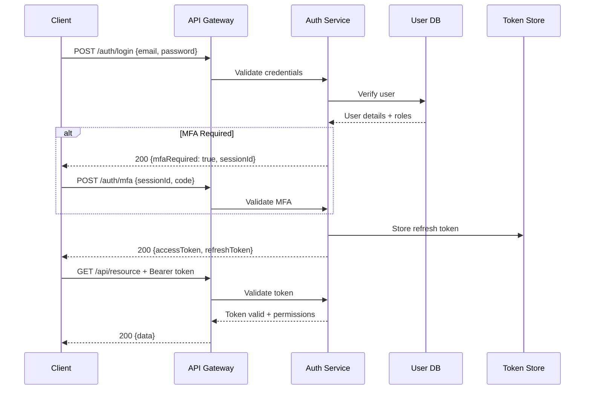

# Authentication Flow Documentation

## Overview

This document details the authentication mechanisms for the Botaniqal medical booking system, covering all user types (patients, practitioners, consultants, administrators) and ensuring secure access to protected health information.

## Authentication Methods

### 1. Primary Authentication

#### Email + Password
- **Users**: All user types
- **Requirements**: 
  - Email verification required
  - Password complexity rules enforced
  - Account lockout after 5 failed attempts

#### Phone + OTP
- **Users**: Patients (optional), Consultants (required)
- **Requirements**:
  - SMS OTP valid for 5 minutes
  - Rate limiting: 3 OTP requests per hour
  - Phone verification required

#### Single Sign-On (SSO)
- **Users**: Practitioners, Admin staff
- **Providers**: 
  - Office 365 (primary)
  - Google Workspace (secondary)
- **Protocol**: SAML 2.0 / OAuth 2.0

### 2. Multi-Factor Authentication (MFA)

Required for all users accessing PHI:

```javascript
const MFA_REQUIREMENTS = {
  patient: {
    required: false,
    methods: ['sms', 'totp', 'email']
  },
  consultant: {
    required: true,
    methods: ['totp', 'sms']
  },
  practitioner: {
    required: true,
    methods: ['totp', 'hardware_key', 'push']
  },
  admin: {
    required: true,
    methods: ['hardware_key', 'totp'],
    gracePeriod: 0
  }
};
```

## Authentication Architecture

### JWT Token Flow



### Token Structure

#### Access Token (JWT)
```json
{
  "header": {
    "alg": "RS256",
    "typ": "JWT",
    "kid": "2024-01-key"
  },
  "payload": {
    "sub": "user_uuid",
    "email": "user@example.com",
    "roles": ["practitioner"],
    "permissions": ["read:patients", "write:notes"],
    "sessionId": "session_uuid",
    "iat": 1704067200,
    "exp": 1704070800,
    "iss": "https://api.botaniqal.com.au",
    "aud": "botaniqal_web",
    "jti": "unique_token_id"
  }
}
```

#### Refresh Token
- Opaque token (UUID)
- Stored in secure httpOnly cookie
- 7-day expiry for patients
- 12-hour expiry for practitioners
- Single use - rotated on refresh

## Implementation Details

### Password Requirements

```javascript
const PASSWORD_POLICY = {
  minLength: 12,
  requireUppercase: true,
  requireLowercase: true,
  requireNumbers: true,
  requireSpecialChars: true,
  preventCommon: true, // Check against common passwords
  preventUserInfo: true, // Can't contain email/name
  historyCount: 5, // Can't reuse last 5 passwords
  maxAge: 90, // Days before forced reset
  adminMaxAge: 60 // Shorter for admins
};

const validatePassword = (password, userInfo) => {
  const errors = [];
  
  if (password.length < PASSWORD_POLICY.minLength) {
    errors.push('Password must be at least 12 characters');
  }
  
  if (!/[A-Z]/.test(password)) {
    errors.push('Password must contain uppercase letters');
  }
  
  if (!/[a-z]/.test(password)) {
    errors.push('Password must contain lowercase letters');
  }
  
  if (!/[0-9]/.test(password)) {
    errors.push('Password must contain numbers');
  }
  
  if (!/[!@#$%^&*(),.?":{}|<>]/.test(password)) {
    errors.push('Password must contain special characters');
  }
  
  // Check against common passwords
  if (COMMON_PASSWORDS.includes(password.toLowerCase())) {
    errors.push('Password is too common');
  }
  
  // Check against user info
  const userTokens = [
    userInfo.email.split('@')[0],
    userInfo.firstName,
    userInfo.lastName
  ].map(t => t.toLowerCase());
  
  for (const token of userTokens) {
    if (password.toLowerCase().includes(token)) {
      errors.push('Password cannot contain personal information');
    }
  }
  
  return errors;
};
```

### Login Flow Implementation

```javascript
class AuthenticationService {
  async login(credentials) {
    const { email, password, mfaCode } = credentials;
    
    // Rate limiting check
    await this.checkRateLimit(email);
    
    // Validate credentials
    const user = await this.validateCredentials(email, password);
    if (!user) {
      await this.recordFailedAttempt(email);
      throw new AuthError('Invalid credentials');
    }
    
    // Check if account is locked
    if (user.lockedUntil && user.lockedUntil > new Date()) {
      throw new AuthError('Account temporarily locked');
    }
    
    // Check MFA requirement
    if (this.requiresMFA(user.role)) {
      if (!mfaCode) {
        // Initiate MFA challenge
        const sessionId = await this.initiateMFA(user);
        return {
          mfaRequired: true,
          sessionId,
          mfaMethods: user.mfaMethods
        };
      }
      
      // Validate MFA code
      const mfaValid = await this.validateMFA(user, mfaCode);
      if (!mfaValid) {
        throw new AuthError('Invalid MFA code');
      }
    }
    
    // Generate tokens
    const { accessToken, refreshToken } = await this.generateTokens(user);
    
    // Create session
    await this.createSession({
      userId: user.id,
      refreshToken,
      ipAddress: this.getClientIP(),
      userAgent: this.getUserAgent()
    });
    
    // Record successful login
    await this.recordSuccessfulLogin(user);
    
    return {
      accessToken,
      refreshToken,
      user: {
        id: user.id,
        email: user.email,
        role: user.role,
        name: user.name
      }
    };
  }
}
```

### Session Management

```javascript
class SessionManager {
  async createSession(sessionData) {
    const session = {
      id: generateUUID(),
      userId: sessionData.userId,
      refreshToken: sessionData.refreshToken,
      ipAddress: sessionData.ipAddress,
      userAgent: sessionData.userAgent,
      createdAt: new Date(),
      lastActivity: new Date(),
      expiresAt: this.calculateExpiry(sessionData.userRole)
    };
    
    // Store in Redis with expiry
    await redis.setex(
      `session:${session.id}`,
      this.getSessionTTL(sessionData.userRole),
      JSON.stringify(session)
    );
    
    // Track active sessions
    await redis.sadd(`user:${sessionData.userId}:sessions`, session.id);
    
    return session;
  }
  
  async validateSession(sessionId) {
    const session = await redis.get(`session:${sessionId}`);
    if (!session) return null;
    
    const sessionData = JSON.parse(session);
    
    // Check expiry
    if (new Date(sessionData.expiresAt) < new Date()) {
      await this.terminateSession(sessionId);
      return null;
    }
    
    // Update last activity
    sessionData.lastActivity = new Date();
    await redis.setex(
      `session:${sessionId}`,
      this.getRemainingTTL(sessionData),
      JSON.stringify(sessionData)
    );
    
    return sessionData;
  }
  
  async terminateAllUserSessions(userId, exceptSessionId = null) {
    const sessions = await redis.smembers(`user:${userId}:sessions`);
    
    for (const sessionId of sessions) {
      if (sessionId !== exceptSessionId) {
        await this.terminateSession(sessionId);
      }
    }
  }
}
```

### Token Refresh Flow

```javascript
async refreshAccessToken(refreshToken) {
  // Validate refresh token
  const session = await this.validateRefreshToken(refreshToken);
  if (!session) {
    throw new AuthError('Invalid refresh token');
  }
  
  // Check if token has been used (replay attack prevention)
  if (session.used) {
    // Potential security breach - invalidate all user sessions
    await this.terminateAllUserSessions(session.userId);
    throw new AuthError('Token replay detected');
  }
  
  // Mark token as used
  await this.markRefreshTokenUsed(refreshToken);
  
  // Get user data
  const user = await this.getUser(session.userId);
  
  // Generate new token pair
  const { accessToken, newRefreshToken } = await this.generateTokens(user);
  
  // Update session with new refresh token
  await this.updateSessionRefreshToken(session.id, newRefreshToken);
  
  return {
    accessToken,
    refreshToken: newRefreshToken
  };
}
```

## Security Headers

```javascript
const securityHeaders = {
  'Strict-Transport-Security': 'max-age=31536000; includeSubDomains',
  'X-Content-Type-Options': 'nosniff',
  'X-Frame-Options': 'DENY',
  'X-XSS-Protection': '1; mode=block',
  'Referrer-Policy': 'strict-origin-when-cross-origin',
  'Content-Security-Policy': "default-src 'self'; script-src 'self' 'unsafe-inline' https://apis.google.com; style-src 'self' 'unsafe-inline';",
  'Permissions-Policy': 'geolocation=(), microphone=(), camera=(self)'
};
```

## Account Security

### Email Verification Flow

```javascript
async sendVerificationEmail(user) {
  const token = await this.generateVerificationToken(user.id);
  const verificationUrl = `${BASE_URL}/verify-email?token=${token}`;
  
  await emailService.send({
    to: user.email,
    subject: 'Verify your Botaniqal account',
    template: 'email-verification',
    data: {
      name: user.name,
      verificationUrl,
      expiryHours: 24
    }
  });
  
  // Log email sent
  await auditLog.record({
    action: 'email_verification_sent',
    userId: user.id,
    metadata: { email: user.email }
  });
}

async verifyEmail(token) {
  const payload = await this.validateVerificationToken(token);
  if (!payload) {
    throw new Error('Invalid or expired verification token');
  }
  
  // Update user
  await db.users.update({
    where: { id: payload.userId },
    data: { 
      emailVerified: true,
      emailVerifiedAt: new Date()
    }
  });
  
  // Invalidate token
  await this.invalidateVerificationToken(token);
  
  return { success: true };
}
```

### Password Reset Flow

```javascript
async initiatePasswordReset(email) {
  const user = await this.getUserByEmail(email);
  if (!user) {
    // Don't reveal if email exists
    return { message: 'If account exists, reset email sent' };
  }
  
  // Check rate limiting
  const recentRequests = await this.getRecentPasswordResets(user.id);
  if (recentRequests.length >= 3) {
    throw new Error('Too many password reset requests');
  }
  
  // Generate reset token
  const token = await this.generatePasswordResetToken(user.id);
  const resetUrl = `${BASE_URL}/reset-password?token=${token}`;
  
  // Send email
  await emailService.send({
    to: user.email,
    subject: 'Reset your Botaniqal password',
    template: 'password-reset',
    data: {
      name: user.name,
      resetUrl,
      expiryMinutes: 30,
      ipAddress: this.getClientIP()
    }
  });
  
  // Log reset request
  await auditLog.record({
    action: 'password_reset_requested',
    userId: user.id,
    metadata: { ipAddress: this.getClientIP() }
  });
  
  return { message: 'If account exists, reset email sent' };
}
```

### Account Lockout

```javascript
const LOCKOUT_POLICY = {
  maxAttempts: 5,
  windowMinutes: 15,
  lockoutDuration: {
    1: 15, // First lockout: 15 minutes
    2: 60, // Second lockout: 1 hour
    3: 240, // Third lockout: 4 hours
    default: 1440 // Subsequent: 24 hours
  }
};

async handleFailedLogin(email) {
  const attempts = await this.getFailedAttempts(email);
  attempts.push({
    timestamp: new Date(),
    ipAddress: this.getClientIP()
  });
  
  // Remove old attempts outside window
  const cutoff = new Date(Date.now() - LOCKOUT_POLICY.windowMinutes * 60000);
  const recentAttempts = attempts.filter(a => a.timestamp > cutoff);
  
  await this.saveFailedAttempts(email, recentAttempts);
  
  // Check if should lock account
  if (recentAttempts.length >= LOCKOUT_POLICY.maxAttempts) {
    const lockoutCount = await this.getLockoutCount(email);
    const duration = LOCKOUT_POLICY.lockoutDuration[lockoutCount] || 
                    LOCKOUT_POLICY.lockoutDuration.default;
    
    await this.lockAccount(email, duration);
    
    // Notify user of lockout
    await this.sendLockoutNotification(email, duration);
  }
}
```

## OAuth 2.0 Integration

### Office 365 SSO Configuration

```javascript
const office365Config = {
  clientId: process.env.O365_CLIENT_ID,
  clientSecret: process.env.O365_CLIENT_SECRET,
  redirectUri: `${BASE_URL}/auth/callback/office365`,
  tenant: 'common',
  scope: 'openid profile email User.Read',
  responseType: 'code',
  responseMode: 'query'
};

// Authorization URL
const getAuthorizationUrl = (state) => {
  const params = new URLSearchParams({
    client_id: office365Config.clientId,
    response_type: office365Config.responseType,
    redirect_uri: office365Config.redirectUri,
    response_mode: office365Config.responseMode,
    scope: office365Config.scope,
    state: state
  });
  
  return `https://login.microsoftonline.com/${office365Config.tenant}/oauth2/v2.0/authorize?${params}`;
};

// Token exchange
async exchangeCodeForToken(code) {
  const params = new URLSearchParams({
    client_id: office365Config.clientId,
    client_secret: office365Config.clientSecret,
    code: code,
    redirect_uri: office365Config.redirectUri,
    grant_type: 'authorization_code'
  });
  
  const response = await fetch(
    `https://login.microsoftonline.com/${office365Config.tenant}/oauth2/v2.0/token`,
    {
      method: 'POST',
      headers: { 'Content-Type': 'application/x-www-form-urlencoded' },
      body: params
    }
  );
  
  return response.json();
}
```

## API Authentication Middleware

```javascript
const authenticateRequest = async (req, res, next) => {
  try {
    // Extract token from header
    const authHeader = req.headers.authorization;
    if (!authHeader || !authHeader.startsWith('Bearer ')) {
      return res.status(401).json({ error: 'No token provided' });
    }
    
    const token = authHeader.substring(7);
    
    // Verify token
    const payload = await verifyAccessToken(token);
    if (!payload) {
      return res.status(401).json({ error: 'Invalid token' });
    }
    
    // Check token revocation
    const isRevoked = await checkTokenRevocation(payload.jti);
    if (isRevoked) {
      return res.status(401).json({ error: 'Token revoked' });
    }
    
    // Validate session
    const session = await validateSession(payload.sessionId);
    if (!session) {
      return res.status(401).json({ error: 'Invalid session' });
    }
    
    // Attach user context
    req.user = {
      id: payload.sub,
      email: payload.email,
      roles: payload.roles,
      permissions: payload.permissions,
      sessionId: payload.sessionId
    };
    
    // Log API access
    setImmediate(() => {
      auditLog.recordAPIAccess({
        userId: req.user.id,
        endpoint: req.path,
        method: req.method,
        ip: req.ip
      });
    });
    
    next();
  } catch (error) {
    logger.error('Authentication error:', error);
    res.status(401).json({ error: 'Authentication failed' });
  }
};
```

## Security Monitoring

### Authentication Events to Monitor

```javascript
const MONITORED_EVENTS = [
  'login_success',
  'login_failure',
  'mfa_success',
  'mfa_failure',
  'password_reset_request',
  'password_changed',
  'account_locked',
  'suspicious_activity',
  'token_refresh',
  'session_terminated'
];

// Real-time alerting for suspicious patterns
const monitorAuthEvents = async (event) => {
  // Check for patterns
  if (event.type === 'login_failure') {
    const recentFailures = await getRecentFailures(event.email);
    if (recentFailures.length > 10) {
      await alertSecurityTeam({
        type: 'brute_force_attempt',
        email: event.email,
        attempts: recentFailures.length
      });
    }
  }
  
  // Geographic anomaly detection
  if (event.type === 'login_success') {
    const isAnomalous = await checkGeographicAnomaly(
      event.userId,
      event.ipAddress
    );
    if (isAnomalous) {
      await alertUser({
        type: 'new_location_login',
        userId: event.userId,
        location: event.location
      });
    }
  }
};
```

## Testing Authentication

```javascript
describe('Authentication Tests', () => {
  test('Valid login returns tokens', async () => {
    const user = await createTestUser();
    const result = await authService.login({
      email: user.email,
      password: 'TestPassword123!'
    });
    
    expect(result.accessToken).toBeDefined();
    expect(result.refreshToken).toBeDefined();
    expect(jwt.verify(result.accessToken, PUBLIC_KEY)).toBeTruthy();
  });
  
  test('Account locks after failed attempts', async () => {
    const user = await createTestUser();
    
    // Make 5 failed attempts
    for (let i = 0; i < 5; i++) {
      try {
        await authService.login({
          email: user.email,
          password: 'wrong'
        });
      } catch (e) {
        // Expected
      }
    }
    
    // 6th attempt should fail with lockout
    await expect(authService.login({
      email: user.email,
      password: 'TestPassword123!'
    })).rejects.toThrow('Account temporarily locked');
  });
  
  test('MFA required for practitioner login', async () => {
    const practitioner = await createTestPractitioner();
    const result = await authService.login({
      email: practitioner.email,
      password: 'TestPassword123!'
    });
    
    expect(result.mfaRequired).toBe(true);
    expect(result.sessionId).toBeDefined();
    expect(result.accessToken).toBeUndefined();
  });
});
```

---

*Last Updated: [Current Date]*
*Version: 1.0.0*
*Security Review: Required before production deployment*