# Current Botaniqal Booking Flow

## Overview
This flowchart represents the current booking flow for Botaniqal website (www.botaniqal.com.au).

**Key Feature**: Initial consultations require an eligibility assessment that determines whether you can book online or must contact the practice.

```mermaid
flowchart TD
    Start([User visits www.botaniqal.com.au]) --> Choice{Booking Type}
    
    %% Initial Consultation Path
    Choice -->|Initial Consult $89 AUD| Eligibility[Health & Wellness Assessment]
    
    Eligibility --> HealthCheck{Eligibility Check:<br/>Are you suitable for<br/>standard telehealth care?}
    HealthCheck -->|YES - Standard Care| Calendar1[Proceed to Calendly Booking]
    HealthCheck -->|NO - Special Needs| ContactRequired[Must Contact Practice]
    
    ContactRequired --> ContactInfo[📞 Call: 1800-XXX-XXX<br/>📧 Email: enquiries@botaniqal.com.au<br/>❌ Cannot book online]
    ContactInfo --> End1([End - Contact Required])
    
    %% Follow-up Path
    Choice -->|Follow-up $69 AUD| Calendar2[Direct to Calendly Booking]
    
    %% Booking Process for Initial
    Calendar1 --> SelectTime1[Select Available Time with Dr. Dia - 15 min]
    SelectTime1 --> Details1[Fill Patient Details]
    Details1 --> Payment1[Pay $89.00 AUD via Stripe]
    Payment1 --> Submit1[Submit Booking]
    Submit1 --> IntakeForm[Intake Form]
    
    IntakeForm --> FillIntake[Fill Out Intake Form]
    FillIntake --> Consent[Review & Sign Consent]
    Consent --> SubmitIntake[Submit Intake Form]
    
    %% Booking Process for Follow-up
    Calendar2 --> SelectTime2[Select Available Time with Dr. Dia - 10 min]
    SelectTime2 --> Details2[Fill Patient Details]
    Details2 --> Payment2[Pay $69.00 AUD via Stripe]
    Payment2 --> Submit2[Submit Booking]
    
    %% Success Pages
    SubmitIntake --> Success1[Booking Successful Page]
    Submit2 --> Success2[Booking Successful Page]
    
    %% Notifications
    Success1 --> Notifications1{Automated Notifications}
    Success2 --> Notifications2{Automated Notifications}
    
    Notifications1 --> SMS1[SMS with booking details]
    Notifications1 --> Email1[Email with booking details & payment confirmation]
    Notifications1 --> IntakeCopy[Email copy of submitted intake form]
    
    Notifications2 --> SMS2[SMS with booking details]
    Notifications2 --> Email2[Email with booking details & payment confirmation]
    
    SMS1 --> End2([End])
    Email1 --> End2
    IntakeCopy --> End2
    SMS2 --> End3([End])
    Email2 --> End3
    
    %% Styling
    classDef startEnd fill:#e1f5fe,stroke:#01579b,stroke-width:2px
    classDef process fill:#fff3e0,stroke:#e65100,stroke-width:2px
    classDef decision fill:#f3e5f5,stroke:#4a148c,stroke-width:2px
    classDef payment fill:#e8f5e9,stroke:#2e7d32,stroke-width:2px
    classDef notification fill:#ffebee,stroke:#c62828,stroke-width:2px
    classDef form fill:#f3e5f5,stroke:#6a1b9a,stroke-width:2px
    
    class Start,End1,End2,End3 startEnd
    class Choice,HealthCheck,Notifications1,Notifications2 decision
    class Calendar1,Calendar2,SelectTime1,SelectTime2,Details1,Details2,Submit1,Submit2 process
    class Payment1,Payment2 payment
    class SMS1,SMS2,Email1,Email2,IntakeCopy notification
    class Eligibility,IntakeForm,FillIntake,Consent,SubmitIntake form
    class ContactRequired,ContactInfo blocked
```

## Current Flow Details

### Initial Consultation ($89.00 AUD - 15 minutes)
1. User selects "Initial Consult"
2. Completes health & wellness assessment
3. If specialized care needed → Offered multiple contact options
   - Call clinic directly (1800-XXX-XXX)
   - Submit quick contact form
   - Book anyway with special note for provider
4. If standard care suitable → Calendly booking with Dr. Dia (15 min slot)
5. Fills details and pays $89.00 AUD
6. Completes intake form with consent
7. Receives confirmations (SMS, Email, Intake copy)

### Follow-up Consultation ($69.00 AUD - 10 minutes)
1. User selects "Follow-up"
2. Direct to Calendly booking (10 min slot)
3. Fills details and pays $69.00 AUD
4. Receives confirmations (SMS, Email)

## Key Components
- **Single Provider**: Dr. Dia only
- **Payment Gateway**: Integrated with Calendly
- **Intake Form**: Separate step after payment
- **Consent**: Part of intake form
- **Notifications**: SMS and Email automated

## Business Rules

### Eligibility Assessment (Initial Consultations Only)
The health assessment determines if you can book online:

✅ **CAN Book Online (Standard Care)**:
- General health consultations
- Common conditions suitable for telehealth
- No complex medication requirements
- Standard alternative medicine consultations

❌ **CANNOT Book Online (Must Contact Practice)**:
- Controlled substance prescriptions needed
- Complex mental health conditions
- Pregnancy-related care
- Chronic pain management
- Any condition requiring specialized care

**Important**: If eligibility check fails, online booking is BLOCKED. Patient must call or email the practice.

## Current Pain Points
- Eligibility assessment blocks some patients from booking
- No option to override eligibility decision
- Two-step process (booking then intake) may cause drop-offs
- No option to save progress
- Single provider limitation (Dr. Dia only)
- No rescheduling flow shown