# Current Doctor Appointment Flow

## Overview
This flowchart represents the doctor's workflow during patient appointments, from preparation through prescription and follow-up.

```mermaid
flowchart TD
    %% Pre-Appointment
    Start([Appointment Time]) --> OpenMediRecords[Open MediRecords]
    OpenMediRecords --> ReviewPatient[Review Patient Record]
    
    ReviewPatient --> CheckNotes[Read Clinical Notes]
    CheckNotes --> GetPhone[Get Patient Phone Number]
    
    %% Appointment Start
    GetPhone --> CallPatient[Call Patient]
    CallPatient --> VerifyIdentity[Verify Patient Identity]
    
    %% During Appointment
    VerifyIdentity --> Consultation{Consultation Process}
    
    Consultation --> AssessCondition[Assess Patient Condition]
    AssessCondition --> CheckHistory[Review Medical History]
    
    CheckHistory --> SafeScript[Check SafeScript]
    SafeScript --> RequireInfo{Additional Info Needed?}
    
    RequireInfo -->|Yes| RequestInfo[Request from Patient]
    RequireInfo -->|No| CreatePlan[Create Treatment Plan]
    
    RequestInfo --> UpdateNotesTemp[Update Notes with Info]
    UpdateNotesTemp --> CreatePlan
    
    %% Treatment Decision
    CreatePlan --> PrescribeDecision{Prescribe Medication?}
    
    PrescribeDecision -->|Yes| PrescriptionFlow[Prescription Process]
    PrescribeDecision -->|No| NonMedTreatment[Non-Medical Treatment Plan]
    
    %% Prescription Process
    PrescriptionFlow --> eRxSystem[Access eRx in MediRecords]
    eRxSystem --> CreateScript[Create Electronic Prescription]
    CreateScript --> DeliveryMethod{Delivery Method}
    
    DeliveryMethod -->|SMS| SendSMS[Send Script via SMS]
    DeliveryMethod -->|Email| SendEmail[Send Script via Email]
    DeliveryMethod -->|Pharmacy| SendPharmacy[Send Direct to Pharmacy]
    
    SendSMS --> ConfirmDelivery[Confirm Delivery]
    SendEmail --> ConfirmDelivery
    SendPharmacy --> ConfirmDelivery
    
    %% Non-Prescription Path
    NonMedTreatment --> DocumentPlan[Document Treatment Plan]
    
    %% Follow-up Requirements
    ConfirmDelivery --> FollowUpNeeded{Follow-up Required?}
    DocumentPlan --> FollowUpNeeded
    
    FollowUpNeeded -->|Yes| ContactPM[Contact Practice Manager]
    FollowUpNeeded -->|No| FinalNotes[Finalize Notes]
    
    ContactPM --> PMInstructions[Provide Follow-up Instructions]
    PMInstructions --> FinalNotes
    
    %% Appointment Completion
    FinalNotes --> UpdateRecord[Update Patient Record]
    UpdateRecord --> SaveNotes[Save All Notes]
    SaveNotes --> CloseAppointment[Close Appointment]
    
    CloseAppointment --> UpdateStatus[Update Booking Status to Complete]
    UpdateStatus --> End([End])
    
    %% Error Handling
    CallPatient -->|No Answer| Retry{Retry Call?}
    Retry -->|Yes| CallPatient
    Retry -->|No| DocumentNoShow[Document No-Show]
    DocumentNoShow --> NotifyPM[Notify Practice Manager]
    NotifyPM --> End
    
    %% Styling
    classDef doctor fill:#e8f5e9,stroke:#2e7d32,stroke-width:3px
    classDef system fill:#e3f2fd,stroke:#1565c0,stroke-width:2px
    classDef decision fill:#f3e5f5,stroke:#4a148c,stroke-width:2px
    classDef prescription fill:#fff3e0,stroke:#e65100,stroke-width:3px
    classDef notes fill:#f3e5f5,stroke:#6a1b9a,stroke-width:2px
    classDef followup fill:#ffebee,stroke:#c62828,stroke-width:2px
    
    class Start,End,CallPatient,VerifyIdentity,AssessCondition doctor
    class OpenMediRecords,ReviewPatient,CheckHistory,SafeScript,eRxSystem system
    class Consultation,RequireInfo,PrescribeDecision,DeliveryMethod,FollowUpNeeded,Retry decision
    class PrescriptionFlow,CreateScript,SendSMS,SendEmail,SendPharmacy prescription
    class CheckNotes,UpdateNotesTemp,FinalNotes,UpdateRecord,SaveNotes notes
    class ContactPM,PMInstructions,NotifyPM followup
```

## Doctor Workflow Details

### Pre-Appointment Preparation
1. **Open MediRecords** at appointment time
2. **Review patient record** including:
   - Previous appointment notes
   - Medical history
   - Current medications
3. **Get patient phone number** from records

### During Appointment
1. **Call patient** using number from MediRecords
2. **Verify patient identity** for security
3. **Assess condition** through consultation
4. **Check SafeScript** for medication history
5. **Request additional information** if needed
6. **Create treatment plan** based on assessment

### Prescription Process (if required)
1. **Access eRx** integration in MediRecords
2. **Create electronic prescription**
3. **Choose delivery method**:
   - SMS to patient's mobile
   - Email to patient
   - Direct to nominated pharmacy
4. **Confirm delivery** of prescription

### Post-Appointment Tasks
1. **Update clinical notes** with:
   - Consultation summary
   - Treatment plan
   - Prescription details (if applicable)
   - Follow-up requirements
2. **Contact Practice Manager** if follow-up needed
3. **Update booking status** to "Complete"

### Key Systems Used
- **MediRecords**: Patient records, notes, eRx
- **SafeScript**: Prescription monitoring
- **eRx**: Electronic prescription service
- **Phone**: Patient communication

### No-Show Protocol
- Retry call if no answer
- Document no-show in system
- Notify Practice Manager for follow-up