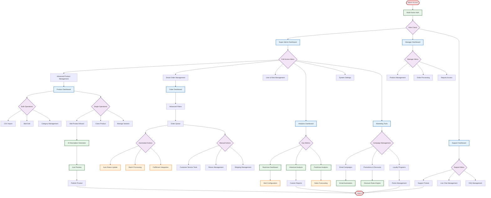

# New Update Admin Flow

## Overview
This flowchart represents the updated admin workflow ready for deployment.

## New Features

### Enhanced Security
- Multi-factor authentication
- Role-based access control
- Activity logging
- Session management

### Product Management
- Bulk import/export
- AI-powered descriptions
- Variant management
- Live preview
- Category trees

### Order Automation
- Automated status updates
- Batch processing
- Fulfillment integration
- Return management
- Shipping automation

### Analytics & Insights
- Real-time dashboards
- Custom report builder
- Predictive analytics
- Alert system
- KPI tracking

### Marketing Integration
- Email campaign management
- Discount rules engine
- Loyalty program tools
- A/B testing capabilities