# New Update Booking Admin Flow

## Overview
This flowchart represents the updated admin workflow with multiple practitioners, consultant triage, and enhanced booking management.

```mermaid
flowchart TD
    %% Availability Setup - Multiple Practitioners
    Start([Admin Dashboard]) --> MultiPractitioner{Practitioner Availability Setup}
    
    MultiPractitioner --> SetupDoc1[Setup Dr Dia - MediRecords]
    MultiPractitioner --> SetupDoc2[Setup Doctor 2 - MediRecords]
    MultiPractitioner --> SetupNurse[Setup Nurse Practitioner - MediRecords]
    MultiPractitioner --> SetupGAPS[Setup Ramona - GAPS Coach - MediRecords]
    MultiPractitioner --> SetupConsultant[Setup Consultant - MediRecords]
    
    SetupDoc1 --> SyncDoc1[Sync to Dr Dia Calendly]
    SetupDoc2 --> SyncDoc2[Sync to Doctor 2 Calendly]
    SetupNurse --> SyncNurse[Sync to Nurse Calendly]
    SetupGAPS --> SyncGAPS[Sync to GAPS Calendly]
    SetupConsultant --> SyncConsultant[Sync to Consultant Calendly]
    
    SyncDoc1 --> VerifySync[Verify All Calendars Synced]
    SyncDoc2 --> VerifySync
    SyncNurse --> VerifySync
    SyncGAPS --> VerifySync
    SyncConsultant --> VerifySync
    
    %% Email Monitoring - Enhanced
    VerifySync --> MonitorEmails[Monitor enquiries@botaniqal.com.au]
    
    MonitorEmails --> EmailType{Email Type}
    EmailType -->|Initial Booking| InitialBookingEmail[Free Consultation Alert]
    EmailType -->|Triage Form| TriageFormEmail[Dynamic Form Results]
    EmailType -->|Phone Booking| PhoneBookingEmail[Manual Booking Confirmation]
    EmailType -->|Payment| PaymentEmail[Payment Confirmation]
    EmailType -->|Follow-up| FollowUpEmail[Follow-up Booking]
    
    %% Initial Consultation Processing
    InitialBookingEmail --> NoPaymentCheck[✓ Verify No Payment]
    NoPaymentCheck --> TrackInitial[Track Initial Booking]
    
    %% Triage Form Processing
    TriageFormEmail --> SaveTriageForm[Save to SharePoint]
    SaveTriageForm --> ProcessDynamic[Process Dynamic Form Data]
    ProcessDynamic --> GenerateTriageNotes[Generate Triage Clinical Notes]
    GenerateTriageNotes --> LLMTriage[LLM Processing]
    LLMTriage --> AddTriageNotes[Add to Patient Record]
    
    %% Phone Booking Management
    PhoneBookingEmail --> RecordPhoneBooking[Record Manual Booking]
    RecordPhoneBooking --> AssignPractitioner{Assign to Practitioner}
    
    AssignPractitioner -->|Dr Dia| AssignDoc1[Update Dr Dia Calendar]
    AssignPractitioner -->|Doctor 2| AssignDoc2[Update Doctor 2 Calendar]
    AssignPractitioner -->|Nurse| AssignNurse[Update Nurse Calendar]
    AssignPractitioner -->|GAPS| AssignGAPS[Update GAPS Calendar]
    
    AssignDoc1 --> VerifyBooking[Verify Booking in MediRecords]
    AssignDoc2 --> VerifyBooking
    AssignNurse --> VerifyBooking
    AssignGAPS --> VerifyBooking
    
    %% Payment Processing
    PaymentEmail --> VerifyPayment[Verify Payment Amount]
    VerifyPayment --> MatchPractitioner[Match to Practitioner Type]
    MatchPractitioner --> LogPayment[Log Payment Received]
    
    %% Consent and Intake Processing
    AddTriageNotes --> CheckConsent{Consent Received?}
    CheckConsent -->|Yes| ProcessConsent[Process Consent Form]
    CheckConsent -->|No| FollowUpConsent[Follow Up for Consent]
    
    ProcessConsent --> UploadConsent[Upload to MediRecords]
    FollowUpConsent --> ContactPatient[Contact Patient]
    ContactPatient --> ProcessConsent
    
    %% Final Booking Confirmation
    VerifyBooking --> FinalChecklist{Complete Checklist}
    LogPayment --> FinalChecklist
    UploadConsent --> FinalChecklist
    
    FinalChecklist --> CheckItems[Verify All Items]
    CheckItems --> PatientDetails{Details Complete?}
    CheckItems --> BookingCreated{Booking Created?}
    CheckItems --> PaymentConfirmed{Payment Confirmed?}
    CheckItems --> ConsentUploaded{Consent Uploaded?}
    CheckItems --> NotesGenerated{Clinical Notes Ready?}
    
    PatientDetails -->|Yes| AllGood[✓]
    BookingCreated -->|Yes| AllGood
    PaymentConfirmed -->|Yes| AllGood
    ConsentUploaded -->|Yes| AllGood
    NotesGenerated -->|Yes| AllGood
    
    AllGood --> UpdateStatus[Update to Confirmed]
    
    %% Appointment Day Management
    UpdateStatus --> AppointmentDay[Appointment Day]
    AppointmentDay --> ConsultantFlow{Appointment Type}
    
    ConsultantFlow -->|Initial| ConsultantProcess[Consultant Conducts Triage]
    ConsultantFlow -->|Practitioner| PractitionerProcess[Practitioner Appointment]
    
    ConsultantProcess --> ManagePhoneBooking[Manage Phone Booking Process]
    PractitionerProcess --> CompleteAppointment[Mark Complete]
    
    ManagePhoneBooking --> End([Continue Monitoring])
    CompleteAppointment --> End
    
    %% Styling
    classDef setup fill:#e3f2fd,stroke:#1565c0,stroke-width:2px
    classDef email fill:#ffebee,stroke:#c62828,stroke-width:2px
    classDef process fill:#e8f5e9,stroke:#2e7d32,stroke-width:2px
    classDef decision fill:#f3e5f5,stroke:#4a148c,stroke-width:2px
    classDef llm fill:#fff8e1,stroke:#f57c00,stroke-width:3px
    classDef verify fill:#e0f2f1,stroke:#00695c,stroke-width:2px
    
    class Start,MultiPractitioner,SetupDoc1,SetupDoc2,SetupNurse,SetupGAPS,SetupConsultant setup
    class MonitorEmails,EmailType,InitialBookingEmail,TriageFormEmail,PhoneBookingEmail,PaymentEmail email
    class SaveTriageForm,ProcessDynamic,RecordPhoneBooking,VerifyBooking,ProcessConsent process
    class AssignPractitioner,CheckConsent,FinalChecklist,ConsultantFlow decision
    class GenerateTriageNotes,LLMTriage llm
    class VerifySync,CheckItems,AllGood verify
```

## Key Admin Changes in New Update

### 1. Multi-Practitioner Management
- **5 Calendars to Manage**:
  - 2 Doctors
  - 1 Nurse Practitioner
  - Ramona - GAPS Coach
  - 1 Consultant (for initial free consults)
- **Individual Availability**: Each practitioner has separate MediRecords and Calendly setup
- **Sync Verification**: Must ensure all 5 calendars are properly synced

### 2. Enhanced Email Monitoring
- **New Email Types**:
  - Free initial consultation bookings (no payment)
  - Dynamic triage form results
  - Phone booking confirmations
  - Multiple practitioner types
- **Payment Verification**: Different amounts for different practitioners

### 3. Triage Process Management
- **Dynamic Form Processing**: Handle consultant's dynamic questionnaire
- **Triage Notes Generation**: LLM processes triage assessment
- **Phone Booking Tracking**: Manual bookings made by consultant
- **Practitioner Assignment**: Track which practitioner was recommended

### 4. Streamlined Consent Process
- **Mini Intake for Initial**: Smaller form for free consultations
- **Full Intake for Practitioner**: Complete form after phone booking
- **Same Processing**: Uses existing tech stack and workflows

### 5. Quality Assurance
- **Enhanced Checklist**:
  - Correct practitioner assigned
  - Appropriate payment amount
  - Triage notes completed
  - Consent collected
  - All calendars updated

## Admin Accounts Required
- **MediRecords**: Practice Manager (access to all 5 practitioner calendars)
- **Calendly**: Admin access to 5 separate calendars
- **Email**: enquiries@botaniqal.com.au
- **SharePoint**: Document storage
- **Phone System**: For manual booking management

## Daily Admin Tasks
1. **Morning**: Verify all 5 calendars are synced
2. **Ongoing**: Monitor emails for all booking types
3. **After Triage**: Process phone bookings from consultant
4. **Quality Check**: Ensure correct practitioner assignments
5. **End of Day**: Verify all bookings confirmed