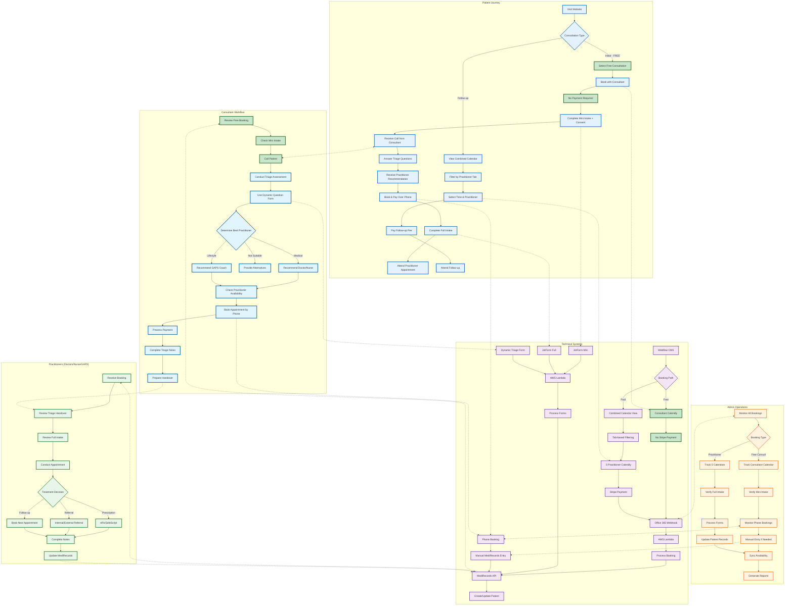

# New Update Comprehensive Booking System Flow

## Overview
This flowchart shows the complete booking ecosystem with all stakeholders: Patient, Consultant, Practitioners (Doctors/Nurse/GAPS Coach), Admin, and Technical Systems for the new multi-practitioner model with free initial consultations.

## Key Features of New System

### 1. **Free Initial Consultation Path**
- Patient books free consultation with consultant
- No payment required upfront
- Mini intake + consent form
- Consultant conducts triage
- Phone booking with payment for practitioner

### 2. **Multi-Practitioner Environment**
- 2 Doctors
- 1 Nurse Practitioner
- 1 GAPS Coach
- 1 Consultant (for triage)
- Each with dedicated Calendly calendar

### 3. **Enhanced Booking Options**
- Combined calendar view for follow-ups
- Tab-based filtering by practitioner
- Direct booking for returning patients
- Phone booking for new patients after triage

### 4. **Improved Information Flow**
- Triage assessment captures detailed info
- Handover from consultant to practitioner
- Dynamic forms adapt to patient needs
- Complete patient history available

### 5. **Technical Enhancements**
- 5 separate Calendly integrations
- Dynamic form processing
- Phone booking support
- Enhanced webhook processing
- Multiple form types (mini, full, dynamic)

## Integration Points

### Patient ↔ Consultant
- Phone consultation for triage
- Practitioner recommendation
- Phone booking assistance

### Consultant ↔ Practitioner
- Triage notes handover
- Patient context transfer
- Treatment recommendations

### Systems ↔ Admin
- Booking notifications
- Form submissions
- Manual interventions
- Availability sync

### Technical ↔ Clinical
- Automated data flow
- Manual backup processes
- Real-time updates
- Error handling

## Process Flows

### Initial Consultation (Free)
1. Patient books free slot with consultant
2. Completes mini intake + consent
3. Consultant calls for triage
4. Consultant books practitioner appointment
5. Patient pays over phone
6. Completes full intake
7. Attends practitioner appointment

### Follow-up Consultation
1. Patient views combined calendar
2. Filters by preferred practitioner
3. Selects time and books
4. Pays online
5. Attends appointment

### Manual Interventions
- Admin monitors all bookings
- Syncs availability across systems
- Handles phone booking entries
- Manages form processing issues
- Generates required reports