# New Consultant Triage Flow

## Overview
This flowchart represents the consultant's workflow for conducting free initial consultations and triaging patients to appropriate practitioners.

```mermaid
flowchart TD
    %% Pre-Appointment
    Start([Appointment Time]) --> OpenSystem[Open MediRecords]
    OpenSystem --> ReviewBooking[Review Free Consultation Booking]
    
    ReviewBooking --> CheckIntake[Review Mini Intake Form]
    CheckIntake --> PrepareQuestions[Prepare Triage Questions]
    PrepareQuestions --> GetPhone[Get Patient Phone Number]
    
    %% Initial Contact
    GetPhone --> CallPatient[Call Patient]
    CallPatient --> Introduction[Introduce Self & Service]
    Introduction --> VerifyIdentity[Verify Patient Identity]
    
    %% Triage Assessment
    VerifyIdentity --> BeginTriage[Begin Triage Assessment]
    BeginTriage --> OpenDynamicForm[Open Dynamic Question Form]
    
    OpenDynamicForm --> AskQuestions{Dynamic Questioning}
    AskQuestions --> HealthHistory[Health History Questions]
    AskQuestions --> CurrentConcerns[Current Health Concerns]
    AskQuestions --> Goals[Treatment Goals]
    AskQuestions --> Preferences[Care Preferences]
    
    HealthHistory --> RecordAnswers[Record in Dynamic Form]
    CurrentConcerns --> RecordAnswers
    Goals --> RecordAnswers
    Preferences --> RecordAnswers
    
    %% Eligibility Assessment
    RecordAnswers --> AssessEligibility{Assess Eligibility}
    
    AssessEligibility -->|Complex Mental Health| MHReferral[Mental Health Referral Needed]
    AssessEligibility -->|Medical Needs| MedicalAssess{Medical Assessment}
    AssessEligibility -->|Coaching Suitable| CoachingAssess[GAPS Coaching Appropriate]
    AssessEligibility -->|Not Suitable| NotEligible[Alternative Resources]
    
    %% Medical Assessment Path
    MedicalAssess -->|Complex Medical| DoctorNeeded[Doctor Required]
    MedicalAssess -->|Routine Care| NurseAppropriate[Nurse Practitioner Suitable]
    
    %% Practitioner Recommendation
    DoctorNeeded --> DoctorChoice{Doctor Selection}
    DoctorChoice -->|Based on Specialty| RecDoc1[Recommend Dr Dia]
    DoctorChoice -->|Based on Availability| RecDoc2[Recommend Doctor 2]
    
    NurseAppropriate --> RecNurse[Recommend Nurse Practitioner]
    CoachingAssess --> RecGAPS[Recommend Ramona - GAPS Coach]
    
    %% Information Gathering
    RecDoc1 --> GatherInfo[Gather Additional Info Needed]
    RecDoc2 --> GatherInfo
    RecNurse --> GatherInfo
    RecGAPS --> GatherInfo
    
    GatherInfo --> InfoChecklist{Information Checklist}
    InfoChecklist --> Medicare[Medicare Details]
    InfoChecklist --> Insurance[Insurance Info]
    InfoChecklist --> Medications[Current Medications]
    InfoChecklist --> Allergies[Allergies]
    
    %% Phone Booking Process
    Medicare --> PhoneBooking[Begin Phone Booking]
    Insurance --> PhoneBooking
    Medications --> PhoneBooking
    Allergies --> PhoneBooking
    
    PhoneBooking --> CheckAvailability[Check Practitioner Availability]
    CheckAvailability --> OfferTimes[Offer Available Times]
    OfferTimes --> PatientSelects[Patient Selects Time]
    
    PatientSelects --> ConfirmDetails[Confirm Appointment Details]
    ConfirmDetails --> ExplainFees[Explain Fees for Service]
    ExplainFees --> ProcessPayment[Take Payment Over Phone]
    ProcessPayment --> VerifyPayment[Verify Credit Card Payment Processed]
    
    VerifyPayment --> BookingComplete[Practitioner Booking Confirmed]
    
    %% Alternative Paths
    MHReferral --> ProvideResources[Provide MH Resources]
    NotEligible --> ProvideAlternatives[Provide Alternative Options]
    
    ProvideResources --> DocumentReferral[Document Referral]
    ProvideAlternatives --> DocumentReferral
    
    %% Post-Call Tasks
    BookingComplete --> CompleteForm[Complete Dynamic Form]
    DocumentReferral --> CompleteForm
    
    CompleteForm --> SubmitForm[Submit Dynamic Form]
    
    SubmitForm --> FormProcessing{Automatic Processing}
    FormProcessing --> UpdateMediRecords[Update MediRecords]
    FormProcessing --> SendAdmin[Copy to enquiries@botaniqal.com.au]
    FormProcessing --> SendPatient[Copy to Patient Email]
    
    UpdateMediRecords --> UpdateNotes[Clinical Notes Updated]
    SendAdmin --> NotifyAdmin[Admin Notified]
    SendPatient --> PatientRecord[Patient Has Record]
    
    UpdateNotes --> PrepareHandover[Prepare Practitioner Handover]
    NotifyAdmin --> PrepareHandover
    PatientRecord --> PrepareHandover
    
    PrepareHandover --> FollowUp{Follow-up Needed?}
    FollowUp -->|Yes| ScheduleFollowUp[Schedule Follow-up Call]
    FollowUp -->|No| Complete[Complete Consultation]
    
    ScheduleFollowUp --> End([End])
    Complete --> End
    
    %% No Show Protocol
    CallPatient -->|No Answer| RetryCall{Retry?}
    RetryCall -->|Yes| CallPatient
    RetryCall -->|No| DocumentNoShow[Document No Show]
    DocumentNoShow --> NotifyAdmin2[Notify Admin]
    NotifyAdmin2 --> End
    
    %% Styling
    classDef consultant fill:#e1f5fe,stroke:#01579b,stroke-width:3px
    classDef form fill:#e0f2f1,stroke:#00695c,stroke-width:2px
    classDef decision fill:#f3e5f5,stroke:#4a148c,stroke-width:2px
    classDef booking fill:#fff3e0,stroke:#e65100,stroke-width:3px
    classDef referral fill:#ffebee,stroke:#c62828,stroke-width:2px
    classDef complete fill:#e8f5e9,stroke:#2e7d32,stroke-width:2px
    
    class Start,CallPatient,Introduction,BeginTriage consultant
    class OpenDynamicForm,RecordAnswers,CompleteForm,SubmitForm form
    class AskQuestions,AssessEligibility,MedicalAssess,DoctorChoice,InfoChecklist,FollowUp decision
    class PhoneBooking,CheckAvailability,OfferTimes,ProcessPayment,BookingComplete booking
    class MHReferral,NotEligible,ProvideResources,ProvideAlternatives,DocumentReferral referral
    class UpdateNotes,PrepareHandover,Complete complete
```

## Consultant Workflow Details

### Pre-Call Preparation
1. **Review booking**: Check free consultation appointment
2. **Mini intake review**: Understand basic patient information
3. **Prepare questions**: Based on initial information
4. **Get contact details**: Phone number from MediRecords

### Triage Assessment Process
1. **Introduction**: Explain free consultation purpose
2. **Dynamic questioning**: Use form to guide assessment
   - Health history
   - Current concerns
   - Treatment goals
   - Care preferences
3. **Record responses**: Document in dynamic form

### Practitioner Matching
1. **Assess needs**: Determine appropriate care level
2. **Match practitioner**:
   - Dr Dia or Dr. Shivani: Complex medical needs
   - Nurse Practitioner: Routine care
   - Ramona - GAPS Coach: Lifestyle/nutrition focus
3. **Consider availability**: Factor in scheduling

### Information Gathering
1. **Essential details**: Medicare, insurance, medications
2. **Eligibility check**: Ensure patient qualifies
3. **Additional needs**: Identify any special requirements

### Phone Booking Process
1. **Check availability**: Real-time calendar access
2. **Offer times**: Present suitable options  
3. **Confirm time**: Lock in appointment slot
4. **Explain fees**: Clear pricing for service
5. **Take payment**: Process payment over phone
6. **Verify payment**: Ensure payment successful
7. **Confirm booking**: Send confirmation details

### Post-Call Tasks
1. **Complete dynamic form**: Finish assessment during call
2. **Submit form**: Triggers automatic processing:
   - Updates MediRecords with patient data
   - Sends copy to admin email (enquiries@botaniqal.com.au)
   - Sends copy to patient for their records
3. **Prepare handover**: Brief for practitioner with all info from dynamic form
4. **No additional forms**: Dynamic form is complete intake - nothing else needed
5. **Admin notification**: Alert to new booking

### Alternative Pathways
- **Mental health needs**: Provide appropriate resources
- **Not eligible**: Offer alternative options
- **Documentation**: Record all referrals

## Key Tools
- **MediRecords**: Patient information and booking
- **Dynamic Form**: Guided triage questions
- **Phone System**: Secure payment processing
- **Calendar Access**: All practitioner availability

## Success Metrics
- Complete triage in 20-30 minutes
- Accurate practitioner matching
- Smooth phone booking process
- Clear patient communication
- Proper documentation