# New Update Booking Technical Flow

## Overview
This flowchart represents the updated technical architecture with multiple practitioner calendars, dynamic forms, and enhanced booking flows.

```mermaid
flowchart TD
    %% User Interface Layer
    User[User Browser] --> Webflow[Webflow CMS]
    Webflow --> BookingType{Booking Type Selection}
    
    %% Initial Consultation Path - FREE
    BookingType -->|Initial FREE| ConsultantCalendly[Embedded Consultant Calendly]
    ConsultantCalendly --> NoStripe[✓ No Payment Required]
    NoStripe --> CalendarEvent1[Create Calendar Event]
    
    CalendarEvent1 --> ConsultantO365[Consultant Office 365]
    ConsultantO365 --> MSGraphWebhook1[MS Graph Webhook]
    
    %% Follow-up Path - Combined Calendar
    BookingType -->|Follow-up| CombinedView[Combined Calendar View]
    CombinedView --> TabFilter{Tab Selection}
    
    TabFilter -->|All| ShowAllCalendars[Display All Practitioners]
    TabFilter -->|Dr Dia| ShowDoc1Cal[Dr Dia Calendly]
    TabFilter -->|Doctor 2| ShowDoc2Cal[Doctor 2 Calendly]
    TabFilter -->|Nurse| ShowNurseCal[Nurse Calendly]
    TabFilter -->|Ramona| ShowGAPSCal[Ramona Calendly]
    
    ShowAllCalendars --> SelectPractitioner[Select Time & Practitioner]
    ShowDoc1Cal --> SelectPractitioner
    ShowDoc2Cal --> SelectPractitioner
    ShowNurseCal --> SelectPractitioner
    ShowGAPSCal --> SelectPractitioner
    
    SelectPractitioner --> StripePayment[Stripe Payment]
    StripePayment --> CalendarEvent2[Create Calendar Event]
    
    %% Calendar Integration - Multiple Practitioners
    CalendarEvent2 --> PractitionerO365{Route to Practitioner}
    PractitionerO365 -->|Dr Dia| Doc1O365[Dr Dia Office 365]
    PractitionerO365 -->|Doctor 2| Doc2O365[Doctor 2 Office 365]
    PractitionerO365 -->|Nurse| NurseO365[Nurse Office 365]
    PractitionerO365 -->|GAPS| GAPSO365[GAPS Office 365]
    
    Doc1O365 --> MSGraphWebhook2[MS Graph Webhook]
    Doc2O365 --> MSGraphWebhook2
    NurseO365 --> MSGraphWebhook2
    GAPSO365 --> MSGraphWebhook2
    
    %% Webhook Processing
    MSGraphWebhook1 --> WebhookRenewal[Auto-Renewal System]
    MSGraphWebhook2 --> WebhookRenewal
    WebhookRenewal --> AWSGateway[AWS API Gateway]
    
    AWSGateway --> Lambda1[Lambda - Booking Processor]
    Lambda1 --> ExtractCalendarData[Extract Calendar Data]
    ExtractCalendarData --> IdentifyType{Identify Booking Type}
    
    IdentifyType -->|Initial Free| ProcessFreeConsult[Process Free Consultation]
    IdentifyType -->|Paid Booking| ProcessPaidBooking[Process Paid Booking]
    
    %% MediRecords Integration
    ProcessFreeConsult --> PythonLib1[Custom Python Library]
    ProcessPaidBooking --> PythonLib1
    
    PythonLib1 --> MediRecordsAPI[MediRecords API]
    MediRecordsAPI --> CheckPatient{Patient Exists?}
    
    CheckPatient -->|No| CreatePatient[Create New Patient]
    CheckPatient -->|Yes| UpdatePatient[Update Patient]
    
    CreatePatient --> AddPlaceholders[Add Placeholder Data]
    AddPlaceholders --> CreateBooking[Create MediRecords Booking]
    UpdatePatient --> CreateBooking
    
    CreateBooking --> AssignCalendar{Assign to Calendar}
    AssignCalendar -->|Consultant| ConsultantMediCal[Consultant MediRecords Calendar]
    AssignCalendar -->|Dr Dia| Doc1MediCal[Dr Dia MediRecords Calendar]
    AssignCalendar -->|Doctor 2| Doc2MediCal[Doctor 2 MediRecords Calendar]
    AssignCalendar -->|Nurse| NurseMediCal[Nurse MediRecords Calendar]
    AssignCalendar -->|GAPS| GAPSMediCal[GAPS MediRecords Calendar]
    
    %% Form Processing - Multiple Types
    CalendarEvent1 --> MiniIntakeForm[Embedded JotForm - Mini Intake]
    CalendarEvent2 --> FullIntakeForm[Embedded JotForm - Full Intake]
    
    MiniIntakeForm --> SubmitMini[Submit Mini Form]
    FullIntakeForm --> SubmitFull[Submit Full Form]
    
    %% Dynamic Form for Consultant
    ConsultantMediCal --> ConsultantAppt[Consultant Appointment]
    ConsultantAppt --> DynamicForm[Dynamic Triage Form]
    DynamicForm --> SubmitDynamic[Submit Dynamic Form]
    
    %% All Forms Process Through Same Pipeline
    SubmitMini --> JotFormWebhook[JotForm Webhook]
    SubmitFull --> JotFormWebhook
    SubmitDynamic --> JotFormWebhook
    
    JotFormWebhook --> AWSGateway2[AWS API Gateway - Forms]
    AWSGateway2 --> Lambda2[Lambda - Form Processor]
    
    Lambda2 --> ParseFormData[Parse Form Data]
    ParseFormData --> IdentifyFormType{Identify Form Type}
    
    IdentifyFormType -->|Mini Intake| ProcessMini[Process Mini Intake]
    IdentifyFormType -->|Full Intake| ProcessFull[Process Full Intake]
    IdentifyFormType -->|Dynamic Triage| ProcessDynamic[Process Triage Data]
    
    ProcessMini --> PythonLib2[Custom Python Library]
    ProcessFull --> PythonLib2
    ProcessDynamic --> PythonLib2
    
    PythonLib2 --> MediRecordsAPI2[MediRecords API]
    MediRecordsAPI2 --> UpdatePatientDetails[Update Patient Details]
    UpdatePatientDetails --> ReplacePlaceholders[Replace Placeholders]
    
    %% Notifications - Enhanced
    CreateBooking --> NotificationSystem{Notification Router}
    NotificationSystem --> EmailNotify[Email Notifications]
    NotificationSystem --> SMSNotify[SMS Notifications]
    NotificationSystem --> CalendarInvite[Calendar Invites]
    
    EmailNotify --> PatientEmail[Patient Email]
    EmailNotify --> EnquiriesEmail[Enquiries Email]
    SMSNotify --> MediRecordsSMS[MediRecords SMS Service]
    CalendarInvite --> PatientCalendar[Patient Calendar App]
    
    %% Phone Booking Integration
    ConsultantAppt --> PhoneBooking[Manual Phone Booking]
    PhoneBooking --> AdminEntry[Admin Manual Entry]
    AdminEntry --> DirectMediRecords[Direct MediRecords Entry]
    DirectMediRecords --> CreateBooking
    
    %% Data Storage
    Lambda1 -.-> CloudWatchLogs1[CloudWatch Logs]
    Lambda2 -.-> CloudWatchLogs2[CloudWatch Logs]
    MediRecordsAPI -.-> MediDB[(MediRecords DB)]
    PractitionerO365 -.-> O365Storage[(Office 365 Storage)]
    
    %% Styling
    classDef webflow fill:#e3f2fd,stroke:#1976d2,stroke-width:3px
    classDef calendly fill:#fff3e0,stroke:#e65100,stroke-width:2px
    classDef aws fill:#fff8e1,stroke:#f57c00,stroke-width:3px
    classDef medirecords fill:#e8f5e9,stroke:#2e7d32,stroke-width:2px
    classDef form fill:#e0f2f1,stroke:#00695c,stroke-width:3px
    classDef notification fill:#ffebee,stroke:#c62828,stroke-width:2px
    classDef decision fill:#f3e5f5,stroke:#4a148c,stroke-width:2px
    classDef free fill:#c8e6c9,stroke:#2e7d32,stroke-width:3px
    
    class Webflow,CombinedView,TabFilter webflow
    class ConsultantCalendly,ShowDoc1Cal,ShowDoc2Cal,ShowNurseCal,ShowGAPSCal calendly
    class AWSGateway,AWSGateway2,Lambda1,Lambda2,CloudWatchLogs1,CloudWatchLogs2 aws
    class MediRecordsAPI,MediRecordsAPI2,ConsultantMediCal,Doc1MediCal,Doc2MediCal,NurseMediCal,GAPSMediCal medirecords
    class MiniIntakeForm,FullIntakeForm,DynamicForm,JotFormWebhook form
    class EmailNotify,SMSNotify,CalendarInvite,PatientEmail,EnquiriesEmail notification
    class BookingType,IdentifyType,CheckPatient,AssignCalendar,IdentifyFormType,NotificationSystem decision
    class NoStripe,ConsultantCalendly,ProcessFreeConsult free
```

## Technical Implementation Details

### Frontend Changes
- **Dynamic Tab System**: JavaScript for calendar filtering
- **Multiple Embedded Calendly**: 5 separate calendar widgets
- **Form Variations**: Mini intake, full intake, dynamic triage
- **No Payment Flow**: Special handling for free consultations

### Calendar Integration (5 Separate Flows)
1. **Consultant Calendar**: Free initial consultations
2. **Dr Dia Calendar**: Medical appointments
3. **Doctor 2 Calendar**: Medical appointments
4. **Nurse Practitioner Calendar**: Nursing appointments
5. **GAPS Coach Calendar**: Coaching sessions

### AWS Lambda Functions
- **Booking Processor**: Enhanced to handle multiple practitioner types
- **Form Processor**: Handles three form types (mini, full, dynamic)
- **Calendar Router**: Routes to correct MediRecords calendar

### MediRecords Integration
- **5 Practitioner Calendars**: Each practitioner has separate calendar
- **Patient Routing**: Automatic assignment to correct practitioner
- **Dynamic Form Support**: New API endpoints for triage data

### Key Technical Changes
1. **No Stripe for Initial**: Bypass payment for consultant bookings
2. **Combined Calendar View**: Aggregate availability display
3. **Tab-based Filtering**: Client-side calendar switching
4. **Dynamic Form Integration**: New form type for triage
5. **Phone Booking Support**: Manual entry workflow

### Database Schema Updates
- New practitioner type field
- Triage assessment storage
- Phone booking tracking
- Multi-calendar associations

### API Endpoints
- `/booking/consultant` - Free consultation bookings
- `/booking/practitioner` - Paid practitioner bookings
- `/forms/mini` - Mini intake processing
- `/forms/full` - Full intake processing
- `/forms/triage` - Dynamic triage form processing
- `/calendars/combined` - Aggregated availability

### Security Considerations
- Practitioner-specific access controls
- Separate calendar permissions
- Phone booking audit trail
- Triage data encryption