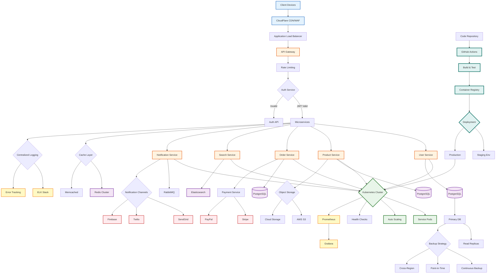

# New Update Technical Architecture Flow

## Overview
This flowchart represents the updated technical architecture ready for deployment.

## Updated Stack

### Frontend
- **Framework**: React 18 with TypeScript
- **State Management**: Redux Toolkit
- **UI Library**: Material-UI
- **Build Tool**: Vite

### Backend
- **Language**: Node.js with TypeScript
- **Framework**: NestJS
- **API**: RESTful + GraphQL
- **Authentication**: JWT with refresh tokens

### Infrastructure
- **Container**: Docker
- **Orchestration**: Kubernetes
- **CI/CD**: GitHub Actions
- **Monitoring**: Prometheus + Grafana
- **Logging**: ELK Stack

### Databases
- **Primary**: PostgreSQL 14
- **Search**: Elasticsearch
- **Cache**: Redis Cluster
- **Queue**: RabbitMQ

### Cloud Services
- **CDN**: CloudFlare
- **Storage**: AWS S3
- **Email**: SendGrid
- **SMS**: Twilio
- **Analytics**: Google Analytics 4

## Key Improvements

### Architecture
- Microservices architecture
- Container orchestration with K8s
- Auto-scaling capabilities
- Service mesh for communication

### Performance
- Response time < 200ms
- 99.9% uptime SLA
- Horizontal scaling
- Optimized caching strategy

### Security
- JWT authentication
- API rate limiting
- WAF protection
- Encrypted data at rest

### Development
- Automated CI/CD pipeline
- Infrastructure as Code
- Blue-green deployments
- Feature flags system