# Coming Soon Admin Workflow - Multi-Service Management

## Overview
Admin workflow for managing multiple services with different appointment types, practitioners, and pricing.

```mermaid
flowchart TD
    Start([Daily Admin Tasks]) --> ServiceDashboard[Multi-Service Dashboard]
    
    ServiceDashboard --> ServiceStatus{Check Service Status}
    
    %% Service Management
    ServiceStatus -->|Active Services| ActiveManagement[Manage Active Services]
    ServiceStatus -->|Coming Soon| WaitlistManagement[Manage Waitlists]
    ServiceStatus -->|All Services| GlobalTasks[Global Admin Tasks]
    
    %% Active Service Management
    ActiveManagement --> ServiceLoop{For Each Active Service}
    
    ServiceLoop -->|Alt Medicine| ManageAlt[Manage Alternative Medicine]
    ServiceLoop -->|GAPS| ManageGAPS[Manage GAPS Program]
    ServiceLoop -->|Weight Loss| ManageWeight[Manage Weight Loss]
    
    %% Service-Specific Tasks
    ManageAlt --> AltTasks{Alt Med Tasks}
    AltTasks --> AltAvail[Check Doctor/Nurse Availability]
    AltTasks --> Alt30min[Verify 30min Slots]
    AltTasks --> AltPrice[Confirm $69 Pricing]
    
    ManageGAPS --> GAPSTasks{GAPS Tasks}
    GAPSTasks --> GAPSAvail[Check Coach Availability]
    GAPSTasks --> GAPS45min[Verify 45min Slots]
    GAPSTasks --> GAPSPrice[Confirm $69 Pricing]
    
    ManageWeight --> WeightTasks{Weight Loss Tasks}
    WeightTasks --> WeightAvail[Check Team Availability]
    WeightTasks --> Weight45min[Verify 45min Slots]
    WeightTasks --> WeightPrice[Confirm $89 Pricing]
    
    %% Availability Synchronization
    AltAvail --> SyncCalendars[Sync MediRecords ↔ Calendly]
    GAPSAvail --> SyncCalendars
    WeightAvail --> SyncCalendars
    
    SyncCalendars --> CalendarMatrix{Calendar Sync Matrix}
    
    CalendarMatrix --> SyncConsultant[Consultant Calendar]
    CalendarMatrix --> SyncPractitioners{Practitioner Calendars}
    
    SyncPractitioners --> SyncDoc1[Doctor 1 Calendar]
    SyncPractitioners --> SyncDoc2[Doctor 2 Calendar]
    SyncPractitioners --> SyncNurse[Nurse Calendar]
    SyncPractitioners --> SyncGAPS[GAPS Coach Calendar]
    
    %% Service-Specific Calendly Setup
    SyncDoc1 --> ServiceSlots1{Configure Service Slots}
    ServiceSlots1 --> Doc1Alt[Alt Med 30min Slots]
    ServiceSlots1 --> Doc1Weight[Weight Loss 45min Slots]
    
    SyncNurse --> ServiceSlots2{Configure Service Slots}
    ServiceSlots2 --> NurseAlt[Alt Med 30min Slots]
    ServiceSlots2 --> NurseWeight[Weight Loss 45min Slots]
    
    SyncGAPS --> ServiceSlots3{Configure Service Slots}
    ServiceSlots3 --> CoachGAPS[GAPS 45min Slots]
    ServiceSlots3 --> CoachWeight[Weight Support 45min]
    
    %% Booking Monitoring
    GlobalTasks --> MonitorBookings[Monitor All Bookings]
    MonitorBookings --> BookingEmails{Check Booking Emails}
    
    BookingEmails --> EmailByService{Sort by Service Type}
    EmailByService -->|Alt Med| AltBookings[Alternative Bookings]
    EmailByService -->|GAPS| GAPSBookings[GAPS Bookings]
    EmailByService -->|Weight Loss| WeightBookings[Weight Bookings]
    EmailByService -->|Free Consult| ConsultBookings[Consultant Bookings]
    
    %% Service-Specific Processing
    AltBookings --> ProcessAlt{Process Alt Med Booking}
    ProcessAlt --> VerifyAlt30[Verify 30min Duration]
    ProcessAlt --> CheckAlt69[Verify $69 Payment]
    
    WeightBookings --> ProcessWeight{Process Weight Booking}
    ProcessWeight --> VerifyWeight45[Verify 45min Duration]
    ProcessWeight --> CheckWeight89[Verify $89 Payment]
    
    %% Intake Form Management
    ConsultBookings --> IntakeManagement[Manage Intake Forms]
    IntakeManagement --> ServiceInterest{Review Service Interest}
    
    ServiceInterest -->|Alt Med Interest| PrepAltPath[Prepare Alt Med Path]
    ServiceInterest -->|GAPS Interest| PrepGAPSPath[Prepare GAPS Path]
    ServiceInterest -->|Weight Interest| PrepWeightPath[Prepare Weight Path]
    ServiceInterest -->|Multiple| PrepMultiPath[Prepare Multi-Service]
    
    %% Waitlist Management
    WaitlistManagement --> WaitlistServices{Coming Soon Services}
    
    WaitlistServices -->|Counseling| CounselWaitlist[Counseling Waitlist]
    WaitlistServices -->|Equine| EquineWaitlist[Equine Waitlist]
    
    CounselWaitlist --> CounselCount[Track Registrations]
    EquineWaitlist --> EquineCount[Track Registrations]
    
    CounselCount --> WaitlistComm[Waitlist Communications]
    EquineCount --> WaitlistComm
    
    WaitlistComm --> MonthlyUpdate[Monthly Update Email]
    MonthlyUpdate --> LaunchPrep[Prepare for Launch]
    
    %% Reporting and Analytics
    GlobalTasks --> ServiceReporting[Service-Level Reporting]
    
    ServiceReporting --> DailyMetrics{Daily Service Metrics}
    
    DailyMetrics --> ServiceBookings[Bookings by Service]
    DailyMetrics --> ServiceRevenue[Revenue by Service]
    DailyMetrics --> ServiceUtilization[Practitioner Utilization]
    DailyMetrics --> ServiceConversion[Conversion by Service]
    
    ServiceBookings --> CreateReports[Generate Reports]
    ServiceRevenue --> CreateReports
    ServiceUtilization --> CreateReports
    ServiceConversion --> CreateReports
    
    %% Manual Interventions
    GlobalTasks --> ManualTasks[Manual Service Tasks]
    
    ManualTasks --> PhoneBookings{Phone Booking Entry}
    PhoneBookings --> SelectService[Select Service Type]
    SelectService --> SelectDuration[Select Duration]
    SelectDuration --> CalculatePrice[Apply Service Pricing]
    CalculatePrice --> ManualEntry[Enter in MediRecords]
    
    %% Service Configuration
    GlobalTasks --> ServiceConfig[Service Configuration]
    
    ServiceConfig --> UpdateServices{Update Service Settings}
    UpdateServices --> AddService[Add New Service]
    UpdateServices --> ModifyService[Modify Existing]
    UpdateServices --> ToggleService[Activate/Deactivate]
    
    %% End of Day
    CreateReports --> DailyReview[Daily Service Review]
    ManualEntry --> DailyReview
    LaunchPrep --> DailyReview
    DailyReview --> PrepTomorrow[Prepare Next Day]
    PrepTomorrow --> End([End Admin Tasks])
    
    %% Styling
    classDef active fill:#e8f5e9,stroke:#2e7d32,stroke-width:3px
    classDef coming fill:#fff3e0,stroke:#ef6c00,stroke-width:2px,stroke-dasharray: 5 5
    classDef task fill:#e1f5fe,stroke:#01579b,stroke-width:2px
    classDef sync fill:#f3e5f5,stroke:#6a1b9a,stroke-width:2px
    classDef report fill:#fff8e1,stroke:#f57c00,stroke-width:2px
    
    class ManageAlt,ManageGAPS,ManageWeight,AltBookings,GAPSBookings,WeightBookings active
    class CounselWaitlist,EquineWaitlist,WaitlistComm,LaunchPrep coming
    class AltTasks,GAPSTasks,WeightTasks,GlobalTasks,ManualTasks task
    class SyncCalendars,CalendarMatrix,SyncPractitioners sync
    class ServiceReporting,DailyMetrics,CreateReports report
```



## Admin Workflow Key Components

### Service-Specific Management

#### Active Services (Alt Med, GAPS, Weight Loss)
1. **Availability Management**
   - Service-specific time slots
   - Practitioner assignments
   - Duration verification

2. **Pricing Verification**
   - Service-based pricing
   - Payment confirmation
   - Billing code accuracy

3. **Calendar Synchronization**
   - Multiple appointment types
   - Service-duration matching
   - Cross-platform sync

#### Coming Soon Services
1. **Waitlist Management**
   - Registration tracking
   - Interest analytics
   - Launch preparation

2. **Communication**
   - Monthly updates
   - Launch announcements
   - Early access offers

### Daily Tasks by Service

#### Alternative Medicine
- 30-minute slot verification
- $69 payment confirmation
- Doctor/Nurse availability

#### GAPS Coaching
- 45-minute slot verification
- $69 payment confirmation
- Coach availability

#### Weight Loss Program
- 45-minute slot verification
- $89 payment confirmation
- Multi-practitioner coordination

### Reporting Structure
```
Daily Service Report
├── Bookings
│   ├── Alt Med: X bookings
│   ├── GAPS: Y bookings
│   └── Weight Loss: Z bookings
├── Revenue
│   ├── Alt Med: $XXX
│   ├── GAPS: $YYY
│   └── Weight Loss: $ZZZ
├── Utilization
│   ├── By Service
│   └── By Practitioner
└── Waitlist Growth
    ├── Counseling: +X
    └── Equine: +Y
```

### Manual Processes
1. **Multi-Service Phone Bookings**
   - Service selection
   - Duration selection
   - Price calculation
   - Manual entry

2. **Service Configuration**
   - Add new services
   - Update pricing
   - Modify durations
   - Toggle availability