# Admin Dashboard Flow - Future Options

## Overview
This flowchart shows the enhanced admin dashboard for managing multiple services, including active services and waitlisted offerings.

```mermaid
graph TD
    Start([Admin Login]) --> Auth{Authentication}
    
    Auth -->|Failed| LoginFail[Login Failed]
    LoginFail --> Start
    
    Auth -->|Success| Dashboard[Multi-Service Dashboard]
    
    %% Main Dashboard
    Dashboard --> ServiceOverview[Service Portfolio Overview]
    
    ServiceOverview --> ServiceStats{View Service Stats}
    
    %% Service-Specific Views
    ServiceStats --> AltMed[Alternative Medicine<br/>Active: 150 patients]
    ServiceStats --> GAPS[GAPS Coaching<br/>Active: 45 patients]
    ServiceStats --> Weight[Weight Loss<br/>Active: 78 patients]
    ServiceStats --> Counsel[Counseling<br/>Waitlist: 32 interested]
    ServiceStats --> Equine[Equine Therapy<br/>Waitlist: 18 interested]
    
    %% Management Options
    Dashboard --> AdminTasks{Admin Functions}
    
    AdminTasks --> ServiceMgmt[Service Management]
    AdminTasks --> PractMgmt[Practitioner Management]
    AdminTasks --> WaitlistMgmt[Waitlist Management]
    AdminTasks --> Analytics[Analytics & Reports]
    AdminTasks --> ConfigMgmt[Configuration]
    
    %% Service Management
    ServiceMgmt --> ServiceActions{Service Actions}
    ServiceActions --> EnableService[Enable/Disable Service]
    ServiceActions --> PricingUpdate[Update Pricing]
    ServiceActions --> AvailabilitySet[Set Availability]
    ServiceActions --> ServiceRules[Service Rules]
    
    %% Practitioner Management
    PractMgmt --> PractView[View All Practitioners]
    PractView --> PractUtil{Utilization by Service}
    
    PractUtil --> DocUtil[Doctors: 85% utilized<br/>Alt Med + Weight Loss]
    PractUtil --> NurseUtil[Nurse: 75% utilized<br/>Alt Med + Weight Loss]
    PractUtil --> GAPSUtil[GAPS Coach: 90% utilized<br/>GAPS + Free Consults]
    PractUtil --> FutureHires[Future Hires:<br/>Counselor, Equine Therapist]
    
    %% Waitlist Management
    WaitlistMgmt --> WaitlistView{Waitlist Actions}
    
    WaitlistView --> ViewInterest[View Interest Levels]
    WaitlistView --> ContactWaitlist[Contact Waitlisted Patients]
    WaitlistView --> ConvertReady[Convert to Active]
    WaitlistView --> WaitlistAnalytics[Waitlist Analytics]
    
    ViewInterest --> ServiceDemand[Service Demand Analysis]
    ContactWaitlist --> CampaignCreate[Create Launch Campaign]
    ConvertReady --> ActivateService[Activate Service Flow]
    
    %% Analytics Dashboard
    Analytics --> AnalyticsType{Analytics Views}
    
    AnalyticsType --> ServiceAnalytics[By Service Line]
    AnalyticsType --> PractAnalytics[By Practitioner]
    AnalyticsType --> RevenueAnalytics[Revenue Analysis]
    AnalyticsType --> ConversionAnalytics[Funnel Conversions]
    
    ServiceAnalytics --> ServiceMetrics[Service Performance Metrics]
    RevenueAnalytics --> RevenueDash[Multi-Service Revenue]
    
    %% Configuration Management
    ConfigMgmt --> ConfigOptions{Configuration}
    
    ConfigOptions --> CalendarConfig[Calendar Settings]
    ConfigOptions --> FormConfig[Intake Forms]
    ConfigOptions --> NotificationConfig[Notifications]
    ConfigOptions --> IntegrationConfig[Integrations]
    
    CalendarConfig --> ServiceCalendars[Service-Specific Calendars]
    FormConfig --> DynamicForms[Dynamic Form Rules]
    
    %% Reporting
    ServiceMetrics --> GenerateReport[Generate Reports]
    RevenueDash --> GenerateReport
    ServiceDemand --> GenerateReport
    
    GenerateReport --> ExportOptions{Export Format}
    ExportOptions --> PDF[PDF Report]
    ExportOptions --> Excel[Excel Export]
    ExportOptions --> Email[Email Report]
    
    %% Styling
    classDef dashboard fill:#e3f2fd,stroke:#1565c0,stroke-width:3px
    classDef active fill:#e8f5e9,stroke:#2e7d32,stroke-width:2px
    classDef waitlist fill:#fff3e0,stroke:#ef6c00,stroke-width:2px
    classDef analytics fill:#f3e5f5,stroke:#7b1fa2,stroke-width:2px
    classDef config fill:#e0f2f1,stroke:#00796b,stroke-width:2px
    
    class Dashboard,ServiceOverview,AdminTasks dashboard
    class AltMed,GAPS,Weight,ServiceMgmt,PractMgmt active
    class Counsel,Equine,WaitlistMgmt,ViewInterest,ContactWaitlist waitlist
    class Analytics,ServiceAnalytics,RevenueAnalytics analytics
    class ConfigMgmt,CalendarConfig,FormConfig config
```



## Admin Functions by Service Status

### Active Services Management
**Alternative Medicine, GAPS, Weight Loss**

1. **Real-time Monitoring**
   - Active patient count
   - Appointment utilization
   - Revenue tracking
   - Practitioner workload

2. **Service Configuration**
   - Pricing adjustments
   - Duration settings
   - Availability windows
   - Practitioner assignments

3. **Performance Analytics**
   - Conversion rates from funnels
   - Patient retention
   - Revenue per service
   - Growth trends

### Waitlist Services Management
**Counseling, Equine Therapy**

1. **Interest Tracking**
   - Waitlist signups by source
   - Geographic distribution
   - Requested features
   - Contact preferences

2. **Launch Preparation**
   - Practitioner recruitment status
   - Infrastructure readiness
   - Marketing campaign planning
   - Conversion projections

3. **Communication Tools**
   - Bulk email to waitlist
   - SMS notifications
   - Launch announcements
   - Early bird offers

## Key Dashboard Sections

### 1. Service Portfolio Overview
```
┌─────────────────────────────────────────────────┐
│  Active Services          Waitlist Services      │
├─────────────────────────────────────────────────┤
│  ✅ Alt Medicine (150)    ⏳ Counseling (32)    │
│  ✅ GAPS (45)            ⏳ Equine (18)        │
│  ✅ Weight Loss (78)                            │
└─────────────────────────────────────────────────┘
```

### 2. Revenue Dashboard
- **By Service**: Comparative revenue analysis
- **By Practitioner**: Individual performance
- **By Time Period**: Daily/Weekly/Monthly
- **By Source**: Funnel attribution

### 3. Utilization Metrics
- **Practitioner Load**: Hours booked vs available
- **Service Demand**: Booking patterns
- **Peak Times**: By service and practitioner
- **Capacity Planning**: Future resource needs

### 4. Waitlist Analytics
- **Growth Rate**: Signups over time
- **Conversion Readiness**: Interest to booking potential
- **Geographic Demand**: Location-based interest
- **Competitive Analysis**: Market positioning

## Configuration Management

### Service-Specific Settings
| Service | Duration | Price | Practitioners | Status |
|---------|----------|-------|---------------|---------|
| Alt Medicine | 15-20 min | $119/$79 | 3 | Active |
| GAPS | 60/15 min | $195/$79 | 1 | Active |
| Weight Loss | TBD | TBD | 3 | Active |
| Counseling | TBD | TBD | 0 | Waitlist |
| Equine | TBD | TBD | 0 | Waitlist |

### Dynamic Form Configuration
- **Service Selection**: Which forms for which services
- **Conditional Logic**: Form routing rules
- **Field Mapping**: Service-specific fields
- **Validation Rules**: Required information

### Integration Management
- **Calendly**: Multiple calendar configurations
- **Payment**: Service-specific processing
- **Communications**: Automated messaging
- **Analytics**: Third-party tracking

## Role-Based Access

### Super Admin
- Full system access
- Service enable/disable
- Pricing changes
- System configuration

### Service Manager
- Service-specific access
- Practitioner scheduling
- Report generation
- Waitlist management

### Support Staff
- View-only analytics
- Basic reporting
- Patient communications
- Appointment monitoring

## Automated Workflows

### Daily Tasks
- Utilization reports
- Waitlist growth tracking
- Revenue reconciliation
- Appointment confirmations

### Weekly Tasks
- Service performance review
- Practitioner meeting prep
- Waitlist engagement campaigns
- Capacity planning

### Monthly Tasks
- Revenue analysis
- Service expansion planning
- Practitioner performance reviews
- System optimization

[← Back to Roles Overview](../../roles/README.md) | [Next: Consultant Flow →](../consultant/consultant-triage-flow.md)