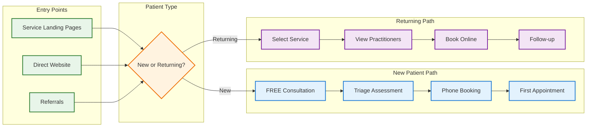

# Fully Operational Variation - Patient Booking System

## System Overview
The fully operational booking system supports 5 distinct services with 8 practitioners, offering both new patient triage and self-service follow-up booking.

> **Note**: This is the simplified, modular version. For the original comprehensive flowchart, see [patient-booking-flow-original.md](./patient-booking-flow-original.md)

### 🔍 Quick Navigation
- **[Master Overview](./patient-booking-overview.md)** - High-level system view
- **[New Patient Journey](./new-patient-journey.md)** - First-time patient experience  
- **[Returning Patient Flow](./returning-patient-flow.md)** - Follow-up booking process
- **[Service Triage Process](../consultant/service-triage-process.md)** - Assessment and matching
- **[Phone Booking Process](../consultant/phone-booking-process.md)** - Consultant-assisted booking

## Simplified System Flow

## Complete Service Portfolio

### Active Services

| Service | Initial Consult | Follow-up | Practitioners |
|---------|----------------|-----------|---------------|
| **Alternative Medicine** | $119 AUD (15-20 min) | $79 AUD (10-15 min) | Dr Dia, Dr. Shivani*, Nurse |
| **GAPS Diet Coaching** | $195 AUD (60 min) | $79 AUD (15 min) | Ramona |
| **Weight Loss Program** | TBD | TBD | Dr Dia, Dr. Shivani*, Nurse |
| **Counseling Services** | TBD | TBD | Counselor |
| **Equine Therapy** | TBD | TBD | Equine Therapist |

*Dr. Shivani offers both telehealth and in-person appointments in Melbourne

### Practitioner Team (8 Total)

1. **Consultant Role** - Currently performed by Ramona
2. **Dr Dia** - Telehealth (Alt Med & Weight Loss)
3. **Doctor 2 (Dr. Shivani)** - Telehealth & Melbourne (Alt Med & Weight Loss)
4. **Nurse Practitioner** - Telehealth (Alt Med & Weight Loss)
5. **Ramona (GAPS Coach)** - GAPS specialty + free consultations
6. **Counselor** - Online mental health
7. **Equine Therapist** - In-person therapy
8. *(One additional practitioner)*

## Key System Features

### 🎯 For New Patients
- **FREE 20-minute consultation** with no upfront payment
- **Dynamic intake forms** selected during consultation
- **Personalized triage** to match with right practitioner
- **Phone-assisted booking** for first appointment
- **Multiple service options** with integrated care planning

### 🔄 For Returning Patients  
- **Direct online booking** without phone calls
- **Service-filtered calendars** showing only relevant practitioners
- **Combined practitioner view** for services with multiple providers
- **Self-service payment** with multiple options
- **24/7 accessibility** for convenient scheduling

### 💻 Technical Capabilities
- **15+ appointment types** across all services
- **Service-practitioner matrix** for smart routing
- **Dynamic form system** for customized intake
- **Integrated billing** supporting multiple services
- **Comprehensive reporting** by service line

## Process Highlights

### New Patient Experience
1. Enter through service-specific marketing funnel
2. Book free consultation (no payment required)
3. Receive triage call from Ramona/Consultant
4. Complete dynamic intake form during call
5. Get matched with appropriate practitioner(s)
6. Book and pay for first appointment over phone

### Returning Patient Experience
1. Access follow-up booking page directly
2. Select service type needed
3. View combined calendar of available practitioners
4. Choose preferred time and practitioner
5. Complete booking and payment online
6. Receive instant confirmation

## Implementation Complexity

### Why Multiple Documents?
The fully operational system involves:
- 5 distinct service lines
- 8 practitioners with different specialties
- Complex triage and matching logic
- Multiple booking pathways
- Integrated care coordination

Breaking this into focused documents improves:
- **Readability**: Each flow is digestible
- **Maintenance**: Updates are localized
- **Training**: Staff can focus on their area
- **Development**: Teams can work in parallel

### Integration Points
- Webflow CMS for content management
- Calendly for appointment scheduling
- MediRecords for clinical records
- AWS Lambda for complex routing logic
- Payment gateway for transactions

---

📚 **For detailed flows, please refer to the linked documents above. Each provides a focused view of specific aspects of the booking system.**