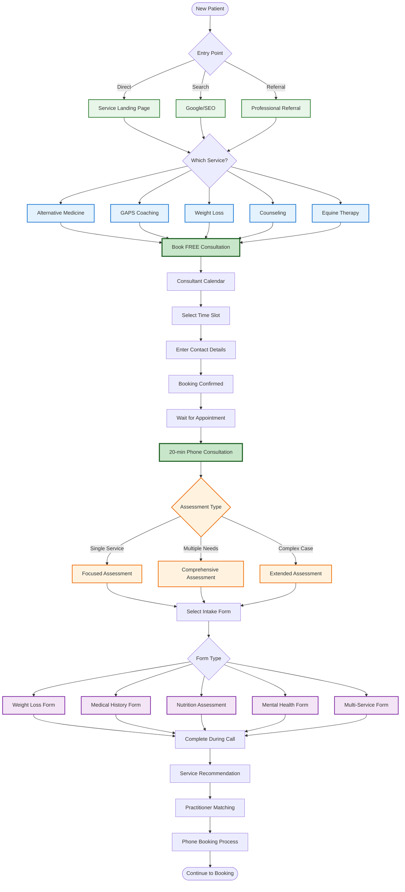

# New Patient Journey - Detailed Flow

## Overview
This diagram shows the complete journey for first-time patients from landing page to first appointment.

## Process Details

### 1. Entry Points
- **Service Landing Pages**: Targeted marketing funnels
- **SEO/Search**: Organic search results
- **Professional Referrals**: GP or specialist referrals

### 2. Free Consultation Booking
- No payment required
- 20-minute phone consultation
- Basic contact information only
- Immediate confirmation

### 3. Consultation Process

#### Who Performs Consultations?
- **Currently**: Ramona (GAPS Coach) handles all free consultations
- **Future**: May transition to dedicated consultant role

#### Dynamic Form Selection
The consultant selects appropriate intake forms based on:
- Patient's stated interests
- Health concerns discussed
- Service preferences
- Complexity of needs

#### Form Types Available
1. **Weight Loss Form**: BMI, diet history, goals
2. **Medical History Form**: General health assessment
3. **GAPS Nutrition Form**: Gut health, dietary restrictions
4. **Mental Health Form**: Mood, stress, support needs
5. **Multi-Service Form**: Comprehensive for multiple concerns

### 4. Assessment Outcomes

#### Service Recommendations
Based on assessment, consultant recommends:
- Single service focus
- Multi-service integrated care
- Specialty service priority
- Alternative resources if not suitable

#### Practitioner Matching
- **Alternative Medicine**: Dr Dia, Dr. Shivani, or Nurse
- **GAPS**: Ramona only
- **Weight Loss**: Dr Dia, Dr. Shivani, or Nurse
- **Counseling**: Counselor only
- **Equine Therapy**: Equine Therapist only

### 5. Transition to Booking
After assessment, consultant:
1. Explains recommended service(s)
2. Discusses practitioner options
3. Checks availability while on phone
4. Books appointment(s)
5. Processes payment
6. Sends confirmation

## Key Features

### 🎯 Smart Triage
- Dynamic form selection
- Service-specific assessments
- Complexity evaluation
- Appropriate practitioner matching

### 📞 Personal Touch
- Phone-based consultation
- Real-time assessment
- Immediate recommendations
- Assisted booking process

### 🔄 Flexible Pathways
- Single or multi-service options
- Integrated care planning
- Priority-based scheduling
- Alternative recommendations

[← Back to Overview](./patient-booking-overview.md) | [Next: Phone Booking Process →](./phone-booking-process.md)