# Fully Operational Variation - Patient Booking Flow (Original Comprehensive Version - Fixed)

> **Note**: This is the original comprehensive flowchart with syntax fixes applied. The duplicate node IDs have been resolved and special characters that could cause GitHub mermaid parsing errors have been simplified (parentheses removed from multi-line labels, dollar signs replaced with USD, arrows replaced with dashes). For a more accessible version broken into focused sub-flows, see [patient-booking-flow.md](./patient-booking-flow.md).

## Overview
This flowchart shows the complete patient experience with all services active: Alternative Medicine, GAPS Coaching, Weight Loss, Counseling, and Equine Therapy.

### Key Process Points:
1. **Free Consultation**: Consultant uses specialty intake forms during call - different forms based on patient's service interests
2. **Dynamic Form Selection**: Consultant chooses appropriate intake form (weight loss, GAPS, etc.) based on initial discussion
3. **Follow-up Booking**: Direct service selection page, no patient portal required

```mermaid
flowchart TD
    Start([User visits www.botaniqal.com.au]) --> Homepage[Comprehensive Service Homepage]
    
    Homepage --> ServiceHub{Service Selection Hub}
    
    %% All Service Funnels Active
    ServiceHub -->|Alternative Medicine| AltMedFunnel[Alternative Medicine Landing]
    ServiceHub -->|GAPS Coaching| GAPSFunnel[GAPS Diet Landing]
    ServiceHub -->|Weight Loss| WeightLossFunnel[Weight Loss Program Landing]
    ServiceHub -->|Counseling| CounselingFunnel[Mental Health & Counseling Landing]
    ServiceHub -->|Equine Therapy| EquineFunnel[Equine Therapy Landing]
    ServiceHub -->|Explore All| GeneralBooking[Book Free Consultation]
    
    %% Service-Specific Value Props
    AltMedFunnel --> AltMedCTA[Natural Health Solutions - Book Free]
    GAPSFunnel --> GAPSCTA[Gut Health Journey - Book Free]
    WeightLossFunnel --> WeightCTA[Transform Your Health - Book Free]
    CounselingFunnel --> CounselCTA[Mental Wellness Support - Book Free]
    EquineFunnel --> EquineCTA[Healing with Horses - Book Free]
    
    %% Converge to Booking
    AltMedCTA --> UnifiedBooking[Free Initial Consultation]
    GAPSCTA --> UnifiedBooking
    WeightCTA --> UnifiedBooking
    CounselCTA --> UnifiedBooking
    EquineCTA --> UnifiedBooking
    GeneralBooking --> UnifiedBooking
    
    UnifiedBooking --> ServiceInterest{Primary Interest}
    
    ServiceInterest -->|Alternative Medicine| BookConsultant[Book Consultant Time]
    ServiceInterest -->|GAPS Diet| BookConsultant
    ServiceInterest -->|Weight Loss| BookConsultant
    ServiceInterest -->|Counseling| BookConsultant
    ServiceInterest -->|Equine Therapy| BookConsultant
    ServiceInterest -->|Multiple/Unsure| BookConsultant
    
    BookConsultant --> SelectTime[Select Available Time]
    SelectTime --> BasicDetails[Enter Contact Details]
    BasicDetails --> NoPayment[FREE Consultation]
    NoPayment --> InitialConfirmed[Booking Confirmed]
    
    %% Free Consultation Process
    InitialConfirmed --> ConsultantCall[Consultant/GAPS Coach Calls<br/>GAPS Coach currently<br/>handles free consultations]
    ConsultantCall --> DynamicForm{Dynamic Form Process}
    
    %% Consultant selects appropriate intake form
    DynamicForm -->|Weight Loss Interest| WeightLossIntake[Weight Loss Intake Form]
    DynamicForm -->|Alt Medicine Interest| MedicalIntake[Medical History Intake]
    DynamicForm -->|GAPS Interest| GAPSIntake[GAPS Nutrition Intake]
    DynamicForm -->|Mental Health| MentalHealthIntake[Counseling Intake Form]
    DynamicForm -->|Multiple Concerns| ComprehensiveIntake[Multi-Service Intake]
    
    WeightLossIntake --> ConsultantFills[Consultant Completes During Call]
    MedicalIntake --> ConsultantFills
    GAPSIntake --> ConsultantFills
    MentalHealthIntake --> ConsultantFills
    ComprehensiveIntake --> ConsultantFills
    
    ConsultantFills --> MultiServiceAssess{Multi-Service Assessment}
    
    MultiServiceAssess --> ReviewAll[Review All Interests]
    ReviewAll --> ComprehensiveTriage[Holistic Health Assessment]
    ComprehensiveTriage --> PriorityDetermine[Determine Priority Needs]
    
    PriorityDetermine --> RecommendPath{Recommendation Path}
    
    %% Multiple Service Paths
    RecommendPath -->|Single Service| SingleService[Focused Approach]
    RecommendPath -->|Multi-Service| IntegratedCare[Integrated Care Plan]
    RecommendPath -->|Specialty First| SpecialtyPath[Equine/Counseling Priority]
    
    %% Practitioner Matching by Service
    SingleService --> MatchPractitioner{Match to Specialist}
    IntegratedCare --> CareTeam[Build Care Team]
    SpecialtyPath --> SpecialtyMatch[Match Specialty Provider]
    
    MatchPractitioner -->|Alt Med| AssignDoctor[Assign Doctor/Nurse]
    MatchPractitioner -->|GAPS| AssignGAPS[Assign GAPS Coach]
    MatchPractitioner -->|Weight Loss| AssignWeightTeam[Assign Weight Loss Team]
    MatchPractitioner -->|Counseling| AssignCounselor[Assign Counselor]
    MatchPractitioner -->|Equine| AssignEquine[Assign Equine Therapist]
    
    %% Care Team Approach
    CareTeam --> PrimaryCare[Select Primary Practitioner]
    PrimaryCare --> SecondarySupport[Add Support Services]
    
    %% Phone Booking with Service Matrix
    AssignDoctor --> PhoneBookingMatrix[Complex Booking Process]
    AssignGAPS --> PhoneBookingMatrix
    AssignWeightTeam --> PhoneBookingMatrix
    AssignCounselor --> PhoneBookingMatrix
    AssignEquine --> PhoneBookingMatrix
    SpecialtyMatch --> PhoneBookingMatrix
    SecondarySupport --> PhoneBookingMatrix
    
    PhoneBookingMatrix --> ServiceSchedule{Service Scheduling}
    
    ServiceSchedule -->|Alt Med 15min| BookAlt[Book Alternative Medicine]
    ServiceSchedule -->|GAPS 60min| BookGAPS[Book GAPS Session]
    ServiceSchedule -->|Weight TBD| BookWeight[Book Weight Loss]
    ServiceSchedule -->|Counsel TBD| BookCounsel[Book Counseling]
    ServiceSchedule -->|Equine TBD| BookEquine[Book Equine Session]
    ServiceSchedule -->|Multiple| BookMultiple[Schedule Multiple Services]
    
    %% Payment Processing by Service
    BookAlt --> PaymentProcess{Process Payment}
    BookGAPS --> PaymentProcess
    BookWeight --> PaymentProcess
    BookCounsel --> PaymentProcess
    BookEquine --> PaymentProcess
    BookMultiple --> PaymentCalc[Calculate Combined Services]
    
    PaymentCalc --> PaymentProcess
    
    PaymentProcess -->|Alt Med 119 USD| ProcessPay1[Process Initial Payment]
    PaymentProcess -->|GAPS 195 USD| ProcessPay2[Process Initial Payment]
    PaymentProcess -->|Weight TBD| ProcessPay3[Process Payment]
    PaymentProcess -->|Counsel TBD| ProcessPay4[Process Payment]
    PaymentProcess -->|Equine TBD| ProcessPay5[Process Payment]
    
    ProcessPay1 --> AppointmentsConfirmed[All Appointments Confirmed]
    ProcessPay2 --> AppointmentsConfirmed
    ProcessPay3 --> AppointmentsConfirmed
    ProcessPay4 --> AppointmentsConfirmed
    ProcessPay5 --> AppointmentsConfirmed
    
    %% Ready for appointments
    AppointmentsConfirmed --> ReadyForServices[Ready for Appointments]
    
    %% Follow-up Booking - Direct
    Homepage -->|Returning Patient| FollowUpPage[Follow-up Booking Page]
    FollowUpPage --> ServiceSelection{Select Service Type<br/>Shows Available Practitioners<br/>For That Service}
    
    ServiceSelection --> ServiceOptions{Choose Service & Duration}
    
    ServiceOptions -->|Alt Med 10min| FollowAlt[Alternative Medicine<br/>79 USD follow-up]
    ServiceOptions -->|GAPS 15min| FollowGAPS[GAPS Coaching<br/>79 USD follow-up]
    ServiceOptions -->|Weight TBD| FollowWeight[Weight Loss]
    ServiceOptions -->|Counsel TBD| FollowCounsel[Counseling]
    ServiceOptions -->|Equine TBD| FollowEquine[Equine Therapy]
    
    FollowAlt --> PractSelectAlt[Combined Calendar View<br/>Doctor 1 - Dr. Shivani - Nurse]
    FollowGAPS --> PractSelectGAPS[GAPS Coach Calendar]
    FollowWeight --> PractSelectWeight[Combined Calendar View<br/>Doctor 1 - Dr. Shivani - Nurse]
    FollowCounsel --> PractSelectCounsel[Counselor Calendar]
    FollowEquine --> PractSelectEquine[Equine Therapist Calendar]
    
    PractSelectAlt --> TimeSelect[Select Time Slot]
    PractSelectGAPS --> TimeSelect
    PractSelectWeight --> TimeSelect
    PractSelectCounsel --> TimeSelect
    PractSelectEquine --> TimeSelect
    
    TimeSelect --> ServiceConfirm[Confirm Service Details]
    ServiceConfirm --> OnlinePayment[Pay Online by Service Type]
    OnlinePayment --> FollowUpBooked[Follow-up Booked]
    
    %% Completion
    ReadyForServices --> EndServices([Service Journey Active])
    FollowUpBooked --> EndFollowUp([Follow-up Complete])
    
    %% Styling
    classDef service fill:#e1f5fe,stroke:#01579b,stroke-width:3px
    classDef free fill:#c8e6c9,stroke:#1b5e20,stroke-width:3px
    classDef specialty fill:#f3e5f5,stroke:#6a1b9a,stroke-width:3px
    classDef booking fill:#fff3e0,stroke:#e65100,stroke-width:2px
    classDef multi fill:#e8eaf6,stroke:#283593,stroke-width:3px
    
    class ServiceHub,ServiceSelection,ServiceSchedule,ServiceOptions service
    class UnifiedBooking,NoPayment,ConsultantCall free
    class CounselingFunnel,EquineFunnel,BookCounsel,BookEquine specialty
    class PhoneBookingMatrix,PaymentProcess,TimeSelect booking
    class CareTeam,IntegratedCare,BookMultiple,PaymentCalc multi
```

## Fully Operational Features

### Complete Service Portfolio
1. **Alternative Medicine** 
   - Initial: 15 min, $119 (Telehealth)
   - Follow-up: 10 min, $79
   - Dr. Shivani (Telehealth & In-Person Melbourne): 20 min initial, 15 min follow-up, same price
2. **GAPS Diet Coaching**
   - Initial: 60 min, $195
   - Follow-up: 15 min, $79
3. **Weight Loss Program** (TBD)
4. **Counseling Services** (Online - TBD)
5. **Equine Therapy** (TBD)

### Practitioner Team (8 Total)
- **Consultant**: Initial assessments (NOTE: GAPS Coach currently performs free consultations)
- **Doctor 1**: Alternative Medicine & Weight Loss (Telehealth)
- **Doctor 2 (Dr. Shivani)**: Alternative Medicine & Weight Loss (Telehealth & In-Person Melbourne)
- **Nurse Practitioner**: Alternative Medicine & Weight Loss (Telehealth)
- **GAPS Coach**: GAPS Diet coaching (currently also doing free consultations)
- **Counselor**: Online counseling (when available)
- **Equine Therapist**: Equine therapy (when available)

**Service Assignments:**
- Alternative Medicine: Doctor 1, Dr. Shivani, Nurse Practitioner
- Weight Loss: Doctor 1, Dr. Shivani, Nurse Practitioner  
- GAPS Coaching: GAPS Coach only
- Counseling: Counselor only
- Equine Therapy: Equine Therapist only

### Enhanced Booking Features
- Specialty intake forms used by consultant during free consultation
- Consultant selects appropriate form based on patient's interests
- Different forms for: weight loss, GAPS, alternative medicine, counseling, equine therapy
- Multi-service intake form for patients with multiple concerns
- Consultant completes forms during phone call with patient input
- Integrated care planning for multiple services
- Care team approach for complex cases
- Varied appointment durations by service
- Tiered pricing structure

### Follow-up Booking Process
- Direct follow-up page (no patient portal)
- Select service type first
- Combined calendar shows all practitioners who can service that appointment type
- For Alt Med/Weight Loss: See availability for Doctor 1, Dr. Shivani, and Nurse Practitioner
- For GAPS: Only GAPS Coach calendar
- Choose practitioner and time from available options
- Online payment for follow-ups
- No additional forms needed for follow-ups

### Marketing & Funnels
- 5 dedicated service funnels
- Cross-service promotions
- Integrated wellness packages
- Referral incentives
- Service bundling options

### Technical Implementation
- 15+ appointment types in Calendly
- Service-practitioner matrix
- Complex availability management
- Integrated billing for multiple services
- Comprehensive reporting by service line