# Fully Operational Variation - Patient Booking Flow

## Overview
This flowchart shows the complete patient experience with all services active: Alternative Medicine, GAPS Coaching, Weight Loss, Counseling, and Equine Therapy.

### Key Process Points:
1. **Free Consultation**: Consultant uses dynamic forms during call - questions adapt based on patient's interests
2. **Specialty Intake Forms**: Sent via email AFTER booking is confirmed - service-specific detailed forms
3. **Follow-up Booking**: Direct service selection page, no patient portal required

```mermaid
flowchart TD
    Start([User visits www.botaniqal.com.au]) --> Homepage[Comprehensive Service Homepage]
    
    Homepage --> ServiceHub{Service Selection Hub}
    
    %% All Service Funnels Active
    ServiceHub -->|Alternative Medicine| AltMedFunnel[Alternative Medicine Landing]
    ServiceHub -->|GAPS Coaching| GAPSFunnel[GAPS Diet Landing]
    ServiceHub -->|Weight Loss| WeightLossFunnel[Weight Loss Program Landing]
    ServiceHub -->|Counseling| CounselingFunnel[Mental Health & Counseling Landing]
    ServiceHub -->|Equine Therapy| EquineFunnel[Equine Therapy Landing]
    ServiceHub -->|Explore All| GeneralBooking[Book Free Consultation]
    
    %% Service-Specific Value Props
    AltMedFunnel --> AltMedCTA[Natural Health Solutions → Book Free]
    GAPSFunnel --> GAPSCTA[Gut Health Journey → Book Free]
    WeightLossFunnel --> WeightCTA[Transform Your Health → Book Free]
    CounselingFunnel --> CounselCTA[Mental Wellness Support → Book Free]
    EquineFunnel --> EquineCTA[Healing with Horses → Book Free]
    
    %% Converge to Booking
    AltMedCTA --> UnifiedBooking[Free Initial Consultation]
    GAPSCTA --> UnifiedBooking
    WeightCTA --> UnifiedBooking
    CounselCTA --> UnifiedBooking
    EquineCTA --> UnifiedBooking
    GeneralBooking --> UnifiedBooking
    
    UnifiedBooking --> ServiceInterest{Primary Interest}
    
    ServiceInterest -->|Alternative Medicine| BookConsultant[Book Consultant Time]
    ServiceInterest -->|GAPS Diet| BookConsultant
    ServiceInterest -->|Weight Loss| BookConsultant
    ServiceInterest -->|Counseling| BookConsultant
    ServiceInterest -->|Equine Therapy| BookConsultant
    ServiceInterest -->|Multiple/Unsure| BookConsultant
    
    BookConsultant --> SelectTime[Select Available Time]
    SelectTime --> BasicDetails[Enter Contact Details]
    BasicDetails --> NoPayment[✓ Free Consultation]
    NoPayment --> InitialConfirmed[Booking Confirmed]
    
    %% Free Consultation Process
    InitialConfirmed --> ConsultantCall[Consultant Calls]
    ConsultantCall --> DynamicForm{Dynamic Form Process}
    
    %% Dynamic form paths based on patient needs
    DynamicForm -->|Weight Loss Interest| WeightLossQuestions[Weight Loss Specific Questions]
    DynamicForm -->|Alt Medicine Interest| AltMedQuestions[Health History Questions]
    DynamicForm -->|GAPS Interest| GAPSQuestions[Digestive Health Questions]
    DynamicForm -->|Mental Health| MentalHealthQuestions[Counseling Readiness]
    DynamicForm -->|Multiple Concerns| GeneralHealthQuestions[Comprehensive Assessment]
    
    WeightLossQuestions --> ConsultantFills[Consultant Fills Form During Call]
    AltMedQuestions --> ConsultantFills
    GAPSQuestions --> ConsultantFills
    MentalHealthQuestions --> ConsultantFills
    GeneralHealthQuestions --> ConsultantFills
    
    ConsultantFills --> MultiServiceAssess{Multi-Service Assessment}
    
    MultiServiceAssess --> ReviewAll[Review All Interests]
    ReviewAll --> ComprehensiveTriage[Holistic Health Assessment]
    ComprehensiveTriage --> PriorityDetermine[Determine Priority Needs]
    
    PriorityDetermine --> RecommendPath{Recommendation Path}
    
    %% Multiple Service Paths
    RecommendPath -->|Single Service| SingleService[Focused Approach]
    RecommendPath -->|Multi-Service| IntegratedCare[Integrated Care Plan]
    RecommendPath -->|Specialty First| SpecialtyPath[Equine/Counseling Priority]
    
    %% Practitioner Matching by Service
    SingleService --> MatchPractitioner{Match to Specialist}
    IntegratedCare --> CareTeam[Build Care Team]
    SpecialtyPath --> SpecialtyMatch[Match Specialty Provider]
    
    MatchPractitioner -->|Alt Med| AssignDoctor[Assign Doctor/Nurse]
    MatchPractitioner -->|GAPS| AssignGAPS[Assign GAPS Coach]
    MatchPractitioner -->|Weight Loss| AssignWeightTeam[Assign Weight Loss Team]
    MatchPractitioner -->|Counseling| AssignCounselor[Assign Counselor]
    MatchPractitioner -->|Equine| AssignEquine[Assign Equine Therapist]
    
    %% Care Team Approach
    CareTeam --> PrimaryCare[Select Primary Practitioner]
    PrimaryCare --> SecondarySupport[Add Support Services]
    
    %% Phone Booking with Service Matrix
    AssignDoctor --> PhoneBookingMatrix[Complex Booking Process]
    AssignGAPS --> PhoneBookingMatrix
    AssignWeightTeam --> PhoneBookingMatrix
    AssignCounselor --> PhoneBookingMatrix
    AssignEquine --> PhoneBookingMatrix
    SpecialtyMatch --> PhoneBookingMatrix
    SecondarySupport --> PhoneBookingMatrix
    
    PhoneBookingMatrix --> ServiceSchedule{Service Scheduling}
    
    ServiceSchedule -->|Alt Med 15min| BookAlt[Book Alternative Medicine]
    ServiceSchedule -->|GAPS 60min| BookGAPS[Book GAPS Session]
    ServiceSchedule -->|Weight TBD| BookWeight[Book Weight Loss]
    ServiceSchedule -->|Counsel TBD| BookCounsel[Book Counseling]
    ServiceSchedule -->|Equine TBD| BookEquine[Book Equine Session]
    ServiceSchedule -->|Multiple| BookMultiple[Schedule Multiple Services]
    
    %% Payment Processing by Service
    BookAlt --> PaymentProcess{Process Payment}
    BookGAPS --> PaymentProcess
    BookWeight --> PaymentProcess
    BookCounsel --> PaymentProcess
    BookEquine --> PaymentProcess
    BookMultiple --> PaymentCalc[Calculate Combined Services]
    
    PaymentCalc --> PaymentProcess
    
    PaymentProcess -->|Alt Med $119| ProcessPay1[Process Payment]
    PaymentProcess -->|GAPS $195| ProcessPay2[Process Payment]
    PaymentProcess -->|Weight TBD| ProcessPay3[Process Payment]
    PaymentProcess -->|Counsel TBD| ProcessPay4[Process Payment]
    PaymentProcess -->|Equine TBD| ProcessPay5[Process Payment]
    
    ProcessPay1 --> AppointmentsConfirmed[All Appointments Confirmed]
    ProcessPay2 --> AppointmentsConfirmed
    ProcessPay3 --> AppointmentsConfirmed
    ProcessPay4 --> AppointmentsConfirmed
    ProcessPay5 --> AppointmentsConfirmed
    
    %% Specialty Intake Forms (After Booking)
    AppointmentsConfirmed --> IntakeEmail[Email with Specialty Forms]
    IntakeEmail --> ServiceIntakes{Service-Specific Intake Forms}
    
    ServiceIntakes -->|Alternative| MedicalIntake[Detailed Medical History]
    ServiceIntakes -->|GAPS| NutritionIntake[GAPS Nutrition Assessment]
    ServiceIntakes -->|Weight Loss| WeightIntake[Weight Loss Questionnaire]
    ServiceIntakes -->|Counseling| MentalHealthIntake[Mental Health History]
    ServiceIntakes -->|Equine| EquineIntake[Equine Experience & Safety]
    
    MedicalIntake --> SubmitForms[Submit Before Appointment]
    NutritionIntake --> SubmitForms
    WeightIntake --> SubmitForms
    MentalHealthIntake --> SubmitForms
    EquineIntake --> SubmitForms
    
    %% Follow-up Booking - Direct
    Homepage -->|Returning Patient| FollowUpPage[Follow-up Booking Page]
    FollowUpPage --> ServiceSelection{Select Service Type}
    
    ServiceSelection --> ServiceOptions{Choose Service & Duration}
    
    ServiceOptions -->|Alt Med 10min| FollowAlt[Alternative Medicine]
    ServiceOptions -->|GAPS 15min| FollowGAPS[GAPS Coaching]
    ServiceOptions -->|Weight TBD| FollowWeight[Weight Loss]
    ServiceOptions -->|Counsel TBD| FollowCounsel[Counseling]
    ServiceOptions -->|Equine TBD| FollowEquine[Equine Therapy]
    
    FollowAlt --> PractitionerSelect[Select Practitioner]
    FollowGAPS --> PractitionerSelect
    FollowWeight --> PractitionerSelect
    FollowCounsel --> PractitionerSelect
    FollowEquine --> PractitionerSelect
    
    PractitionerSelect --> TimeSelect[Select Time Slot]
    TimeSelect --> ServiceConfirm[Confirm Service Details]
    ServiceConfirm --> OnlinePayment[Pay Online by Service Type]
    OnlinePayment --> FollowUpBooked[Follow-up Booked]
    
    %% Completion
    SubmitForms --> ReadyForServices[Ready for Appointments]
    FollowUpBooked --> ReadyForServices
    ReadyForServices --> End([Service Journey Active])
    
    %% Styling
    classDef service fill:#e1f5fe,stroke:#01579b,stroke-width:3px
    classDef free fill:#c8e6c9,stroke:#1b5e20,stroke-width:3px
    classDef specialty fill:#f3e5f5,stroke:#6a1b9a,stroke-width:3px
    classDef booking fill:#fff3e0,stroke:#e65100,stroke-width:2px
    classDef multi fill:#e8eaf6,stroke:#283593,stroke-width:3px
    
    class ServiceHub,ServiceChecklist,ServiceSchedule,ServiceOptions service
    class UnifiedBooking,NoPayment,ConsultantCall free
    class CounselingFunnel,EquineFunnel,BookCounsel,BookEquine specialty
    class PhoneBookingMatrix,PaymentProcess,TimeSelect booking
    class CareTeam,IntegratedCare,BookMultiple,ServiceGrid multi
```

## Fully Operational Features

### Complete Service Portfolio
1. **Alternative Medicine** 
   - Initial: 15 min, $119 (Telehealth)
   - Follow-up: 10 min, $79
   - In-Person (Melbourne): 20 min initial, 15 min follow-up
2. **GAPS Diet Coaching**
   - Initial: 60 min, $195
   - Follow-up: 15 min, $79
3. **Weight Loss Program** (TBD)
4. **Counseling Services** (Online - TBD)
5. **Equine Therapy** (TBD)

### Practitioner Team (8 Total)
- **Consultant**: All initial assessments (20 min free)
- **Doctor 1**: Alternative Medicine (Telehealth)
- **Doctor 2**: Alternative Medicine (Telehealth)
- **Dr Shivani**: In-Person (Melbourne clinic)
- **Nurse Practitioner**: Alternative Medicine (Telehealth)
- **GAPS Coach**: GAPS Diet coaching
- **Counselor**: Online counseling (when available)
- **Equine Therapist**: Equine therapy (when available)

### Enhanced Booking Features
- Dynamic forms during free consultation (consultant fills based on patient needs)
- Different question paths based on service interest (weight loss, GAPS, etc.)
- Consultant-assisted form completion over phone
- Specialty intake forms sent AFTER booking (service-specific)
- Integrated care planning for multiple services
- Care team approach for complex cases
- Varied appointment durations by service
- Tiered pricing structure

### Follow-up Booking Process
- Direct follow-up page (no patient portal)
- Select service type first
- Choose practitioner and time
- Online payment for follow-ups
- No additional forms needed for follow-ups

### Marketing & Funnels
- 5 dedicated service funnels
- Cross-service promotions
- Integrated wellness packages
- Referral incentives
- Service bundling options

### Technical Implementation
- 15+ appointment types in Calendly
- Service-practitioner matrix
- Complex availability management
- Integrated billing for multiple services
- Comprehensive reporting by service line