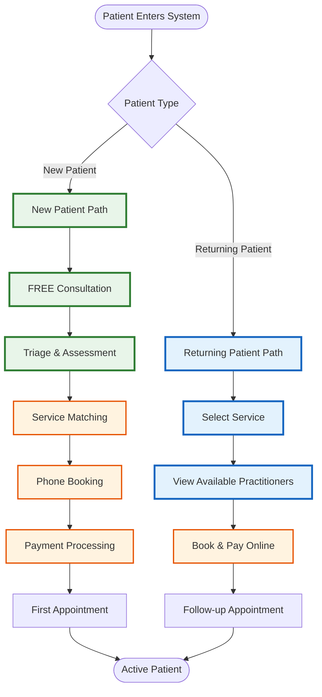

# Fully Operational - Master Overview

## System Overview
This simplified overview shows the main patient journey paths. Click on each section for detailed sub-flows.

## Quick Navigation

### 📘 Detailed Flow Documents
1. **[New Patient Journey](./new-patient-journey.md)** - Complete first-time patient experience
2. **[Returning Patient Flow](./returning-patient-flow.md)** - Follow-up booking process
3. **[Service Triage Process](./service-triage-process.md)** - How patients are matched to services
4. **[Practitioner Assignment](./practitioner-assignment.md)** - Service-to-practitioner mapping

## Key Process Points

### New Patients (First Visit)
1. Enter through service-specific landing pages
2. Book FREE 20-minute consultation
3. Consultant/GAPS Coach performs triage
4. Phone booking with appropriate practitioner
5. Payment taken over phone
6. First appointment scheduled

### Returning Patients (Follow-ups)
1. Direct access to follow-up booking page
2. Select service type needed
3. View combined calendar of relevant practitioners
4. Self-book and pay online
5. No additional triage needed

## Service Portfolio (5 Services)

| Service | Initial | Follow-up | Practitioners |
|---------|---------|-----------|---------------|
| **Alternative Medicine** | $119 (15-20min) | $79 (10-15min) | Doctor 1, Dr. Shivani, Nurse |
| **GAPS Coaching** | $195 (60min) | $79 (15min) | GAPS Coach |
| **Weight Loss** | TBD | TBD | Doctor 1, Dr. Shivani, Nurse |
| **Counseling** | TBD | TBD | Counselor |
| **Equine Therapy** | TBD | TBD | Equine Therapist |

## System Features

### 🎯 Multi-Service Support
- 5 distinct service lines
- Service-specific intake forms
- Integrated care planning
- Cross-service referrals

### 👥 Smart Practitioner Matching
- Service-based practitioner pools
- Combined calendar views
- Availability optimization
- Specialty matching

### 💰 Flexible Payment Options
- Phone payment for new patients
- Online payment for follow-ups
- Service-specific pricing
- Package deals available

### 📱 Booking Channels
- Service landing pages → Free consultation
- Direct follow-up booking
- Phone booking after triage
- Online self-service for returns