# Phone Booking Process - After Triage

## Overview
This diagram shows the consultant-assisted booking process that occurs after triage assessment for new patients.

```mermaid
graph TD
    Start([Triage Complete]) --> Review[Review Recommendations]
    
    Review --> Explain[Explain to Patient]
    Explain --> Agree{Patient Agrees?}
    
    Agree -->|No| Alternative[Discuss Alternatives]
    Alternative --> Explain
    
    Agree -->|Yes| ServiceCount{Single or Multiple?}
    
    %% Single Service Booking
    ServiceCount -->|Single| SingleBook[Single Service Booking]
    SingleBook --> CheckAvail[Check Practitioner Calendar]
    
    CheckAvail --> AvailSlots[View Available Slots]
    AvailSlots --> OfferTimes[Offer Times to Patient]
    
    OfferTimes --> TimeOK{Time Works?}
    TimeOK -->|No| AvailSlots
    TimeOK -->|Yes| HoldSlot[Hold Time Slot]
    
    %% Multiple Service Booking
    ServiceCount -->|Multiple| MultiBook[Multi-Service Booking]
    MultiBook --> ServiceOrder[Determine Service Order]
    
    ServiceOrder --> FirstService[Book Primary Service]
    FirstService --> CheckAvail
    
    HoldSlot --> ServiceBooked[Service Time Confirmed]
    ServiceBooked --> MoreServices{More Services?}
    
    MoreServices -->|Yes| NextService[Book Next Service]
    NextService --> CheckAvail
    MoreServices -->|No| ProceedPayment[Proceed to Payment]
    
    %% Payment Processing
    ProceedPayment --> CalcTotal[Calculate Total]
    CalcTotal --> ReviewCharges[Review Charges with Patient]
    
    ReviewCharges --> PayMethod{Payment Method}
    
    PayMethod -->|Credit Card| CCProcess[Process Card]
    PayMethod -->|HSA/FSA| HSAProcess[Process HSA]
    PayMethod -->|Payment Plan| PlanSetup[Setup Plan]
    
    CCProcess --> PaySuccess{Payment Success?}
    HSAProcess --> PaySuccess
    PlanSetup --> PaySuccess
    
    PaySuccess -->|No| PayIssue[Resolve Issue]
    PayIssue --> PayMethod
    
    PaySuccess -->|Yes| Confirm[Confirm All Bookings]
    
    %% Confirmation Steps
    Confirm --> SendConfirm[Send Confirmations]
    SendConfirm --> EmailConfirm[Email Details]
    EmailConfirm --> SMSConfirm[SMS Reminder]
    SMSConfirm --> IntakeForms[Send Full Intake Forms]
    
    IntakeForms --> FinalSteps[Final Instructions]
    FinalSteps --> End([Booking Complete])
    
    %% Styling
    classDef booking fill:#e3f2fd,stroke:#1976d2,stroke-width:2px
    classDef payment fill:#e8f5e9,stroke:#2e7d32,stroke-width:3px
    classDef confirm fill:#fff3e0,stroke:#ef6c00,stroke-width:2px
    classDef decision fill:#f3e5f5,stroke:#7b1fa2,stroke-width:2px
    
    class SingleBook,MultiBook,CheckAvail,AvailSlots booking
    class CalcTotal,ReviewCharges,CCProcess,HSAProcess,PlanSetup payment
    class Confirm,SendConfirm,EmailConfirm,SMSConfirm confirm
    class Agree,TimeOK,ServiceCount,MoreServices,PayMethod,PaySuccess decision
```



## Process Details

### 1. Recommendation Review

The consultant reviews with the patient:
- Recommended service(s)
- Assigned practitioner(s)
- Expected outcomes
- Treatment timeline
- Associated costs

### 2. Availability Checking

#### Real-Time Calendar Access
- Consultant accesses practitioner calendars
- Shows next 2-4 weeks availability
- Considers patient preferences:
  - Time of day
  - Day of week
  - Telehealth vs in-person

#### Time Slot Management
- Temporarily hold slots during booking
- Release if not confirmed
- Prevent double-booking
- Handle timezone differences

### 3. Service-Specific Booking

| Service | Duration | Booking Considerations |
|---------|----------|----------------------|
| **Alternative Medicine** | 15-20 min | Location preference (Dr. Shivani) |
| **GAPS Coaching** | 60 min | Longer first appointment |
| **Weight Loss** | TBD | May need series booking |
| **Counseling** | TBD | Consistent time slots preferred |
| **Equine Therapy** | TBD | Weather considerations |

### 4. Multi-Service Coordination

For patients booking multiple services:

#### Scheduling Strategy
1. **Priority Service First** - Most urgent need
2. **Logical Sequencing** - E.g., medical before GAPS
3. **Spacing Consideration** - Not too many in one week
4. **Practitioner Communication** - Shared care notes

#### Example Sequences
- **Medical + GAPS**: Book medical first, GAPS 1-2 weeks later
- **Weight Loss + Counseling**: Can start simultaneously
- **Alt Med + Equine**: Coordinate for holistic approach

### 5. Payment Processing

#### Payment Calculation
```
Service 1: Alternative Medicine - $119
Service 2: GAPS Coaching - $195
Total: $314
```

#### Payment Options
- **Credit/Debit Cards** - Processed immediately
- **HSA/FSA Cards** - Health savings accounts
- **Payment Plans** - For amounts over $200
- **Insurance** - If applicable (rare)

#### Security Measures
- PCI compliance
- No card storage
- Secure phone line
- Email receipts only

### 6. Confirmation Process

#### Immediate Actions
1. **Booking Confirmation** - All appointment details
2. **Payment Receipt** - Emailed immediately
3. **Calendar Invites** - For each appointment
4. **SMS Setup** - Opt-in for reminders

#### Follow-Up Communications
- **24 hours**: Welcome email with instructions
- **48 hours**: Full intake forms link
- **1 week before**: Preparation instructions
- **24 hours before**: Final reminder

### 7. Intake Form Distribution

After booking, patients receive:
- Link to full intake forms
- Service-specific questionnaires
- Consent documents
- Insurance information (if applicable)
- Pre-appointment instructions

## Special Scenarios

### Booking Challenges

**No Suitable Times**
- Offer waitlist option
- Check following week
- Consider different practitioner
- Explore telehealth if applicable

**Payment Issues**
- Offer payment plans
- Try different card
- Hold booking for 24 hours
- Provide bank transfer option

**Multiple Practitioners**
- Coordinate schedules
- Book most limited first
- Consider package deals
- Ensure communication plan

### Quality Assurance

#### Booking Checklist
- [ ] Patient understands services
- [ ] Appointment times confirmed
- [ ] Payment processed successfully
- [ ] Confirmations sent
- [ ] Intake forms distributed
- [ ] Special needs noted

#### Documentation
- Service recommendations
- Booking confirmations
- Payment records
- Special instructions
- Communication preferences

[← Back to Overview](./patient-booking-overview.md) | [Back to Triage →](./service-triage-process.md)