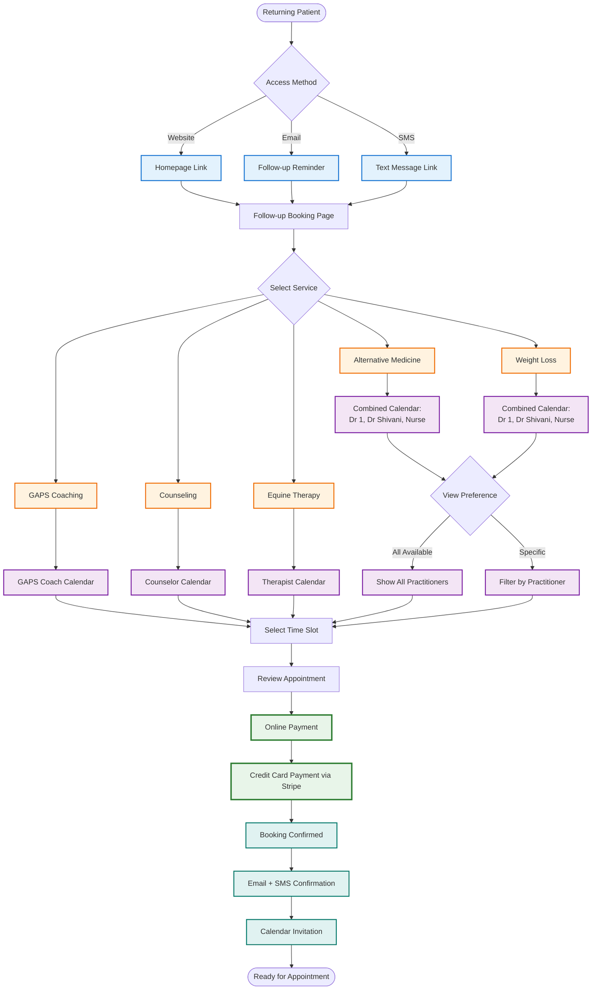

# Returning Patient Flow - Follow-up Booking

## Overview
This diagram shows how existing patients book follow-up appointments with direct online access.

## Process Details

### 1. Direct Access Points
- **Website**: "Book Follow-up" button on homepage
- **Email Reminders**: Direct booking links
- **SMS Reminders**: Mobile-friendly booking links
- **No Login Required**: Simple verification process

### 2. Service Selection

Patients first select their service type, which determines available practitioners:

| Service | Available Practitioners | Duration | Price |
|---------|------------------------|----------|--------|
| Alternative Medicine | Dr Dia, Dr. Shivani, Nurse | 10-15 min | $79 AUD |
| GAPS Coaching | Ramona only | 15 min | $79 AUD |
| Weight Loss | Dr Dia, Dr. Shivani, Nurse | TBD | TBD |
| Counseling | Counselor only | TBD | TBD |
| Equine Therapy | Equine Therapist only | TBD | TBD |

### 3. Calendar Features

#### Combined Calendar View
For services with multiple practitioners:
- See all available time slots
- Color-coded by practitioner
- Filter by specific practitioner
- Show next available for each

#### Smart Filtering
- **By Practitioner**: See only preferred provider
- **By Time**: Morning, afternoon, evening slots
- **By Day**: Weekday vs weekend availability
- **By Location**: Telehealth vs in-person (Dr. Shivani)

### 4. Booking Process

#### Information Required
- Patient verification (email/phone)
- Appointment type confirmation
- Brief reason for visit (optional)
- Insurance updates (if applicable)

#### Payment Options
- Credit/debit card
- Saved payment methods
- HSA/FSA cards
- Payment plans (if available)

### 5. Confirmation & Reminders

#### Immediate Confirmation
- Email with appointment details
- SMS confirmation
- Calendar invite (.ics file)
- Pre-appointment instructions

#### Automated Reminders
- 48 hours before: Email reminder
- 24 hours before: SMS reminder
- 2 hours before: Final reminder
- Rescheduling links included

## Key Advantages

### ⚡ Self-Service Efficiency
- No phone calls needed
- 24/7 booking availability
- Instant confirmation
- Easy rescheduling

### 🎯 Smart Practitioner Display
- Only shows relevant providers
- Real-time availability
- Practitioner profiles available
- Previous provider prioritized

### 💰 Streamlined Payment
- Secure online processing
- Multiple payment options
- Automatic receipts
- Insurance integration ready

### 📱 Mobile Optimized
- Responsive design
- One-thumb navigation
- Quick booking flow
- Mobile calendar sync

[← Back to Overview](./patient-booking-overview.md) | [Next: Service Triage Process →](./service-triage-process.md)