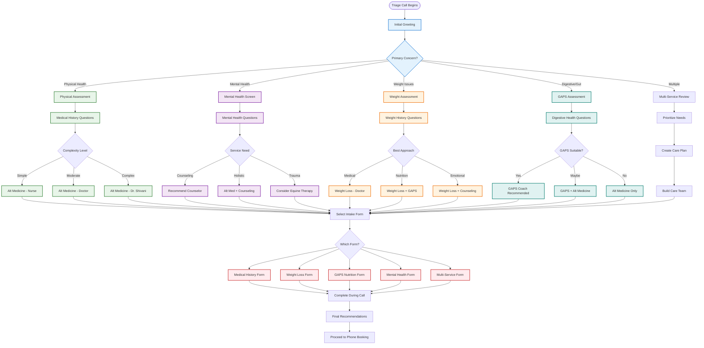

# Service Triage Process - Consultant Assessment

## Overview
This diagram details how the consultant (currently GAPS Coach) assesses patients and matches them with appropriate services and practitioners.

## Triage Decision Framework

### Initial Assessment Questions

#### 1. Primary Concern Identification
- "What brings you to us today?"
- "What's your main health concern?"
- "How long has this been an issue?"
- "What have you tried so far?"

#### 2. Service Matching Criteria

**Alternative Medicine Match:**
- General health concerns
- Chronic conditions
- Preventive care
- Natural treatment preference

**GAPS Coaching Match:**
- Digestive issues
- Autism/ADHD
- Autoimmune conditions
- Failed conventional diets

**Weight Loss Match:**
- BMI concerns
- Failed diet attempts
- Medical weight issues
- Lifestyle change needs

**Counseling Match:**
- Mental health concerns
- Stress/anxiety
- Relationship issues
- Behavioral changes

**Equine Therapy Match:**
- Children with special needs
- Trauma recovery
- Alternative therapy interest
- Failed traditional therapy

### Practitioner Assignment Logic

#### For Alternative Medicine & Weight Loss

| Complexity | Assigned To | Factors |
|------------|-------------|---------|
| **Simple** | Nurse Practitioner | Routine care, stable conditions |
| **Moderate** | Doctor 1 | Multiple conditions, medication management |
| **Complex** | Dr. Shivani | Chronic complex cases, prefer in-person option |

#### Location Considerations
- **Telehealth Only**: Doctor 1, Nurse
- **Telehealth + Melbourne**: Dr. Shivani
- Patient preference considered
- Availability factored

### Dynamic Form Selection

The consultant selects forms based on:

1. **Single Service Interest** → Service-specific form
2. **Multiple Concerns** → Multi-service comprehensive form
3. **Complex History** → Extended medical history form
4. **Mental Health Component** → Include mental health screening
5. **Family Involvement** → Family intake forms

### Multi-Service Care Plans

For patients needing multiple services:

1. **Identify Primary Need** - What's most urgent?
2. **Check Dependencies** - What needs to happen first?
3. **Plan Sequence** - Logical order of services
4. **Coordinate Practitioners** - Ensure communication
5. **Set Timeline** - Realistic scheduling

Example Care Plans:

**Weight + Mental Health:**
- Start with counseling for emotional eating
- Add weight loss program after 2-4 weeks
- Coordinate between counselor and doctor

**GAPS + Alternative Medicine:**
- Begin with medical assessment
- Start GAPS protocol with coach
- Monthly check-ins with doctor

## Quality Assurance

### Triage Checkpoints
- ✓ All major concerns addressed
- ✓ Appropriate service selected
- ✓ Right practitioner matched
- ✓ Patient agrees with plan
- ✓ Booking details confirmed

### When to Escalate
- Complex medical history
- Multiple failed treatments
- Urgent care needs
- Outside scope of practice
- Patient dissatisfaction

### Documentation Requirements
- Summary of concerns
- Services recommended
- Practitioner assigned
- Reason for selection
- Alternative options discussed

[← Back to Overview](./patient-booking-overview.md) | [Next: Phone Booking Process →](./phone-booking-process.md)