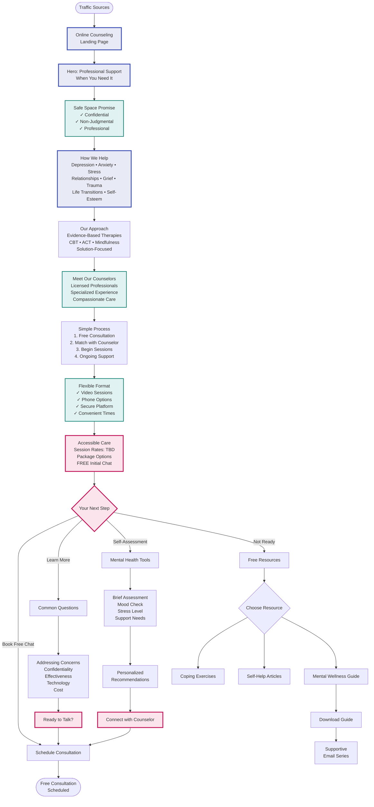

# Counseling Services Funnel

## Overview
This flowchart maps the sensitive journey for patients seeking mental health support through online counseling services.

## Main Funnel Flow

## Conversion Elements

### 1. Trust & Safety First
- **Immediate reassurance**: Confidentiality prominent
- **Professional credentials**: Licensed counselors
- **Secure platform**: Technology safety
- **Testimonials**: Anonymous success stories

### 2. Target Audiences
- Adults experiencing anxiety/depression
- Couples seeking relationship support
- Individuals in life transitions
- Grief and loss support seekers
- Work stress and burnout sufferers

### 3. Reducing Barriers
| Barrier | Solution |
|---------|----------|
| Stigma | Normalize seeking help |
| Privacy concerns | Emphasize confidentiality |
| Technology fears | Simple platform demo |
| Time constraints | Flexible scheduling |
| Cost worries | Transparent pricing |

### 4. Self-Assessment Tool
Quick questions to guide visitors:
1. How has your mood been lately?
2. Are you experiencing sleep issues?
3. How's your stress level (1-10)?
4. What support are you seeking?
5. Preferred communication style?

**Results**: Personalized counselor match suggestions

### 5. Email Nurture Sequence
**Lead Magnet**: "5 Daily Mental Wellness Practices"
1. **Day 0**: Welcome & guide delivery
2. **Day 3**: Understanding therapy myths
3. **Day 5**: Self-care strategies
4. **Day 7**: When to seek help
5. **Day 10**: Counselor spotlight story
6. **Day 14**: Mindfulness exercise
7. **Day 18**: Building resilience tips
8. **Day 21**: Invitation to connect
9. **Ongoing**: Weekly wellness tips

### 6. Sensitive Objection Handling
| Concern | Compassionate Response |
|---------|------------------------|
| "Will online therapy work?" | Research shows equal effectiveness |
| "Is it really confidential?" | Legal privacy protections explained |
| "I'm not ready to talk" | Free resources available, no pressure |
| "What if I don't like my counselor?" | Easy to switch, finding right fit matters |
| "I should handle this myself" | Seeking help is a sign of strength |

## Unique Value Propositions

### Accessibility Focus
- **No travel required**: Support from home
- **Flexible hours**: Evening/weekend options
- **Quick access**: Shorter wait times
- **Continuity**: Same counselor each time

### Holistic Integration
- Coordination with medical team
- Nutrition and lifestyle support
- Mind-body connection focus
- Family involvement options

## Marketing Approach

### Content Strategy
- Mental health awareness posts
- Stress management tips
- Relationship advice articles
- Workplace wellness content
- Seasonal mental health topics

### SEO Keywords
- "online counseling [city]"
- "anxiety therapy telehealth"
- "depression counselor online"
- "relationship counseling virtual"
- "grief support online"

### Social Media
- Instagram: Daily affirmations
- Facebook: Support community
- LinkedIn: Workplace mental health
- Blog: In-depth articles
- Podcast: Expert interviews

## Tracking Metrics
- Assessment completion rate
- Free chat booking rate
- Chat to paid session conversion
- Session package purchases
- Client retention rate
- Satisfaction scores

## Integration Points

### With Booking System
- Service: "Counseling" pre-selected
- Extended session times available
- Counselor matching in triage
- Privacy-first intake process
- Secure communication setup

### With Other Services
- Referrals from Alternative Medicine
- Support for GAPS diet challenges
- Weight loss emotional support
- Integrated wellness plans
- Family therapy options

## Privacy & Compliance

### Security Measures
- HIPAA-compliant platform
- Encrypted communications
- Secure document sharing
- Private waiting rooms
- No recording policy

### Ethical Considerations
- Clear boundaries stated
- Emergency protocols visible
- Limitations acknowledged
- Local resources provided
- Mandatory reporting explained