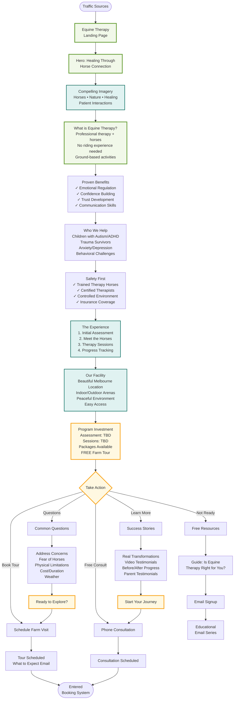

# Equine Therapy Funnel

## Overview
This flowchart shows the patient journey for equine-assisted therapy, emphasizing the unique healing power of horses and the professional therapeutic approach.

## Main Funnel Flow

## Conversion Elements

### 1. Visual Storytelling
- **Hero imagery**: Powerful horse-human connections
- **Video content**: Sessions in action
- **Virtual tour**: Facility walkthrough
- **Photo galleries**: Horses and environments

### 2. Target Audiences

#### Parents Seeking Help for Children
- Autism spectrum disorders
- ADHD and focus issues
- Social skill development
- Behavioral challenges
- School refusal/anxiety

#### Adults Seeking Healing
- PTSD and trauma recovery
- Depression and anxiety
- Addiction recovery support
- Personal growth
- Relationship issues

### 3. Trust Building Elements
| Element | Purpose |
|---------|---------|
| Therapist credentials | Professional expertise |
| Horse training certification | Safety assurance |
| Insurance details | Risk mitigation |
| Success statistics | Proven outcomes |
| Medical professional endorsements | Clinical validity |

### 4. Farm Tour Strategy
**Purpose**: Lower-commitment first step
- Meet the therapy horses
- See facilities in person
- Observe session (if permitted)
- Meet therapists
- Address concerns directly

### 5. Email Nurture Sequence
**Lead Magnet**: "Understanding Equine Therapy" Guide
1. **Day 0**: Welcome & guide + virtual tour video
2. **Day 3**: Science behind equine therapy
3. **Day 5**: Success story: Child with autism
4. **Day 7**: Meet our therapy horses
5. **Day 10**: Common misconceptions addressed
6. **Day 14**: Adult client transformation
7. **Day 18**: Invitation to visit
8. **Day 21**: Special package offer
9. **Ongoing**: Monthly newsletter

### 6. Objection Handling
| Objection | Response |
|-----------|----------|
| "I'm afraid of horses" | Start with smallest, calmest horses |
| "My child won't cooperate" | Horses naturally engage children |
| "Is it just horse riding?" | No riding required, ground work only |
| "How is this therapy?" | Licensed therapists, clinical approach |
| "What if weather is bad?" | Indoor arena available |

## Unique Value Propositions

### The Horse Advantage
- **Non-judgmental partners**: Horses accept everyone
- **Immediate feedback**: Horses respond to emotions
- **Motivation**: Children excited to visit horses
- **Sensory experience**: Multi-sensory healing
- **Natural environment**: Outdoor therapeutic setting

### Professional Integration
- Licensed therapists on staff
- Treatment plans and goals
- Progress documentation
- Coordination with other providers
- Evidence-based approaches

## Marketing Strategies

### Local Community Focus
- School counselor partnerships
- Pediatrician referral program
- Parent support groups
- Special needs organizations
- Local therapy networks

### Content Marketing
- "Day in the Life" videos
- Horse personality profiles
- Therapy technique explanations
- Parent guide resources
- Research and articles

### Social Media Approach
- Instagram: Daily horse photos/videos
- Facebook: Parent testimonials
- YouTube: Session highlights
- TikTok: Horse interactions
- Blog: Educational content

## Tracking Metrics
- Tour booking rate
- Tour to assessment conversion
- Assessment to program enrollment
- Program completion rate
- Referral source effectiveness
- Family satisfaction scores

## Integration Points

### With Booking System
- Service: "Equine Therapy" pre-selected
- Tour bookings separate from consultations
- Family consultation options
- Group session availability
- Weather-dependent scheduling

### With Other Services
- Referrals from counseling
- Support for GAPS families
- Alternative medicine integration
- Family therapy combinations
- Holistic treatment plans

## Facility Considerations

### Safety Protocols
- Comprehensive orientation
- Safety equipment provided
- Clear boundaries and rules
- Emergency procedures
- Weather policies

### Accessibility
- Wheelchair accessible areas
- Sensory-friendly spaces
- Parent observation areas
- Quiet rooms available
- Parking and transport

## Program Structure

### Typical Journey
1. **Free farm tour** (30 min)
2. **Initial assessment** (60 min)
3. **Trial session** (45 min)
4. **Program planning** (collaborative)
5. **Regular sessions** (weekly/biweekly)
6. **Progress reviews** (monthly)
7. **Graduation planning** (goal-based)