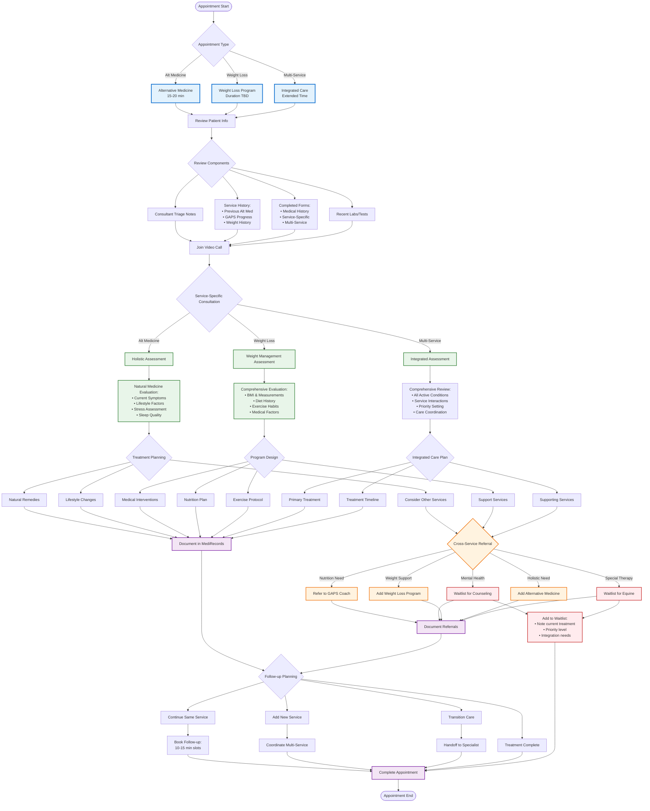

# Doctor Appointment Flow - Future Options

## Overview
This flowchart shows how doctors manage appointments across multiple services (Alternative Medicine, Weight Loss) with cross-service referral capabilities.



## Service-Specific Protocols

### Alternative Medicine Appointments

**Duration**: 15-20 minutes
**Focus Areas**:
- Natural health assessment
- Holistic treatment planning
- Lifestyle medicine
- Preventive care

**Common Interventions**:
- Herbal medicine recommendations
- Nutritional supplements
- Stress management techniques
- Mind-body practices

**Typical Referrals**:
- GAPS Coach for gut health
- Weight Loss for BMI concerns
- Counseling waitlist for mental health

### Weight Loss Program Appointments

**Duration**: TBD (likely 30-45 min initial)
**Focus Areas**:
- Medical weight assessment
- Metabolic evaluation
- Behavioral factors
- Sustainable planning

**Program Components**:
- Medical clearance
- Prescription options
- Nutrition planning
- Exercise prescription
- Behavioral support

**Common Referrals**:
- GAPS Coach for nutrition
- Counseling waitlist for emotional eating
- Alternative Medicine for holistic support

## Cross-Service Referral Matrix

| From Service | To Service | Common Reasons | Process |
|--------------|------------|----------------|---------|
| Alt Medicine | GAPS | Digestive issues, inflammation | Warm handoff to GAPS Coach |
| Alt Medicine | Weight Loss | BMI concerns, metabolic health | Add to doctor's weight program |
| Alt Medicine | Counseling | Stress, anxiety, depression | Add to counseling waitlist |
| Weight Loss | GAPS | Nutrition optimization | Coordinate with GAPS Coach |
| Weight Loss | Counseling | Emotional eating patterns | Priority waitlist placement |
| Weight Loss | Alt Medicine | Holistic support needed | Book with same/other doctor |

## Multi-Service Care Coordination

### Integrated Appointments
For patients in multiple programs:

1. **Extended Time Slots**
   - Review all services
   - Check interactions
   - Unified planning
   - Coordinated goals

2. **Service Priority Matrix**
   ```
   Primary Condition → Lead Service
   Supporting Needs → Secondary Services
   Preventive Care → Maintenance Services
   ```

3. **Documentation Integration**
   - Shared care plans
   - Cross-service notes
   - Unified progress tracking
   - Team communication

### Care Team Communication

**With GAPS Coach:**
- Nutrition plans alignment
- Supplement coordination
- Dietary restrictions
- Progress sharing

**With Other Doctors:**
- Shared patients
- Treatment coordination
- Medication management
- Referral updates

**With Waitlisted Services:**
- Priority flagging
- Current treatment notes
- Integration planning
- Launch notifications

## Service-Specific Documentation

### Alternative Medicine Notes
```
Chief Complaint: [Natural health concern]
Assessment: [Holistic evaluation]
Plan: 
- Natural interventions
- Lifestyle modifications
- Follow-up schedule
- Referrals if needed
```

### Weight Loss Notes
```
Current Weight/BMI: [Metrics]
Program Phase: [Initial/Active/Maintenance]
Interventions:
- Medical: [If applicable]
- Nutrition: [Plan summary]
- Exercise: [Prescription]
- Behavioral: [Strategies]
Progress: [Tracking metrics]
Next Steps: [Follow-up plan]
```

## Follow-up Scheduling Logic

### Within Same Service
- Alternative Medicine: 10-15 min follow-ups
- Weight Loss: Duration based on phase
- Standard intervals: 2-4 weeks

### Adding Services
1. Check availability across services
2. Coordinate timing
3. Avoid appointment overload
4. Consider patient capacity

### Transitioning Care
- Complete current treatment phase
- Warm handoff to next provider
- Ensure continuity documentation
- Follow-up as needed

## Quality Metrics

### Appointment Efficiency
- On-time starts: >95%
- Duration adherence: ±5 minutes
- Documentation time: <5 minutes post-visit

### Cross-Service Metrics
- Referral completion rate
- Multi-service retention
- Integrated care outcomes
- Patient satisfaction

### Waitlist Management
- Appropriate waitlist adds
- Priority flagging accuracy
- Follow-through tracking
- Launch conversion prep

[← Back to Consultant Flow](./consultant-triage-flow.md) | [Next: Tech Architecture →](./tech-architecture-flow.md)