# Target Implementation - Technical Architecture Flow

## Overview
This flowchart shows the scaled technical architecture supporting 5 services with 8+ practitioners, building on the same proven tech stack: Calendly, Office 365, AWS Lambda, and MediRecords.

```mermaid
flowchart TD
    %% User Interface Layer
    User[User Browser] --> Webflow[Webflow CMS]
    Webflow --> ServiceLanding{Service Landing Page}
    
    ServiceLanding -->|Alt Medicine| AltMedFlow[Alternative Medicine Flow]
    ServiceLanding -->|GAPS| GAPSFlow[GAPS Coaching Flow]
    ServiceLanding -->|Weight Loss| WeightFlow[Weight Loss Flow]
    ServiceLanding -->|Counseling| CounselFlow[Counseling Flow]
    ServiceLanding -->|Equine| EquineFlow[Equine Therapy Flow]
    
    %% Initial Consultation Path - All Services
    AltMedFlow --> InitialFree[Free Initial Consultation]
    GAPSFlow --> InitialFree
    WeightFlow --> InitialFree
    CounselFlow --> InitialFree
    EquineFlow --> InitialFree
    
    InitialFree --> ConsultantCalendly[Embedded Consultant Calendly<br/>No Payment Required]
    ConsultantCalendly --> CalendarEvent1[Create Calendar Event]
    
    CalendarEvent1 --> ConsultantO365[Consultant Office 365]
    ConsultantO365 --> MSGraphWebhook1[MS Graph Webhook]
    
    %% Follow-up Path - Service-Specific Calendars
    AltMedFlow --> FollowUp[Follow-up Booking]
    GAPSFlow --> FollowUp
    WeightFlow --> FollowUp
    CounselFlow --> FollowUp
    EquineFlow --> FollowUp
    
    FollowUp --> ServiceCalendars{Service-Specific Calendar View}
    
    ServiceCalendars -->|Alt Med| AltMedCalendars[Show: Dr Dia, Dr Shivani, Nurse]
    ServiceCalendars -->|GAPS| GAPSCalendar[Show: Ramona Only]
    ServiceCalendars -->|Weight Loss| WeightCalendars[Show: Dr Dia, Dr Shivani, Nurse]
    ServiceCalendars -->|Counseling| CounselCalendars[Show: Counselor 1, Counselor 2]
    ServiceCalendars -->|Equine| EquineCalendar[Show: Equine Therapist]
    
    %% Practitioner Selection
    AltMedCalendars --> SelectPractitioner[Select Practitioner & Time]
    GAPSCalendar --> SelectPractitioner
    WeightCalendars --> SelectPractitioner
    CounselCalendars --> SelectPractitioner
    EquineCalendar --> SelectPractitioner
    
    SelectPractitioner --> PractitionerCalendly{Practitioner Calendly<br/>8+ Separate Calendars}
    
    PractitionerCalendly -->|Dr Dia| DrDiaCalendly[Dr Dia Calendly]
    PractitionerCalendly -->|Dr Shivani| DrShivaniCalendly[Dr Shivani Calendly]
    PractitionerCalendly -->|Nurse| NurseCalendly[Nurse Calendly]
    PractitionerCalendly -->|Ramona| RamonaCalendly[Ramona GAPS Calendly]
    PractitionerCalendly -->|Counselor 1| Counsel1Calendly[Counselor 1 Calendly]
    PractitionerCalendly -->|Counselor 2| Counsel2Calendly[Counselor 2 Calendly]
    PractitionerCalendly -->|Equine| EquineCalendly[Equine Therapist Calendly]
    
    %% Payment Processing
    DrDiaCalendly --> StripePayment[Stripe Payment Gateway]
    DrShivaniCalendly --> StripePayment
    NurseCalendly --> StripePayment
    RamonaCalendly --> StripePayment
    Counsel1Calendly --> StripePayment
    Counsel2Calendly --> StripePayment
    EquineCalendly --> StripePayment
    
    StripePayment --> CalendarEvent2[Create Calendar Event]
    
    %% Office 365 Integration - 8+ Calendars
    CalendarEvent2 --> PractitionerO365{Route to Practitioner O365}
    
    PractitionerO365 -->|Dr Dia| DrDiaO365[Dr Dia Office 365]
    PractitionerO365 -->|Dr Shivani| DrShivaniO365[Dr Shivani Office 365]
    PractitionerO365 -->|Nurse| NurseO365[Nurse Office 365]
    PractitionerO365 -->|Ramona| RamonaO365[Ramona Office 365]
    PractitionerO365 -->|Counselor 1| Counsel1O365[Counselor 1 Office 365]
    PractitionerO365 -->|Counselor 2| Counsel2O365[Counselor 2 Office 365]
    PractitionerO365 -->|Equine| EquineO365[Equine Therapist Office 365]
    
    %% All O365 calendars connect to webhook
    DrDiaO365 --> MSGraphWebhook2[MS Graph Webhook]
    DrShivaniO365 --> MSGraphWebhook2
    NurseO365 --> MSGraphWebhook2
    RamonaO365 --> MSGraphWebhook2
    Counsel1O365 --> MSGraphWebhook2
    Counsel2O365 --> MSGraphWebhook2
    EquineO365 --> MSGraphWebhook2
    
    %% AWS Processing Layer - Same as before, just handling more
    MSGraphWebhook1 --> WebhookRenewal[Webhook Auto-Renewal]
    MSGraphWebhook2 --> WebhookRenewal
    WebhookRenewal --> AWSGateway[AWS API Gateway]
    
    AWSGateway --> Lambda1[Lambda - Booking Processor<br/>Enhanced for 8+ practitioners]
    Lambda1 --> ExtractData[Extract Calendar Data]
    ExtractData --> IdentifyService{Identify Service Type}
    
    IdentifyService -->|Alt Med| ProcessAltMed[Process Alt Med Booking]
    IdentifyService -->|GAPS| ProcessGAPS[Process GAPS Booking]
    IdentifyService -->|Weight Loss| ProcessWeight[Process Weight Booking]
    IdentifyService -->|Counseling| ProcessCounsel[Process Counseling Booking]
    IdentifyService -->|Equine| ProcessEquine[Process Equine Booking]
    IdentifyService -->|Initial Free| ProcessFreeConsult[Process Free Consultation]
    
    %% MediRecords Integration - Same system, more calendars
    ProcessAltMed --> PythonLib[Custom Python Library]
    ProcessGAPS --> PythonLib
    ProcessWeight --> PythonLib
    ProcessCounsel --> PythonLib
    ProcessEquine --> PythonLib
    ProcessFreeConsult --> PythonLib
    
    PythonLib --> MediRecordsAPI[MediRecords API]
    MediRecordsAPI --> CheckPatient{Patient Exists?}
    
    CheckPatient -->|No| CreatePatient[Create New Patient]
    CheckPatient -->|Yes| UpdatePatient[Update Patient]
    
    CreatePatient --> CreateBooking[Create MediRecords Booking]
    UpdatePatient --> CreateBooking
    
    CreateBooking --> AssignMediCalendar{Assign to MediRecords Calendar<br/>8+ Practitioner Calendars}
    
    AssignMediCalendar -->|Consultant| ConsultantMediCal[Consultant MediRecords]
    AssignMediCalendar -->|Dr Dia| DrDiaMediCal[Dr Dia MediRecords]
    AssignMediCalendar -->|Dr Shivani| DrShivaniMediCal[Dr Shivani MediRecords]
    AssignMediCalendar -->|Nurse| NurseMediCal[Nurse MediRecords]
    AssignMediCalendar -->|Ramona| RamonaMediCal[Ramona MediRecords]
    AssignMediCalendar -->|Counselor 1| Counsel1MediCal[Counselor 1 MediRecords]
    AssignMediCalendar -->|Counselor 2| Counsel2MediCal[Counselor 2 MediRecords]
    AssignMediCalendar -->|Equine| EquineMediCal[Equine MediRecords]
    
    %% Form Processing - Service-Specific Forms
    CalendarEvent1 --> MiniIntake[Embedded JotForm - Mini Intake]
    CalendarEvent2 --> ServiceForms{Service-Specific Forms}
    
    ServiceForms -->|Alt Med| MedicalIntake[Medical History Form]
    ServiceForms -->|GAPS| GAPSIntake[GAPS Assessment Form]
    ServiceForms -->|Weight Loss| WeightIntake[Weight Loss Form]
    ServiceForms -->|Counseling| MentalHealthIntake[Mental Health Form]
    ServiceForms -->|Equine| EquineIntake[Equine Therapy Form]
    
    %% Form submission processing
    MiniIntake --> JotFormWebhook[JotForm Webhook]
    MedicalIntake --> JotFormWebhook
    GAPSIntake --> JotFormWebhook
    WeightIntake --> JotFormWebhook
    MentalHealthIntake --> JotFormWebhook
    EquineIntake --> JotFormWebhook
    
    JotFormWebhook --> AWSGateway2[AWS API Gateway - Forms]
    AWSGateway2 --> Lambda2[Lambda - Form Processor<br/>Multiple form types]
    
    Lambda2 --> ProcessFormData[Process Form Data]
    ProcessFormData --> PythonLib2[Custom Python Library]
    PythonLib2 --> MediRecordsAPI2[MediRecords API]
    MediRecordsAPI2 --> UpdatePatientDetails[Update Patient Details]
    
    %% Notifications - Same system
    CreateBooking --> NotificationSystem[Notification System]
    NotificationSystem --> EmailNotify[Email via Calendly/JotForm]
    NotificationSystem --> SMSNotify[SMS via MediRecords]
    NotificationSystem --> CalendarInvite[Calendar Invites]
    
    %% Waitlist Management (Simple)
    CounselFlow -->|Not Yet Active| WaitlistForm[JotForm Waitlist]
    EquineFlow -->|Not Yet Active| WaitlistForm
    WaitlistForm --> WaitlistSubmit[Submit Interest]
    WaitlistSubmit --> JotFormWebhook
    
    %% Data Storage - Same as before
    Lambda1 -.-> CloudWatch1[CloudWatch Logs]
    Lambda2 -.-> CloudWatch2[CloudWatch Logs]
    MediRecordsAPI -.-> MediDB[(MediRecords Database)]
    PractitionerO365 -.-> O365Storage[(Office 365 Storage)]
    
    %% Styling
    classDef webflow fill:#e3f2fd,stroke:#1976d2,stroke-width:3px
    classDef calendly fill:#fff3e0,stroke:#e65100,stroke-width:2px
    classDef aws fill:#fff8e1,stroke:#f57c00,stroke-width:3px
    classDef medirecords fill:#e8f5e9,stroke:#2e7d32,stroke-width:2px
    classDef form fill:#e0f2f1,stroke:#00695c,stroke-width:3px
    classDef notification fill:#ffebee,stroke:#c62828,stroke-width:2px
    classDef payment fill:#f3e5f5,stroke:#6a1b9a,stroke-width:2px
    
    class Webflow,ServiceLanding webflow
    class ConsultantCalendly,DrDiaCalendly,DrShivaniCalendly,NurseCalendly,RamonaCalendly,Counsel1Calendly,Counsel2Calendly,EquineCalendly calendly
    class AWSGateway,AWSGateway2,Lambda1,Lambda2,CloudWatch1,CloudWatch2 aws
    class MediRecordsAPI,MediRecordsAPI2,DrDiaMediCal,DrShivaniMediCal,NurseMediCal,RamonaMediCal,Counsel1MediCal,Counsel2MediCal,EquineMediCal medirecords
    class MiniIntake,MedicalIntake,GAPSIntake,WeightIntake,MentalHealthIntake,EquineIntake,JotFormWebhook,WaitlistForm form
    class NotificationSystem,EmailNotify,SMSNotify notification
    class StripePayment payment
```



## Technical Implementation - Scaled from Current

### Core Tech Stack (UNCHANGED)
- **Website**: Webflow CMS with service landing pages
- **Booking**: Calendly embedded widgets (8+ calendars)
- **Payments**: Stripe integrated with Calendly
- **Calendar Sync**: Office 365 with MS Graph API
- **Middleware**: AWS API Gateway + Lambda
- **Patient Management**: MediRecords
- **Forms**: JotForm for all intake forms
- **Notifications**: Existing email/SMS systems

### What's Scaled Up

#### 1. Calendly Calendars (8+ instead of 5)
- Consultant (Free consultations)
- Dr Dia (Alt Med, Weight Loss)
- Dr Shivani (Alt Med, Weight Loss)
- Nurse Practitioner (Alt Med, Weight Loss)
- Ramona (GAPS only)
- Counselor 1 (Counseling)
- Counselor 2 (Counseling)
- Equine Therapist (Equine Therapy)

#### 2. Office 365 Calendars
- Each practitioner has their own O365 calendar
- All sync through same MS Graph webhook system
- Same auto-renewal mechanism

#### 3. Service-Specific Routing
- Landing pages per service on Webflow
- Service-filtered calendar views
- Service-specific intake forms

#### 4. MediRecords Calendars
- 8+ practitioner calendars in MediRecords
- Same API, just more calendar IDs
- Service-based appointment types

### Enhanced Lambda Functions

#### Booking Processor Enhancements
```python
# Pseudo-code for service routing
def process_booking(event):
    service_type = extract_service_type(event)
    practitioner = extract_practitioner(event)
    
    # Route to appropriate MediRecords calendar
    calendar_mapping = {
        'dr_dia': 'CAL_001',
        'dr_shivani': 'CAL_002',
        'nurse': 'CAL_003',
        'ramona': 'CAL_004',
        'counselor_1': 'CAL_005',
        'counselor_2': 'CAL_006',
        'equine': 'CAL_007',
        'consultant': 'CAL_008'
    }
    
    # Same MediRecords API, just more calendars
    create_booking(calendar_mapping[practitioner], patient_data)
```

#### Form Processor Enhancements
```python
# Handle multiple form types
form_types = {
    'mini_intake': process_mini_intake,
    'medical_history': process_medical_intake,
    'gaps_assessment': process_gaps_intake,
    'weight_loss': process_weight_intake,
    'mental_health': process_mental_intake,
    'equine_therapy': process_equine_intake,
    'waitlist': process_waitlist_signup
}
```

### Service Configuration

#### Service-to-Practitioner Mapping
| Service | Practitioners | Initial Price | Follow-up Price |
|---------|--------------|---------------|-----------------|
| Alternative Medicine | Dr Dia, Dr Shivani, Nurse | $119 | $79 |
| GAPS Coaching | Ramona only | $195 | $79 |
| Weight Loss | Dr Dia, Dr Shivani, Nurse | TBD | TBD |
| Counseling | Counselor 1, Counselor 2 | TBD | TBD |
| Equine Therapy | Equine Therapist | TBD | TBD |

### Waitlist Implementation (Simple)
- JotForm for waitlist capture
- Stores in same system
- Manual notification when service launches
- No complex automation needed

### Key Technical Considerations

1. **Calendar Management**
   - Each practitioner manages own Calendly availability
   - MediRecords sync must handle 8+ calendars
   - Service-based filtering in frontend

2. **Form Variants**
   - Service-specific intake forms
   - Same JotForm platform
   - Lambda routes based on form type

3. **Webhook Scaling**
   - More O365 calendars = more webhook events
   - Same renewal system handles all
   - CloudWatch monitoring for all events

4. **Performance**
   - More Lambda invocations (linear with bookings)
   - Same architecture scales horizontally
   - No architectural changes needed

### Security & Compliance (Same as Current)
- HTTPS for all communications
- AWS IAM for permissions
- Secure API key storage
- HIPAA compliance through existing measures
- PCI compliance via Stripe

### Deployment Approach

1. **Add Practitioners Incrementally**
   - Start with existing 5 practitioners
   - Add new practitioners one at a time
   - Test each calendar integration

2. **Service Rollout**
   - Launch services as practitioners ready
   - Waitlist for upcoming services
   - Convert waitlist when launching

3. **No Infrastructure Changes**
   - Same AWS account and setup
   - Same MediRecords instance
   - Just configuration updates

---

[← Back to Doctor Flow](../doctor/doctor-appointment-flow.md) | [Back to Overview →](../../roles/README.md)