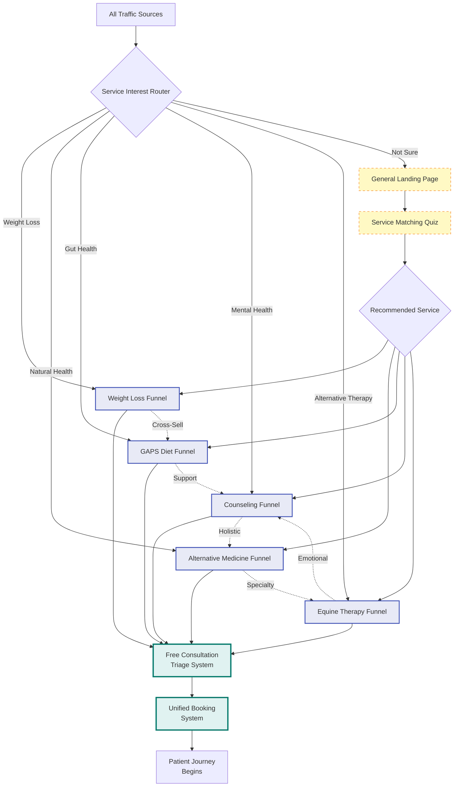

# Service Funnels Overview

## Integrated Marketing System
This document shows how all five service funnels work together to create a comprehensive patient acquisition system.

## Master Funnel Architecture

## Service Funnel Summary

### 1. Alternative Medicine Funnel
- **Primary Appeal**: Natural, holistic healthcare
- **Target**: Health-conscious individuals
- **Key Differentiator**: Telehealth + In-person options
- **Conversion Focus**: Free consultation

### 2. Weight Loss Funnel  
- **Primary Appeal**: Medical weight management
- **Target**: Struggling with weight loss
- **Key Differentiator**: Medical supervision
- **Conversion Focus**: Transformation stories

### 3. GAPS Diet Coaching Funnel
- **Primary Appeal**: Gut-brain healing
- **Target**: Parents, chronic conditions
- **Key Differentiator**: Specialized protocol
- **Conversion Focus**: Education + results

### 4. Counseling Services Funnel
- **Primary Appeal**: Mental health support
- **Target**: Anxiety, depression, life challenges
- **Key Differentiator**: Online convenience
- **Conversion Focus**: Safe, confidential space

### 5. Equine Therapy Funnel
- **Primary Appeal**: Unique healing experience
- **Target**: Children with needs, trauma survivors
- **Key Differentiator**: Horse connection
- **Conversion Focus**: Farm tour first step

## Cross-Selling Matrix

| From Service | Natural Cross-Sells | Reasoning |
|--------------|-------------------|-----------|
| **Alternative Medicine** | GAPS, Weight Loss | Holistic health interest |
| **Weight Loss** | GAPS, Counseling | Emotional eating, gut health |
| **GAPS Diet** | Counseling, Alt Medicine | Support needs, supplements |
| **Counseling** | Alternative Medicine, Equine | Holistic mental health |
| **Equine Therapy** | Counseling, Alt Medicine | Continued support |

## Unified Elements Across All Funnels

### 1. Consistent Messaging
- Free consultation as entry point
- Professional medical approach
- Personalized care plans
- Evidence-based treatments

### 2. Trust Building
- Practitioner credentials
- Success stories/testimonials
- Transparent pricing
- Money-back guarantees

### 3. Conversion Optimization
- Multiple CTAs per page
- Exit intent captures
- Email nurture sequences
- Retargeting campaigns

### 4. Technical Integration
- Same booking system endpoint
- Unified tracking/analytics
- Shared CRM database
- Consistent follow-up

## Traffic Distribution Strategy

### Paid Advertising
- **Google Ads**: 40% budget
  - Alternative Medicine: 30%
  - Weight Loss: 30%
  - GAPS: 20%
  - Counseling: 15%
  - Equine: 5%

- **Social Media**: 30% budget
  - Facebook/Instagram: Lifestyle targeting
  - LinkedIn: Professional wellness
  - TikTok: Younger demographics

### Organic Traffic
- **SEO**: 20% effort
  - Service-specific landing pages
  - Local search optimization
  - Educational blog content

- **Referrals**: 10% focus
  - Practitioner networks
  - Patient referral program
  - Professional partnerships

## Email Marketing Integration

### Master Email Sequences
1. **Welcome Series** (All services)
2. **Service-Specific Education** (Per funnel)
3. **Cross-Service Awareness** (Monthly)
4. **Success Story Highlights** (Weekly)
5. **Special Offers** (Quarterly)

### Segmentation Strategy
- By service interest
- By engagement level
- By patient status
- By location (telehealth vs local)
- By condition/need

## Analytics & KPIs

### Funnel-Specific Metrics
| Funnel | Primary KPI | Secondary KPIs |
|--------|-------------|----------------|
| Alternative Medicine | Booking rate | Telehealth vs in-person ratio |
| Weight Loss | Lead quality | Program completion rate |
| GAPS | Education engagement | Assessment bookings |
| Counseling | Free chat conversions | Session packages sold |
| Equine | Tour bookings | Tour to enrollment rate |

### System-Wide Metrics
- Overall CAC (Customer Acquisition Cost)
- LTV by service line
- Cross-service utilization
- Referral rates
- NPS scores

## Implementation Priorities

### Phase 1: Foundation (Coming Soon Model)
1. Alternative Medicine (existing)
2. GAPS Diet (existing)
3. Weight Loss (new launch)

### Phase 2: Expansion (Fully Operational Model)
4. Counseling Services
5. Equine Therapy

### Continuous Optimization
- A/B testing landing pages
- Funnel conversion improvements
- Cross-sell opportunity identification
- Email sequence refinement
- Content marketing expansion

## Budget Allocation Recommendations

### By Service (Fully Operational)
- Alternative Medicine: 25%
- Weight Loss: 25%
- GAPS Diet: 20%
- Counseling: 20%
- Equine Therapy: 10%

### By Channel
- Paid ads: 40%
- Content creation: 25%
- Email marketing: 15%
- SEO/Organic: 15%
- Partnerships: 5%

## Success Factors

### Critical Elements
1. **Consistent Quality**: All funnels maintain professional standards
2. **Clear Differentiation**: Each service has unique value prop
3. **Seamless Integration**: Smooth handoff to booking system
4. **Data-Driven Decisions**: Regular optimization based on metrics
5. **Patient-Centric**: Focus on solving real problems

### Risk Mitigation
- Don't overwhelm with too many options
- Maintain focus on core services first
- Ensure capacity before scaling
- Monitor cross-service cannibalization
- Keep messaging clear and simple