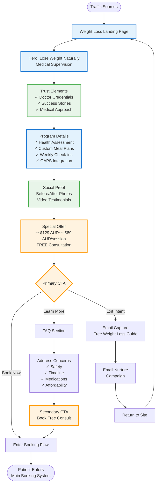

# Weight Loss Program Funnel

## Overview
This flowchart shows the dedicated weight loss marketing funnel from awareness to booking conversion.

## Main Funnel Flow

## Conversion Elements

### 1. Landing Page Components
- **Hero Section**: Clear value proposition with emotional appeal
- **Trust Indicators**: Medical credentials, safety assurances
- **Program Benefits**: Specific deliverables and outcomes
- **Social Proof**: Real patient transformations

### 2. Traffic Sources
- Google Ads (weight loss keywords)
- Facebook/Instagram (interest targeting)
- Organic search (SEO-optimized content)
- Email campaigns (segmented lists)
- Referrals from other services

### 3. Objection Handling
| Common Objection | Response |
|-----------------|----------|
| "Is it safe?" | Medical supervision by qualified doctors |
| "How fast will I see results?" | Sustainable 1-2kg/week approach |
| "What about my medications?" | We work with your current treatments |
| "Can I afford it?" | Payment plans available |

### 4. Email Nurture Sequence
**Immediate Download**: Free Weight Loss Guide
1. **Day 0**: Welcome & guide delivery
2. **Day 2**: Success story spotlight
3. **Day 4**: Common weight loss myths
4. **Day 7**: Special offer reminder
5. **Day 10**: Doctor introduction
6. **Day 14**: Last chance offer
7. **Ongoing**: Weekly tips until booking

### 5. Tracking & Analytics
- Entry source attribution
- Conversion rate by source
- Drop-off points in funnel
- A/B test variations
- ROI by campaign

## Integration Points

### With Main Booking System
- Service pre-selected as "Weight Loss"
- Free consultation booking
- Consultant briefed on weight loss interest
- Appropriate practitioner matching

### With Other Services
- Cross-sell opportunities (GAPS diet)
- Referral pathways (counseling for emotional eating)
- Integrated care packages
- Follow-up service recommendations