# Current Admin Flow

## Overview
This flowchart represents the current admin workflow for managing the Botanical website.

```mermaid
flowchart TD
    Start([Admin Login]) --> Auth[Authentication]
    Auth --> Dashboard[Admin Dashboard]
    
    Dashboard --> Menu{Admin Menu}
    
    Menu --> Products[Product Management]
    Menu --> Orders[Order Management]
    Menu --> Users[User Management]
    Menu --> Content[Content Management]
    Menu --> Reports[Basic Reports]
    Menu --> Bookings[Booking Management]
    
    %% Product Management
    Products --> ProdActions{Product Actions}
    ProdActions --> AddProd[Add Product]
    ProdActions --> EditProd[Edit Product]
    ProdActions --> DeleteProd[Delete Product]
    ProdActions --> Inventory[Update Inventory]
    
    AddProd --> ProdForm[Product Form]
    EditProd --> ProdForm
    ProdForm --> SaveProd[Save Product]
    SaveProd --> Products
    
    %% Order Management
    Orders --> OrderList[Order List]
    OrderList --> OrderDetail[Order Details]
    OrderDetail --> OrderActions{Order Actions}
    OrderActions --> UpdateStatus[Update Status]
    OrderActions --> PrintInvoice[Print Invoice]
    OrderActions --> RefundOrder[Process Refund]
    
    %% User Management
    Users --> UserList[User List]
    UserList --> UserDetail[User Details]
    UserDetail --> UserActions{User Actions}
    UserActions --> EditUser[Edit User]
    UserActions --> BlockUser[Block/Unblock]
    UserActions --> ResetPass[Reset Password]
    
    %% Content Management
    Content --> ContentTypes{Content Types}
    ContentTypes --> Pages[Static Pages]
    ContentTypes --> Banners[Banner Management]
    ContentTypes --> Email[Email Templates]
    
    %% Reports
    Reports --> ReportTypes{Report Types}
    ReportTypes --> Sales[Sales Report]
    ReportTypes --> Inventory2[Inventory Report]
    ReportTypes --> UserReport[User Report]
    
    Sales --> Export[Export CSV]
    Inventory2 --> Export
    UserReport --> Export
    
    %% Booking Management
    Bookings --> BookingTasks{Booking Tasks}
    BookingTasks --> AvailabilitySync[Sync Availability]
    BookingTasks --> ProcessIntake[Process Intake Forms]
    BookingTasks --> ConfirmBookings[Confirm Bookings]
    BookingTasks --> ClinicalNotes[Generate Clinical Notes]
    
    AvailabilitySync --> MediRecords[MediRecords Setup]
    ProcessIntake --> SharePoint[Save to SharePoint]
    ConfirmBookings --> CheckList[Verification Checklist]
    ClinicalNotes --> LLM[LLM Processing]
    
    Export --> End([End Session])
    MediRecords --> End
    SharePoint --> End
    CheckList --> End
    LLM --> End
    
    %% Styling
    classDef startEnd fill:#ffebee,stroke:#c62828,stroke-width:2px
    classDef process fill:#e3f2fd,stroke:#1565c0,stroke-width:2px
    classDef decision fill:#f3e5f5,stroke:#4a148c,stroke-width:2px
    classDef action fill:#fff3e0,stroke:#e65100,stroke-width:2px
    
    class Start,End startEnd
    class Dashboard,Products,Orders,Users,Content,Reports,Bookings,OrderList,UserList,MediRecords,SharePoint process
    class Menu,ProdActions,OrderActions,UserActions,ContentTypes,ReportTypes,BookingTasks decision
    class AddProd,EditProd,DeleteProd,Inventory,UpdateStatus,PrintInvoice,RefundOrder,AvailabilitySync,ProcessIntake,ConfirmBookings,ClinicalNotes,CheckList,LLM action
```

## Current Features
- Basic CRUD operations for products
- Simple order management
- User account management
- Static content editing
- Basic reporting with CSV export
- Manual booking management workflow
- See [Detailed Booking Admin Flow](./booking-admin-flow.md)

## Booking Management Features
- Manual availability synchronization (MediRecords ↔ Calendly)
- Email monitoring (enquiries@botaniqal.com.au)
- Intake form processing and storage
- Clinical notes generation via LLM
- Manual booking confirmation process

## Limitations
- No bulk operations
- Limited automation
- Basic reporting only
- No real-time updates
- Manual inventory tracking
- No role-based permissions
- Manual availability synchronization
- Manual clinical notes generation
- Manual booking confirmation process
- No automated workflow for bookings