# Current Booking Admin Flow

## Overview
This flowchart represents the current admin workflow for managing bookings, from availability setup through appointment completion.

```mermaid
flowchart TD
    %% Availability Setup
    Start([Admin Tasks]) --> AvailabilitySetup{Availability Management}
    
    AvailabilitySetup --> MediRecords[Access MediRecords Practice Manager]
    MediRecords --> SetDrAvail[Set Dr. Dia Availability]
    SetDrAvail --> LinkApptTypes[Link to Appointment Types]
    
    LinkApptTypes --> CalendlySetup[Access Calendly Admin Account]
    CalendlySetup --> DuplicateAvail[Duplicate Availability to Calendly]
    DuplicateAvail --> TimeZoneCheck{Verify Time Zones Match}
    
    TimeZoneCheck -->|Correct| ConfigChoice{Configuration Type}
    TimeZoneCheck -->|Incorrect| FixTimeZone[Adjust Time Zone Settings]
    FixTimeZone --> ConfigChoice
    
    ConfigChoice -->|Per Type| SetPerAppt[Set Availability per Appointment Type]
    ConfigChoice -->|Global| SetAllAppt[Set for All Availability]
    
    SetPerAppt --> AvailComplete[Availability Setup Complete]
    SetAllAppt --> AvailComplete
    
    %% Booking Monitoring
    AvailComplete --> MonitorEmail[Monitor enquiries@botaniqal.com.au]
    
    MonitorEmail --> EmailTypes{Email Type Received}
    EmailTypes -->|Stripe Payment| PaymentEmail[Payment Confirmation]
    EmailTypes -->|Booking Notification| BookingEmail[New Booking Alert]
    EmailTypes -->|Intake Form| IntakeEmail[Completed Intake Form]
    
    %% Intake Form Processing
    IntakeEmail --> SaveSharePoint[Save to SharePoint]
    SaveSharePoint --> UploadMediRecords[Upload to MediRecords Patient File]
    
    UploadMediRecords --> CheckRecords[Check Patient Records in MediRecords]
    CheckRecords --> VerifyDetails{All Details Updated?}
    
    VerifyDetails -->|Yes| ProcessNotes[Process Clinical Notes]
    VerifyDetails -->|No| CheckForm{Details in Form?}
    
    CheckForm -->|Yes| ManualUpdate[Manually Update MediRecords]
    CheckForm -->|No| ContactPatient[Phone Patient for Missing Info]
    
    ManualUpdate --> ProcessNotes
    ContactPatient --> UpdateDetails[Update Patient Details]
    UpdateDetails --> ProcessNotes
    
    %% Clinical Notes Generation
    ProcessNotes --> ExtractInfo[Extract Non-Identifiable Info]
    ExtractInfo --> LLMProcess[Process through LLM]
    LLMProcess --> GenerateNotes[Generate Clinical Notes]
    GenerateNotes --> AddToRecord[Add Notes to Patient Record]
    
    %% Booking Confirmation Process
    AddToRecord --> FinalCheck{Final Verification}
    FinalCheck --> CheckList[Verify Checklist]
    
    CheckList --> PatientDetails{Patient Details Complete?}
    PatientDetails -->|No| FixDetails[Complete Details]
    PatientDetails -->|Yes| BookingExists{Booking Created?}
    
    FixDetails --> BookingExists
    BookingExists -->|No| FixBooking[Fix Booking]
    BookingExists -->|Yes| PaymentVerified{Payment Confirmed?}
    
    FixBooking --> PaymentVerified
    PaymentVerified -->|No| CheckPayment[Verify Payment]
    PaymentVerified -->|Yes| ConsentUploaded{Consent Form Uploaded?}
    
    CheckPayment --> ConsentUploaded
    ConsentUploaded -->|No| UploadConsent[Upload Consent]
    ConsentUploaded -->|Yes| AllCorrect{All Details Correct?}
    
    UploadConsent --> AllCorrect
    AllCorrect -->|No| CorrectDetails[Correct Details]
    AllCorrect -->|Yes| UpdateStatus[Update Booking Status to Confirmed]
    
    CorrectDetails --> UpdateStatus
    
    %% Appointment Execution
    UpdateStatus --> AppointmentDay[Day of Appointment]
    AppointmentDay --> DoctorCalls[Doctor Calls Patient]
    DoctorCalls --> ConductAppointment[Conduct Telehealth Appointment]
    ConductAppointment --> CompleteAppt[Update Status to Complete]
    
    CompleteAppt --> End([End])
    
    %% Follow-up Path
    PaymentEmail --> LogPayment[Log Payment Received]
    BookingEmail --> TrackBooking[Track New Booking]
    LogPayment --> MonitorEmail
    TrackBooking --> MonitorEmail
    
    %% Styling
    classDef admin fill:#e3f2fd,stroke:#1565c0,stroke-width:2px
    classDef system fill:#fff3e0,stroke:#e65100,stroke-width:2px
    classDef email fill:#ffebee,stroke:#c62828,stroke-width:2px
    classDef process fill:#e8f5e9,stroke:#2e7d32,stroke-width:2px
    classDef decision fill:#f3e5f5,stroke:#4a148c,stroke-width:2px
    classDef llm fill:#fff8e1,stroke:#f57c00,stroke-width:3px
    classDef storage fill:#f5f5f5,stroke:#616161,stroke-width:2px
    
    class Start,End,MonitorEmail,CheckRecords admin
    class MediRecords,CalendlySetup,SetDrAvail,LinkApptTypes,DuplicateAvail system
    class EmailTypes,PaymentEmail,BookingEmail,IntakeEmail email
    class SaveSharePoint,UploadMediRecords,ProcessNotes,UpdateStatus,CompleteAppt process
    class AvailabilitySetup,TimeZoneCheck,ConfigChoice,VerifyDetails,CheckForm,FinalCheck,PatientDetails,BookingExists,PaymentVerified,ConsentUploaded,AllCorrect decision
    class ExtractInfo,LLMProcess,GenerateNotes llm
    class SaveSharePoint storage
```

## Admin Workflow Details

### 1. Availability Setup (Initial & Ongoing)
- **MediRecords Configuration**:
  - Access via Practice Manager account
  - Set doctor availability
  - Link to appointment types (Initial/Follow-up)
  
- **Calendly Synchronization**:
  - Access via Calendly admin account
  - Duplicate exact availability from MediRecords
  - Verify time zones are correctly matched
  - Configure per appointment type or globally

### 2. Email Monitoring & Processing
- **Monitor**: enquiries@botaniqal.com.au
- **Email Types**:
  - Stripe payment confirmations
  - New booking notifications
  - Completed intake forms (JotForm)

### 3. Intake Form Management
- **Document Storage**:
  - Save to SharePoint for records
  - Upload to MediRecords patient file
  
- **Data Verification**:
  - Check all details transferred to MediRecords
  - Review form for missing information
  - Contact patient if needed

### 4. Clinical Notes Generation
- **LLM Processing**:
  - Extract non-identifiable information
  - Generate clinical summary
  - Add to patient record for doctor

### 5. Booking Confirmation Checklist
- ✓ Patient details complete
- ✓ Booking created in system
- ✓ Payment confirmed
- ✓ Consent form uploaded
- ✓ All details accurate
- → Update status to "Confirmed"

### 6. Appointment Completion
- Doctor conducts telehealth appointment
- Update booking status to "Complete"

## Key Admin Accounts
- **MediRecords**: Practice Manager account
- **Calendly**: Admin account
- **Email**: enquiries@botaniqal.com.au
- **SharePoint**: Document storage access

## Critical Admin Tasks
1. **Daily**: Monitor emails, verify new bookings
2. **Per Booking**: Process intake forms, generate notes
3. **Regular**: Sync availability between systems
4. **Quality Check**: Verify all data transfers correctly