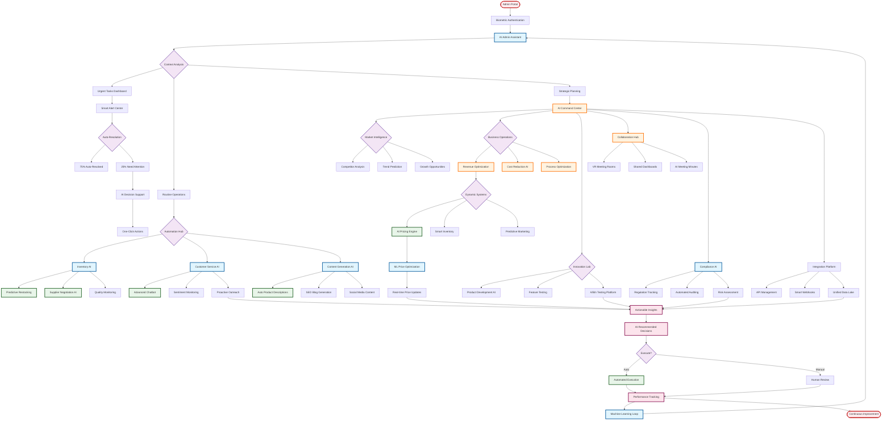

# Proposed Admin Flow

## Overview
This flowchart represents the proposed future admin workflow with AI-driven operations and advanced automation.

## Proposed Features

### AI-Driven Operations
- Intelligent task prioritization
- Automated decision making (75% of routine tasks)
- Predictive analytics for all operations
- Machine learning feedback loops

### Advanced Automation
- Self-managing inventory system
- AI supplier negotiations
- Automated content generation
- Smart pricing engine
- Predictive maintenance

### Strategic Intelligence
- Real-time competitor analysis
- Market trend prediction
- Revenue optimization AI
- Cost reduction algorithms

### Next-Gen Collaboration
- VR meeting rooms
- AI-generated meeting summaries
- Shared real-time dashboards
- Cross-functional AI assistants

### Compliance & Security
- Automated regulation tracking
- AI-powered auditing
- Predictive risk assessment
- Zero-trust security model

### Integration Excellence
- Universal API platform
- Smart webhook management
- Unified data lake
- Real-time synchronization

### Key Benefits
- 90% reduction in manual tasks
- 24/7 autonomous operations
- Predictive problem resolution
- Data-driven decision making
- Continuous self-improvement