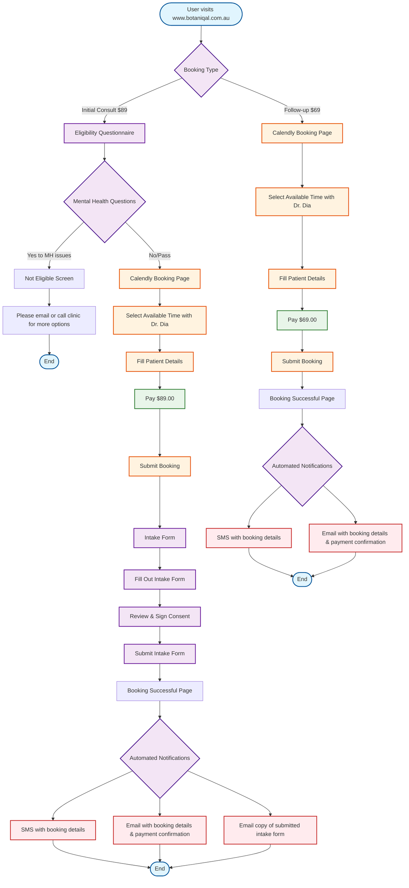

# Current Botaniqal Booking Flow

## Overview
This flowchart represents the current booking flow for Botaniqal website (www.botaniqal.com.au).

## Current Flow Details

### Initial Consultation ($89.00)
1. User selects "Initial Consult"
2. Completes eligibility questionnaire
3. If mental health issues indicated → Not eligible (contact clinic)
4. If eligible → Calendly booking with Dr. Dia
5. Fills details and pays $89.00
6. Completes intake form with consent
7. Receives confirmations (SMS, Email, Intake copy)

### Follow-up Consultation ($69.00)
1. User selects "Follow-up"
2. Direct to Calendly booking
3. Fills details and pays $69.00
4. Receives confirmations (SMS, Email)

## Key Components
- **Single Provider**: Dr. Dia only
- **Payment Gateway**: Integrated with Calendly
- **Intake Form**: Separate step after payment
- **Consent**: Part of intake form
- **Notifications**: SMS and Email automated

## Current Pain Points
- Mental health screening may turn away eligible patients
- Two-step process (booking then intake) may cause drop-offs
- No option to save progress
- No pre-appointment reminders mentioned
- Single provider limitation
- No rescheduling flow shown