# Comprehensive Booking System Flow

## Overview
This flowchart shows the complete booking system flow across all stakeholders: Patient, Admin, Technical Systems, and Doctor.

```mermaid
flowchart TB
    %% Title
    subgraph Title[" "]
        TitleText["🏥 Botaniqal Complete Booking System Flow"]
    end
    
    %% Patient Flow
    subgraph PatientFlow["👤 PATIENT FLOW"]
        P1[Visit Website] --> P2{Choose Booking Type}
        P2 -->|Initial $89| P3[Health Assessment]
        P2 -->|Follow-up $69| P7[Calendly Booking]
        
        P3 --> P4{Assessment Result}
        P4 -->|Standard Care| P5[Calendly Booking]
        P4 -->|Special Needs| P6[Contact Options]
        
        P5 --> P7
        P6 --> P7
        
        P7 --> P8[Select Time]
        P8 --> P9[Enter Details]
        P9 --> P10[Pay via Stripe]
        P10 --> P11[Booking Confirmed]
        
        P11 --> P12[Intake Form]
        P12 --> P13[Fill Details]
        P13 --> P14[Sign Consent]
        P14 --> P15[Submit Form]
        
        P15 --> P16[Receive Confirmations]
        P16 --> P17[SMS + Email + Calendar]
        
        P17 --> P18[Day of Appointment]
        P18 --> P19[Receive Doctor Call]
        P19 --> P20[Consultation]
        P20 --> P21[Receive Prescription]
    end
    
    %% Technical Flow
    subgraph TechFlow["⚙️ TECHNICAL SYSTEMS"]
        T1[Webflow CMS] --> T2[Embedded Calendly]
        T2 --> T3[Stripe Payment]
        T3 --> T4[Office 365 Calendar]
        
        T4 --> T5[MS Graph Webhook]
        T5 --> T6[AWS API Gateway]
        T6 --> T7[Lambda Function]
        
        T7 --> T8[Python Library]
        T8 --> T9[MediRecords API]
        
        T9 --> T10{Patient Exists?}
        T10 -->|No| T11[Create Patient]
        T10 -->|Yes| T12[Update Patient]
        
        T11 --> T13[Create Booking]
        T12 --> T13
        
        T1 --> T14[Embedded JotForm]
        T14 --> T15[JotForm Webhook]
        T15 --> T16[AWS Lambda 2]
        T16 --> T17[Update Patient Details]
        
        T17 --> T18[Send Notifications]
        T18 --> T19[SMS via MediRecords]
        T18 --> T20[Email via Stripe]
        T18 --> T21[Calendar Invite]
    end
    
    %% Admin Flow
    subgraph AdminFlow["👨‍💼 ADMIN FLOW"]
        A1[Set MediRecords Availability] --> A2[Sync to Calendly]
        A2 --> A3[Verify Time Zones]
        
        A4[Monitor Emails] --> A5{Email Type}
        A5 -->|Payment| A6[Log Payment]
        A5 -->|Booking| A7[Track Booking]
        A5 -->|Intake Form| A8[Process Form]
        
        A8 --> A9[Save to SharePoint]
        A9 --> A10[Upload to MediRecords]
        
        A10 --> A11[Verify Details]
        A11 --> A12{Complete?}
        A12 -->|No| A13[Contact Patient]
        A12 -->|Yes| A14[Generate Clinical Notes]
        
        A14 --> A15[LLM Processing]
        A15 --> A16[Add to Patient Record]
        
        A16 --> A17[Confirmation Checklist]
        A17 --> A18[Update to Confirmed]
        
        A18 --> A19[Post-Appointment]
        A19 --> A20[Follow-up if Needed]
    end
    
    %% Doctor Flow
    subgraph DoctorFlow["👨‍⚕️ DOCTOR FLOW"]
        D1[Review Patient Record] --> D2[Read Clinical Notes]
        D2 --> D3[Get Phone Number]
        
        D3 --> D4[Call Patient]
        D4 --> D5[Verify Identity]
        D5 --> D6[Consultation]
        
        D6 --> D7[Check SafeScript]
        D7 --> D8[Create Treatment Plan]
        
        D8 --> D9{Prescribe?}
        D9 -->|Yes| D10[eRx System]
        D9 -->|No| D11[Document Plan]
        
        D10 --> D12{Delivery Method}
        D12 -->|SMS| D13[Send SMS]
        D12 -->|Email| D14[Send Email]
        D12 -->|Pharmacy| D15[Send to Pharmacy]
        
        D13 --> D16[Update Notes]
        D14 --> D16
        D15 --> D16
        D11 --> D16
        
        D16 --> D17{Follow-up?}
        D17 -->|Yes| D18[Contact PM]
        D17 -->|No| D19[Complete Appointment]
        
        D18 --> D19
        D19 --> D20[Update Status]
    end
    
    %% Connections between flows
    P11 -.-> T4
    P10 -.-> T3
    P15 -.-> T14
    
    T13 -.-> A7
    T20 -.-> A5
    T17 -.-> A11
    
    A18 -.-> D1
    A16 -.-> D2
    
    D20 -.-> A19
    D18 -.-> A20
    
    %% Styling
    classDef patient fill:#e1f5fe,stroke:#01579b,stroke-width:3px
    classDef tech fill:#fff8e1,stroke:#f57c00,stroke-width:3px
    classDef admin fill:#e3f2fd,stroke:#1565c0,stroke-width:3px
    classDef doctor fill:#e8f5e9,stroke:#2e7d32,stroke-width:3px
    classDef title fill:#f5f5f5,stroke:#333,stroke-width:4px,font-weight:bold
    
    class P1,P2,P3,P4,P5,P6,P7,P8,P9,P10,P11,P12,P13,P14,P15,P16,P17,P18,P19,P20,P21 patient
    class T1,T2,T3,T4,T5,T6,T7,T8,T9,T10,T11,T12,T13,T14,T15,T16,T17,T18,T19,T20,T21 tech
    class A1,A2,A3,A4,A5,A6,A7,A8,A9,A10,A11,A12,A13,A14,A15,A16,A17,A18,A19,A20 admin
    class D1,D2,D3,D4,D5,D6,D7,D8,D9,D10,D11,D12,D13,D14,D15,D16,D17,D18,D19,D20 doctor
    class TitleText title
```

## Flow Integration Points

### Patient → Technical
- Website visit triggers embedded widgets
- Payment processing through Stripe
- Form submission through JotForm
- Notification delivery

### Technical → Admin
- Booking notifications to enquiries@botaniqal.com.au
- Payment confirmations
- Form submissions for processing
- System updates requiring verification

### Admin → Doctor
- Confirmed bookings ready for appointments
- Clinical notes prepared
- Patient details verified
- Follow-up requirements

### Doctor → Admin
- Appointment completion status
- Follow-up requirements
- Practice Manager coordination

## Key Synchronization Points

1. **Availability Sync**
   - Admin sets in MediRecords
   - Must match in Calendly
   - Time zones critical

2. **Booking Creation**
   - Calendly → Office 365 → MediRecords
   - Multiple system updates
   - Webhook dependencies

3. **Data Flow**
   - JotForm → AWS → MediRecords
   - Manual verification by admin
   - LLM processing for notes

4. **Appointment Execution**
   - Doctor uses MediRecords data
   - Real-time prescription system
   - Status updates back to admin

## Critical Dependencies

### Systems
- Webflow (website platform)
- Calendly (booking system)
- JotForm (intake forms)
- Office 365 (calendar sync)
- AWS (processing)
- MediRecords (EHR)
- Stripe (payments)
- SafeScript (prescriptions)
- eRx (electronic prescriptions)

### Manual Processes
- Availability synchronization
- Email monitoring
- Form verification
- Clinical notes generation
- Follow-up coordination

## Current Pain Points
- Manual availability sync required
- Multiple systems to monitor
- No automated verification
- Manual clinical notes process
- Disconnected follow-up workflow