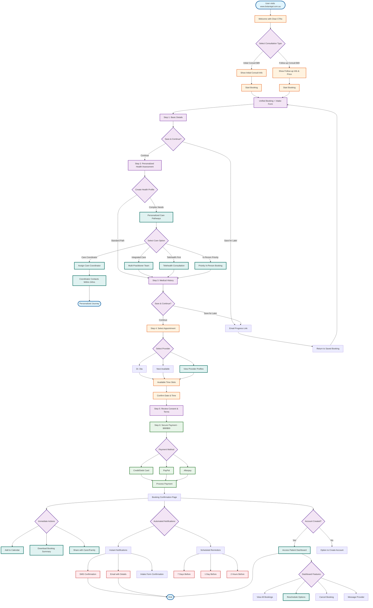

# Improved Botaniqal Booking Flow

## Overview
This flowchart represents an improved booking flow that addresses current pain points and enhances user experience.

## Key Improvements

### 1. Unified Booking Experience
- **Single Form**: Combines booking and intake into one streamlined process
- **Progress Saving**: Users can save and return to complete booking
- **Step Indicators**: Clear progress through booking steps

### 2. Personalized Health Assessment
- **Health Profile Creation**: Builds comprehensive understanding of patient needs
- **Multiple Care Pathways**: Integrated care, telehealth priority, in-person priority
- **Care Coordinator Option**: Personal support for complex cases
- **No Rejection**: Everyone finds a suitable care pathway
- **Proactive Support**: 24-hour coordinator contact for complex needs

### 3. Provider Flexibility
- **Multiple Providers**: Option for next available or specific provider
- **Provider Profiles**: View provider information before selection
- **Smart Scheduling**: Shows best available times

### 4. Payment Options
- **Multiple Methods**: Credit/Debit, PayPal, Afterpay
- **Secure Processing**: PCI-compliant payment handling
- **Clear Pricing**: Transparent fee structure ($89 initial, $69 follow-up)
- **Flexible Payment**: Afterpay for affordability

### 5. Better Communication
- **Instant Confirmation**: Immediate SMS and email
- **Smart Reminders**: 7 days, 1 day, and 2 hours before
- **Calendar Integration**: Add to personal calendar
- **Document Access**: Download booking summary

### 6. Patient Dashboard
- **Account Creation**: Optional but encouraged
- **Booking Management**: View, reschedule, cancel
- **Provider Communication**: Secure messaging
- **History Access**: View past appointments

### 7. Accessibility Features
- **Save Progress**: Return later to complete
- **Share Options**: Share with family/carers
- **Clear Information**: Better explanation of services
- **Support Options**: Multiple ways to get help

## Technical Enhancements
- Single-page application for smooth flow
- Real-time availability updates
- Mobile-responsive design
- Secure data handling
- API integration for all services