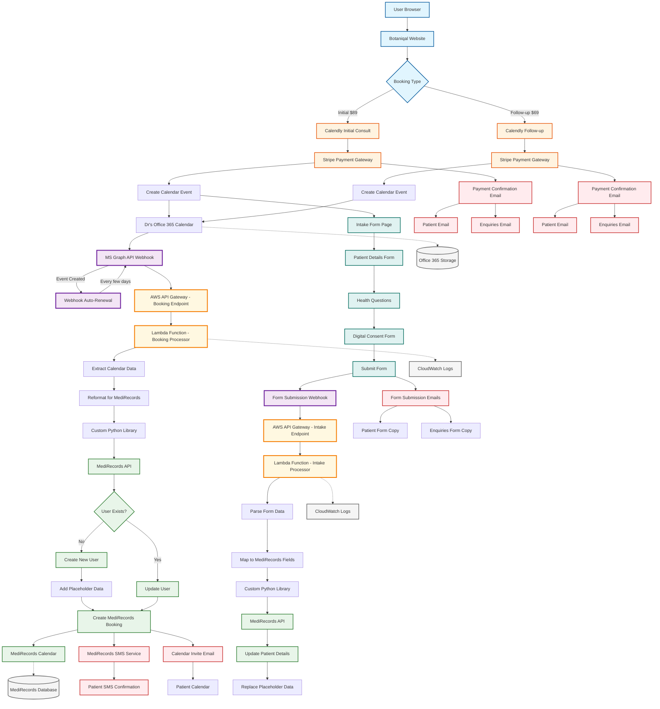

# Current Booking System Technical Architecture

## Overview
This flowchart represents the current technical architecture for the Botaniqal booking system using Calendly, Office 365, AWS, and MediRecords integration.

## Technical Components

### Frontend Layer
- **Website**: Botaniqal website (www.botaniqal.com.au)
- **Calendly Widgets**: Embedded for Initial ($89) and Follow-up ($69) bookings
- **Intake Form**: Custom form for patient details post-booking

### Calendar Integration
- **Calendly**: Two calendar types (Initial Consult, Follow-up)
- **Office 365**: Doctor's calendar synchronized with Calendly
- **MS Graph API**: Webhook for calendar events with auto-renewal

### Payment Processing
- **Stripe Integration**: Embedded in Calendly booking flow
- **Payment Confirmation**: Automated emails to patient and enquiries

### AWS Infrastructure
- **API Gateway**: Two endpoints (booking, intake form)
- **Lambda Functions**: 
  - Booking processor for calendar events
  - Intake processor for form submissions
- **CloudWatch**: Logging and monitoring

### MediRecords Integration
- **Custom Python Library**: Handles API communication
- **Patient Management**: 
  - Checks existing patients by email
  - Creates new patients with placeholders
  - Updates patient details from intake form
- **Booking Creation**: Syncs with MediRecords calendar

### Data Flow Specifics

#### Initial Consultation Flow
1. User selects Initial Consult ($89) on website
2. Calendly booking with Stripe payment
3. Office 365 calendar event created
4. MS Graph webhook triggers AWS Lambda
5. Lambda processes booking data
6. MediRecords patient/booking created
7. User redirected to intake form
8. Form submission triggers second Lambda
9. Patient details updated in MediRecords
10. Notifications sent (SMS, email, calendar)

#### Follow-up Consultation Flow
1. User selects Follow-up ($69) on website
2. Calendly booking with Stripe payment
3. Office 365 calendar event created
4. MS Graph webhook triggers AWS Lambda
5. Lambda processes booking data
6. MediRecords booking created for existing patient
7. Notifications sent (SMS, email, calendar)

### Key Integration Points
- **Calendly ↔ Office 365**: Direct calendar sync
- **Office 365 → AWS**: MS Graph webhooks
- **AWS → MediRecords**: Custom Python library
- **Stripe → Email**: Payment confirmations
- **MediRecords → SMS**: Booking confirmations

### Critical Requirements
- **Calendar Sync**: MediRecords availability must match Calendly
- **Webhook Renewal**: MS Graph webhooks renewed every few days
- **Data Mapping**: Form fields mapped to MediRecords schema
- **Email Notifications**: Both patient and enquiries receive copies

### Security & Compliance
- **HTTPS**: All API communications
- **AWS IAM**: Lambda function permissions
- **API Keys**: Secure storage for MediRecords API
- **PCI Compliance**: Through Stripe integration
- **HIPAA Considerations**: Patient data handling