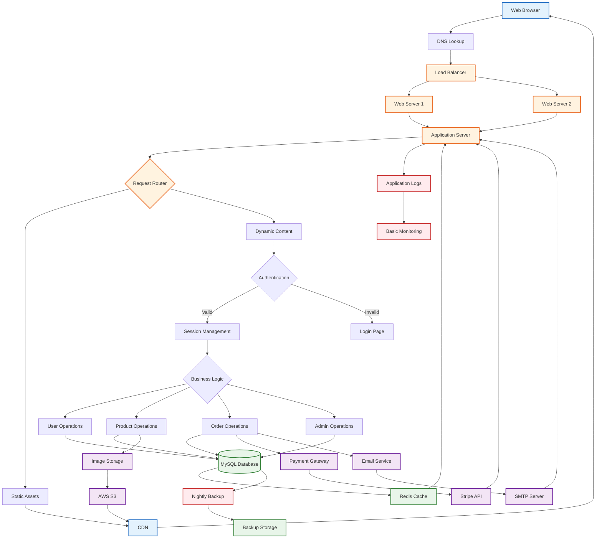

# Current Technical Architecture Flow

## Overview
This flowchart represents the current technical architecture and data flow.

## Current Stack
- **Frontend**: HTML, CSS, JavaScript (jQuery)
- **Backend**: PHP 7.4
- **Database**: MySQL 5.7
- **Cache**: Redis
- **Web Server**: Apache
- **CDN**: CloudFront
- **Storage**: AWS S3

## Booking System Stack
- **Booking Platform**: Calendly (Initial & Follow-up calendars)
- **Calendar Sync**: Office 365 with MS Graph API webhooks
- **Payment**: Stripe integrated with Calendly
- **Serverless**: AWS API Gateway + Lambda functions
- **EHR Integration**: MediRecords API with custom Python library
- **Forms**: Custom intake form post-booking
- **Notifications**: Email (Stripe/Form), SMS (MediRecords)

## Architecture Details
- Traditional monolithic architecture
- Session-based authentication
- Synchronous request processing
- Manual scaling required
- Basic monitoring setup
- Hybrid cloud approach (on-premises + AWS Lambda)

## Booking System Architecture
- Event-driven architecture via webhooks
- Serverless functions for booking processing
- Multiple API integrations (Calendly, Stripe, MediRecords)
- Asynchronous processing for form submissions
- See [Detailed Booking Technical Flow](./booking-tech-flow.md)

## Limitations
- No microservices
- Limited API endpoints
- No real-time features
- Manual deployment process
- Basic error handling
- No container orchestration
- Complex multi-system dependencies
- Manual webhook renewal required