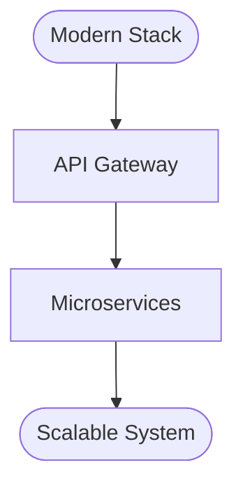

# New Update Booking Technical Flow (Ready for Deployment)

## Overview
This flowchart represents the updated technical architecture ready for deployment with improved integrations.

## Technical Improvements Ready for Deployment
- API-first architecture
- Automated webhooks
- Real-time sync
- Enhanced security
- Better error handling

*To be detailed based on new-update specifications...*