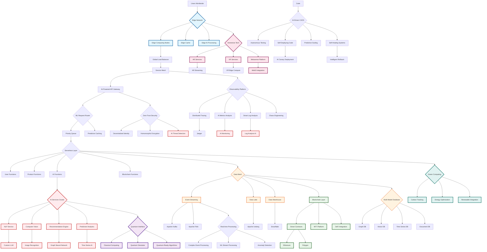

# Proposed Technical Architecture Flow

## Overview
This flowchart represents the proposed future technical architecture with cutting-edge technologies and AI integration.

## Proposed Stack

### Edge & Computing
- **Edge Computing**: Global edge nodes with AI
- **Serverless**: AWS Lambda, Vercel Edge Functions
- **Quantum Ready**: IBM Qiskit integration
- **GPU Clusters**: NVIDIA A100 for AI workloads

### AI & ML Platform
- **Custom LLM**: Fine-tuned language model
- **Computer Vision**: Real-time plant recognition
- **Graph Neural Networks**: Recommendation system
- **AutoML**: Automated model optimization

### Data Architecture
- **Event Streaming**: Apache Kafka + Flink
- **Data Lake**: Apache Iceberg format
- **Multi-Model DB**: ArangoDB, Pinecone (Vector)
- **Blockchain**: Ethereum L2 for transparency

### Immersive Technologies
- **AR Platform**: ARCore/ARKit integration
- **VR Support**: WebXR for browser VR
- **Metaverse**: Decentraland integration
- **3D Rendering**: Three.js + WebGPU

### Infrastructure
- **Service Mesh**: Istio with Envoy
- **Orchestration**: K8s with Knative
- **Observability**: OpenTelemetry + AI
- **Security**: Zero-trust architecture

## Revolutionary Features

### AI-Driven Everything
- Self-optimizing infrastructure
- Predictive auto-scaling
- Autonomous bug fixing
- AI code generation

### Sustainability First
- Carbon-neutral computing
- Renewable energy integration
- Efficient resource allocation
- Green computing metrics

### Web3 Integration
- Decentralized identity
- NFT plant certificates
- DeFi payment options
- DAO governance model

### Quantum Advantages
- Quantum-safe encryption
- Optimization algorithms
- ML model training
- Cryptographic security

### Performance Targets
- < 50ms global latency
- 99.999% availability
- Infinite scalability
- Zero-downtime deployments