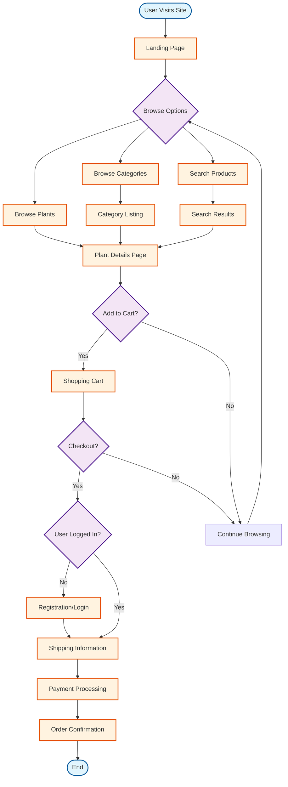

# Current User Experience Flow

## Overview
This flowchart represents the current user experience flow for the Botanical website.

## Key Features
- Simple browsing experience
- Basic search functionality
- Standard e-commerce checkout flow
- Account creation during checkout

## Pain Points
- No guest checkout option
- Limited filtering options
- No wishlist functionality
- No order tracking