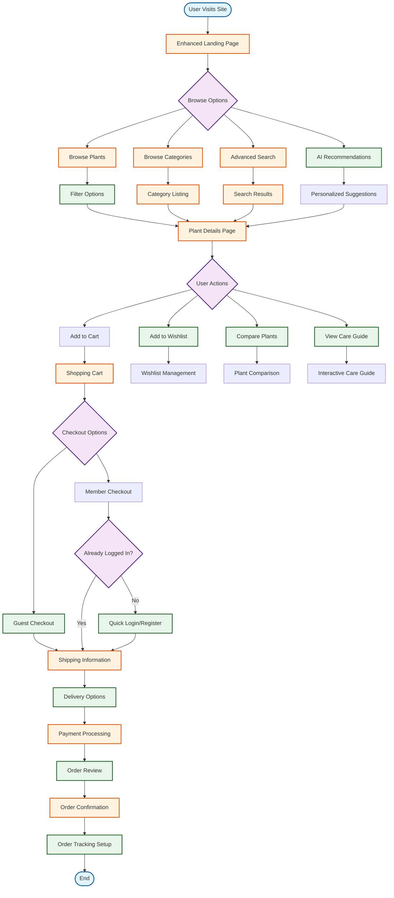

# New Update User Experience Flow

## Overview
This flowchart represents the updated user experience flow ready for deployment.

## New Features
- AI-powered plant recommendations
- Advanced filtering and search
- Guest checkout option
- Wishlist functionality
- Plant comparison tool
- Interactive care guides
- Real-time order tracking
- Quick login/register flow

## Improvements
- Streamlined checkout process
- Better product discovery
- Enhanced user engagement features
- Mobile-optimized interface