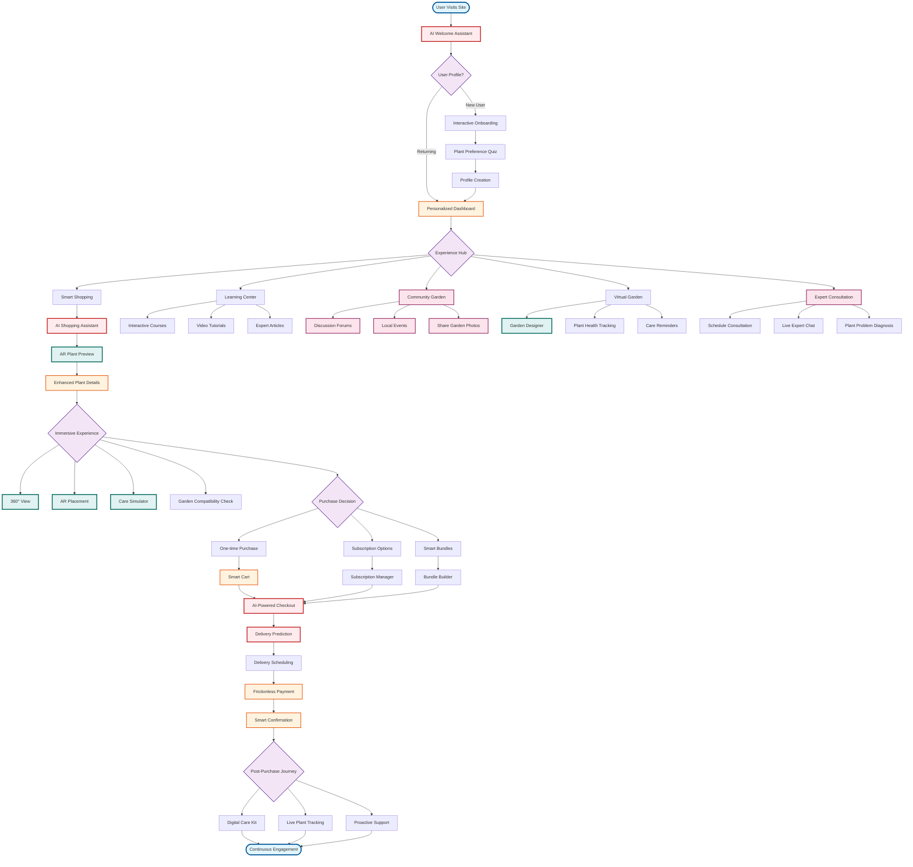

# Proposed User Experience Flow

## Overview
This flowchart represents proposed future enhancements for the user experience.

## Proposed Features

### AI-Driven Personalization
- Intelligent welcome assistant
- Predictive shopping recommendations
- Automated care reminders
- Smart bundling suggestions

### Immersive Technologies
- AR plant preview in user's space
- 360° product views
- Virtual garden designer
- Care simulation games

### Community & Learning
- Expert consultation booking
- Community forums and events
- Interactive learning courses
- Garden sharing platform

### Advanced Commerce
- Subscription management
- Predictive delivery scheduling
- Frictionless payment options
- Post-purchase engagement

### Sustainability Features
- Carbon footprint tracking
- Local supplier matching
- Eco-friendly packaging options
- Plant swap marketplace