# Coming Soon Variation - Patient Booking Flow

## Overview
This flowchart shows the patient booking experience with Weight Loss program active and Counseling/Equine Therapy coming soon.

```mermaid
flowchart TD
    Start([User visits www.botaniqal.com.au]) --> Homepage[Enhanced Homepage]
    
    Homepage --> ServiceDisplay[View All Services]
    ServiceDisplay --> ServiceList{Service Selection}
    
    %% Service Options
    ServiceList -->|Alternative Medicine| AltMedFunnel[Alternative Medicine Landing]
    ServiceList -->|GAPS Coaching| GAPSFunnel[GAPS Diet Landing]
    ServiceList -->|Weight Loss ✓| WeightLossFunnel[Weight Loss Program Landing]
    ServiceList -->|Counseling 🔜| CounselingWaitlist[Coming Soon - Join Waitlist]
    ServiceList -->|Equine Therapy 🔜| EquineWaitlist[Coming Soon - Join Waitlist]
    
    %% Funnel Paths
    AltMedFunnel --> BookingChoice1[Book Free Consultation]
    GAPSFunnel --> BookingChoice2[Book Free Consultation]
    WeightLossFunnel --> BookingChoice3[Book Free Consultation]
    
    %% Waitlist Path
    CounselingWaitlist --> WaitlistForm1[Enter Details]
    EquineWaitlist --> WaitlistForm2[Enter Details]
    WaitlistForm1 --> NotifyLaunch1[We'll Notify You at Launch]
    WaitlistForm2 --> NotifyLaunch2[We'll Notify You at Launch]
    
    %% Unified Booking Path
    BookingChoice1 --> InitialBooking[Free Initial Consultation]
    BookingChoice2 --> InitialBooking
    BookingChoice3 --> InitialBooking
    
    InitialBooking --> ServiceInterest{Select Interest Area}
    
    ServiceInterest -->|Alternative Medicine| SelectTime1[Select Available Time]
    ServiceInterest -->|GAPS Diet| SelectTime1
    ServiceInterest -->|Weight Loss| SelectTime1
    ServiceInterest -->|Not Sure| SelectTime1
    
    SelectTime1 --> BasicDetails[Enter Basic Details]
    BasicDetails --> NoPayment[✓ No Payment Required]
    NoPayment --> BookingConfirmed[Booking Confirmed]
    
    BookingConfirmed --> MiniIntake[Mini Intake + Consent Form]
    MiniIntake --> InterestArea[Indicate Service Interest]
    InterestArea --> HealthInfo[Basic Health Info]
    HealthInfo --> ConsentSign[Digital Consent Signature]
    ConsentSign --> SubmitIntake[Submit Form]
    
    %% Consultant Triage with Service Awareness
    SubmitIntake --> ConsultantCall[Consultant Calls Patient]
    ConsultantCall --> ReviewInterest[Review Patient's Interest]
    ReviewInterest --> TriageAssessment[Comprehensive Assessment]
    
    TriageAssessment --> ServiceRecommend{Service Recommendation}
    
    ServiceRecommend -->|Alternative Medicine| RecDoctor[Recommend Doctor/Nurse]
    ServiceRecommend -->|GAPS Program| RecGAPS[Recommend GAPS Coach]
    ServiceRecommend -->|Weight Loss| RecWeightLoss[Recommend Weight Loss Specialist]
    ServiceRecommend -->|Multiple Services| RecCombined[Recommend Combined Approach]
    ServiceRecommend -->|Not Suitable| RecAlternative[Alternative Resources]
    
    %% Phone Booking with Service Type
    RecDoctor --> PhoneBooking1[Book Appointment by Phone]
    RecGAPS --> PhoneBooking1
    RecWeightLoss --> PhoneBooking1
    RecCombined --> PhoneBooking1
    
    PhoneBooking1 --> SelectServiceType{Select Service Type}
    SelectServiceType -->|Alternative 15min $119| BookAltMed[Book Alternative Medicine]
    SelectServiceType -->|GAPS 60min $195| BookGAPS[Book GAPS Session]
    SelectServiceType -->|Weight Loss TBD| BookWeightLoss[Book Weight Loss]
    SelectServiceType -->|In-Person 20min $119| BookInPerson[Book Melbourne Clinic]
    
    BookAltMed --> ProcessPayment[Process Payment Over Phone]
    BookGAPS --> ProcessPayment
    BookWeightLoss --> ProcessPayment
    BookInPerson --> ProcessPayment
    
    ProcessPayment --> PractitionerBooked[Practitioner Appointment Confirmed]
    PractitionerBooked --> FullIntake[Full Intake Form Sent]
    
    %% Follow-up Path with Service Types
    Homepage -->|Returning Patient| FollowUpBooking[Book Follow-up]
    FollowUpBooking --> ServiceTypeSelect{Select Service Type}
    
    ServiceTypeSelect -->|Alternative Medicine| AltMedCalendar[Alternative Medicine Calendar]
    ServiceTypeSelect -->|GAPS Coaching| GAPSCalendar[GAPS Calendar]
    ServiceTypeSelect -->|Weight Loss| WeightLossCalendar[Weight Loss Calendar]
    
    AltMedCalendar --> PractitionerFilter1[Filter by Practitioner]
    GAPSCalendar --> PractitionerFilter2[Filter by Practitioner]
    WeightLossCalendar --> PractitionerFilter3[Filter by Practitioner]
    
    PractitionerFilter1 --> SelectTimeSlot[Select Available Time]
    PractitionerFilter2 --> SelectTimeSlot
    PractitionerFilter3 --> SelectTimeSlot
    
    SelectTimeSlot --> ServiceDetails[Confirm Service Details]
    ServiceDetails --> PaymentByService{Payment by Service Type}
    
    PaymentByService -->|Alternative $79| PayOnline1[Pay Online]
    PaymentByService -->|GAPS $79| PayOnline2[Pay Online]
    PaymentByService -->|Weight Loss TBD| PayOnline3[Pay Online]
    PaymentByService -->|In-Person $79| PayOnline4[Pay Online]
    
    PayOnline1 --> FollowUpConfirmed[Follow-up Confirmed]
    PayOnline2 --> FollowUpConfirmed
    PayOnline3 --> FollowUpConfirmed
    PayOnline4 --> FollowUpConfirmed
    
    %% Completion
    FullIntake --> ReadyForAppt[Ready for Appointment]
    FollowUpConfirmed --> ReadyForAppt
    RecAlternative --> End([End])
    ReadyForAppt --> End
    NotifyLaunch1 --> End
    NotifyLaunch2 --> End
    
    %% Styling
    classDef active fill:#e8f5e9,stroke:#2e7d32,stroke-width:3px
    classDef comingSoon fill:#fff3e0,stroke:#ef6c00,stroke-width:3px,stroke-dasharray: 5 5
    classDef free fill:#c8e6c9,stroke:#1b5e20,stroke-width:3px
    classDef service fill:#e1f5fe,stroke:#01579b,stroke-width:2px
    classDef booking fill:#f3e5f5,stroke:#4a148c,stroke-width:2px
    
    class WeightLossFunnel,BookWeightLoss,WeightLossCalendar active
    class CounselingWaitlist,EquineWaitlist,WaitlistForm1,WaitlistForm2,NotifyLaunch1,NotifyLaunch2 comingSoon
    class InitialBooking,NoPayment,ConsultantCall free
    class ServiceDisplay,ServiceList,ServiceInterest,ServiceTypeSelect,ServiceRecommend service
    class PhoneBooking1,SelectTimeSlot,ProcessPayment booking
```

## Key Features - Coming Soon Variation

### Active Services
1. **Alternative Medicine** - Fully operational
   - Initial: 15 minutes, $119
   - Follow-up: 10 minutes, $79
   - Doctors & Nurse Practitioner (Telehealth)
   - Dr Shivani (In-person Melbourne - 20 min initial, 15 min follow-up)

2. **GAPS Diet Coaching** - Fully operational
   - Initial: 60 minutes, $195
   - Follow-up: 15 minutes, $79
   - GAPS Coach

3. **Weight Loss Program** - Newly launched
   - Pricing and duration TBD
   - Multiple practitioner support

### Coming Soon Services
1. **Counseling** - Waitlist active
   - Online counseling planned
   - Pricing and duration TBD
   - Building interest list

2. **Equine Therapy** - Waitlist active
   - Pricing and duration TBD
   - Building interest list

### Booking Enhancements
- Service interest captured at initial booking
- Service-specific appointment types
- Different durations per service
- Tiered pricing structure
- Practitioner specialization matching

### Marketing Funnels
- Dedicated landing page per service
- Service-specific value propositions
- Clear CTAs to book free consultation
- Waitlist capture for coming services

### Technical Updates
- 3 active appointment types in Calendly
- Service type selection in booking flow
- Duration-based calendar slots
- Price variations by service
- Waitlist integration for future services