# Coming Soon Technical Architecture - Multi-Service Booking

## Overview
Technical implementation for supporting multiple service types with different durations, prices, and practitioners.

```mermaid
flowchart TD
    %% Frontend Layer
    User[User Browser] --> Webflow[Webflow CMS]
    
    Webflow --> ServiceRouter{Service Router}
    
    ServiceRouter -->|Homepage| ServiceGrid[Service Selection Grid]
    ServiceRouter -->|Direct URL| ServiceFunnel[Service-Specific Funnel]
    ServiceRouter -->|Return Visit| BookingPortal[Booking Portal]
    
    %% Service Selection Layer
    ServiceGrid --> ServiceDB[(Service Configuration)]
    ServiceDB --> ServiceList{Available Services}
    
    ServiceList -->|Active| ActiveServices[Alt Med, GAPS, Weight Loss]
    ServiceList -->|Coming Soon| InactiveServices[Counseling, Equine]
    
    ActiveServices --> ServiceDetails[Load Service Details]
    InactiveServices --> WaitlistForm[Waitlist Capture]
    
    %% Calendly Integration - Multiple Types
    ServiceDetails --> CalendlyConfig{Calendly Configuration}
    
    CalendlyConfig --> ConsultantCal[Consultant Calendar]
    CalendlyConfig --> ServiceCalendars{Service-Specific Calendars}
    
    ServiceCalendars --> AltMedCal[Alternative Medicine Calendar]
    ServiceCalendars --> GAPSCal[GAPS Calendar]  
    ServiceCalendars --> WeightCal[Weight Loss Calendar]
    
    %% Appointment Types
    ConsultantCal --> FreeConsult[initial-consult-free]
    
    AltMedCal --> AltTypes{Alt Med Types}
    AltTypes --> AltFollow30[followup-alternative-30min]
    AltTypes --> AltExtended45[followup-alternative-extended-45min]
    
    GAPSCal --> GAPSTypes{GAPS Types}
    GAPSTypes --> GAPSStandard45[followup-gaps-45min]
    GAPSTypes --> GAPSIntensive60[followup-gaps-intensive-60min]
    
    WeightCal --> WeightTypes{Weight Loss Types}
    WeightTypes --> WeightStandard45[followup-weight-45min]
    WeightTypes --> WeightCheck15[followup-weight-checkin-15min]
    
    %% Booking Flow
    FreeConsult --> NoPaymentFlow[Skip Payment Gateway]
    AltFollow30 --> PaymentGateway[Stripe Payment Gateway]
    AltExtended45 --> PaymentGateway
    GAPSStandard45 --> PaymentGateway
    GAPSIntensive60 --> PaymentGateway
    WeightStandard45 --> PaymentGateway
    WeightCheck15 --> PaymentGateway
    
    %% Payment Processing
    PaymentGateway --> PriceMatrix{Dynamic Pricing}
    
    PriceMatrix -->|Alt 30min| Price69[Process $69]
    PriceMatrix -->|Alt 45min| Price89[Process $89]
    PriceMatrix -->|GAPS 45min| Price69_2[Process $69]
    PriceMatrix -->|GAPS 60min| Price99[Process $99]
    PriceMatrix -->|Weight 45min| Price89_2[Process $89]
    PriceMatrix -->|Weight 15min| Price39[Process $39]
    
    %% Calendar Integration
    NoPaymentFlow --> CreateEvent[Create Calendar Event]
    Price69 --> CreateEvent
    Price89 --> CreateEvent
    Price69_2 --> CreateEvent
    Price99 --> CreateEvent
    Price89_2 --> CreateEvent
    Price39 --> CreateEvent
    
    CreateEvent --> O365Integration{Office 365 Integration}
    
    O365Integration --> EventDetails{Event Metadata}
    EventDetails --> ServiceType[Service Type Tag]
    EventDetails --> Duration[Duration Flag]
    EventDetails --> Practitioner[Practitioner Assignment]
    EventDetails --> Price[Price Point]
    
    %% Webhook Processing
    ServiceType --> MSGraphWebhook[MS Graph Webhook]
    Duration --> MSGraphWebhook
    Practitioner --> MSGraphWebhook
    Price --> MSGraphWebhook
    
    MSGraphWebhook --> AWSGateway[AWS API Gateway]
    AWSGateway --> LambdaRouter{Lambda Function Router}
    
    %% Service-Specific Processing
    LambdaRouter -->|By Service| ServiceProcessor{Service Type Processor}
    
    ServiceProcessor -->|Alternative| AltMedProcessor[Alt Med Lambda]
    ServiceProcessor -->|GAPS| GAPSProcessor[GAPS Lambda]
    ServiceProcessor -->|Weight Loss| WeightProcessor[Weight Loss Lambda]
    ServiceProcessor -->|Waitlist| WaitlistProcessor[Waitlist Lambda]
    
    %% MediRecords Integration
    AltMedProcessor --> MediAPI[MediRecords API]
    GAPSProcessor --> MediAPI
    WeightProcessor --> MediAPI
    
    MediAPI --> AppointmentCreate{Create Appointment}
    
    AppointmentCreate --> SetType[Set Appointment Type]
    SetType --> SetDuration[Set Duration]
    SetDuration --> SetBilling[Set Billing Code]
    SetBilling --> AssignCalendar[Assign to Practitioner Calendar]
    
    %% Appointment Type Mapping
    AssignCalendar --> TypeMapping{MediRecords Types}
    
    TypeMapping --> MediAlt30[CONSULT_ALT_30]
    TypeMapping --> MediAlt45[CONSULT_ALT_45]
    TypeMapping --> MediGAPS45[CONSULT_GAPS_45]
    TypeMapping --> MediGAPS60[CONSULT_GAPS_60]
    TypeMapping --> MediWeight45[CONSULT_WEIGHT_45]
    TypeMapping --> MediWeight15[CONSULT_WEIGHT_15]
    
    %% Form Processing
    ServiceDetails --> FormSelection{Form Selection}
    
    FormSelection -->|Initial| MiniIntakeForm[Mini Intake + Service Interest]
    FormSelection -->|Follow-up| ServiceIntakeForm{Service-Specific Intake}
    
    ServiceIntakeForm -->|Alternative| MedicalHistory[Medical History Form]
    ServiceIntakeForm -->|GAPS| NutritionAssessment[Nutrition Assessment]
    ServiceIntakeForm -->|Weight Loss| WeightLifestyle[Weight & Lifestyle Form]
    
    %% Waitlist Processing
    WaitlistForm --> WaitlistCapture[Capture Details]
    WaitlistCapture --> WaitlistDB[(Waitlist Database)]
    WaitlistDB --> WaitlistProcessor
    WaitlistProcessor --> EmailAutomation[Email Automation]
    EmailAutomation --> WaitlistCampaign[Nurture Campaign]
    
    %% Reporting & Analytics
    MediAlt30 --> ReportingEngine[Analytics Engine]
    MediAlt45 --> ReportingEngine
    MediGAPS45 --> ReportingEngine
    MediGAPS60 --> ReportingEngine
    MediWeight45 --> ReportingEngine
    MediWeight15 --> ReportingEngine
    
    ReportingEngine --> ServiceMetrics{Service Metrics}
    
    ServiceMetrics --> Revenue[Revenue by Service]
    ServiceMetrics --> Utilization[Practitioner Utilization]
    ServiceMetrics --> Conversion[Conversion Rates]
    ServiceMetrics --> PatientFlow[Patient Journey]
    
    %% Styling
    classDef service fill:#e1f5fe,stroke:#01579b,stroke-width:3px
    classDef calendar fill:#fff3e0,stroke:#e65100,stroke-width:2px
    classDef payment fill:#e8f5e9,stroke:#2e7d32,stroke-width:2px
    classDef aws fill:#fff8e1,stroke:#f57c00,stroke-width:3px
    classDef medi fill:#f3e5f5,stroke:#6a1b9a,stroke-width:2px
    classDef waitlist fill:#ffebee,stroke:#c62828,stroke-width:2px,stroke-dasharray: 5 5
    
    class ServiceRouter,ServiceList,ServiceDetails,ServiceProcessor service
    class CalendlyConfig,ConsultantCal,AltMedCal,GAPSCal,WeightCal calendar
    class PaymentGateway,PriceMatrix,Price69,Price89,Price99,Price39 payment
    class AWSGateway,LambdaRouter,AltMedProcessor,GAPSProcessor,WeightProcessor aws
    class MediAPI,AppointmentCreate,TypeMapping medi
    class WaitlistForm,WaitlistCapture,WaitlistDB,WaitlistProcessor waitlist
```



## Technical Implementation Details

### Service Configuration Database
```json
{
  "services": [
    {
      "id": "alternative-medicine",
      "name": "Alternative Medicine",
      "status": "active",
      "appointments": [
        {
          "type": "followup-alternative-30min",
          "duration": 30,
          "price": 69,
          "calendly_event": "alt-med-30",
          "medi_code": "CONSULT_ALT_30"
        }
      ]
    },
    {
      "id": "weight-loss",
      "name": "Weight Loss Program",
      "status": "active",
      "appointments": [
        {
          "type": "followup-weight-45min",
          "duration": 45,
          "price": 89,
          "calendly_event": "weight-45",
          "medi_code": "CONSULT_WEIGHT_45"
        }
      ]
    },
    {
      "id": "counseling",
      "name": "Counseling Services",
      "status": "coming-soon",
      "launch_date": "2024-06-01",
      "waitlist": true
    }
  ]
}
```

### Lambda Function Structure
- **Service Router Lambda**: Routes to appropriate processor
- **Service Processor Lambdas**: Handle service-specific logic
- **Waitlist Lambda**: Manages coming soon registrations
- **Analytics Lambda**: Processes service metrics

### Calendly Configuration
- Separate event types for each service/duration
- Dynamic availability rules
- Service-specific questions
- Custom confirmation messages

### MediRecords Setup
- Appointment types matching each service
- Billing codes per service type
- Duration templates
- Service-based reporting categories

### Key Features
1. **Dynamic Service Management**: Easy to add/remove services
2. **Flexible Pricing**: Per-service pricing structure
3. **Waitlist System**: Capture interest for upcoming services
4. **Analytics**: Service-level performance tracking
5. **Scalable Architecture**: Add new services without code changes